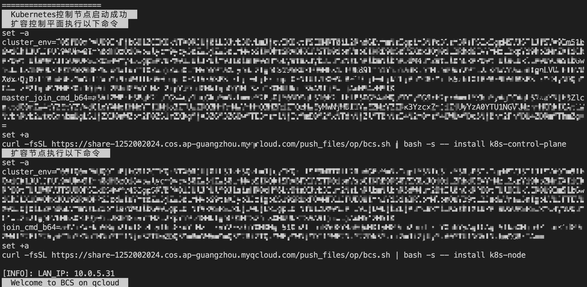

# 开始部署
1. 确认已经阅读过[K8S 新手必读](beginners_guide.md)

# 资源准备
## 中控机
您需要一台机器执行部署操作。我们沿用惯例称其为“中控机”。

如果您的中控机同时作为 Kubenetes master node 存在，请确保配置至少为 4 核心 8GB 内存 100GB 磁盘。

## k8s 集群
如果您选择自建 k8s 集群，则需根据类型准备合乎规格的机器（物理机或虚拟机均可）：
* `master` 负责 k8s 集群本身的管理调度，配置至少为 4 核心 8GB 内存 100GB 磁盘。
* `node` 负责承载业务运行。建议每台机器配置至少为 8 核心 32GB 内存 100GB 磁盘。

## 资源评估表
我们整理了各套餐所需的 node 数量。如果您的 `node` 配置不同，请自行折算。

|蓝鲸套餐 | 描述 | 最低配置 | 推荐配置 | 备注 |
| -- | -- | -- | -- | -- |
|基础套餐 | 后台及 SaaS | 2 台 node | 2.5 台 node | |
|容器管理平台 | 容器管理后台及 SaaS | 0.7 台 node | 1 台 node | |
|监控套餐 | 监控、日志服务及其 SaaS | 1 台 node | 2 台 node | |

<a id="get-a-k8s-cluster"></a>

# 准备 K8S 集群
蓝鲸社区版 7.0 容器化部署方案预期运行于 Kubernetes 1.18 及以上版本。

我们适配了如下的场景：
* 【推荐】[使用蓝鲸提供的 bcs.sh 脚本快速部署 k8s 集群](#deploy-k8s-using-bcs-sh)
* [使用现有的 k8s 集群](#using-existing-k8s)
* [购买腾讯云 TKE 服务](#purchase-cloud-service-tke) （其他厂商提供 K8S 集群同理）

请查阅如下章节获得对应场景的操作指引。

<a id="deploy-k8s-using-bcs-sh" ></a>

## 使用 bcs.sh 快速部署 k8s 集群
### 部署初始 master
欢迎使用蓝鲸提供的 `bcs.sh` 脚本快速部署 k8s 集群。

请在 **第一台 `master` 机器**（下文称为 **初始 master**，新手用户建议复用 **中控机**）上执行此命令：
``` bash
curl -fsSL https://bkopen-1252002024.file.myqcloud.com/ce7/bcs.sh | bash -s -- -i k8s
```

安装成功后会提示如下输出:



这表示您成功部署了一个 k8s 集群，此时您可以使用 `kubectl` 命令了。接下来开始添加节点吧。

### 添加 k8s-node
在 **部署初始 master** 章节，我们可以观察到脚本在结尾输出了 **扩容控制平面** （即 master） 及 **扩容节点** （即 node）的命令。

如果当时没有保存扩容命令，可以在 **初始 master** 机器上执行如下命令重新获取：
``` bash
curl -fsSL https://bkopen-1252002024.file.myqcloud.com/ce7/bcs.sh | bash -s -- -i k8sctrl
```

>**注意**
>
>`master` 和 `node` 机器的扩容命令不同，请勿混用。而同一类型的机器扩容命令相同。

登录到待扩容一批机器上粘贴对应的命令即可。假设我们要扩容 `node`，则需在 **待扩容机器** 上执行：
```plain
set -a
cluster_env=略
join_cmd_b64=略
set +a
curl -fsSL https://bkopen-1252002024.file.myqcloud.com/ce7/bcs.sh  | bash -s -- install k8s-node
```

扩容成功后, 会在结尾输出:
``` text
This node has joined the cluster:
* Certificate signing request was sent to apiserver and a response was received.
* The Kubelet was informed of the new secure connection details.

Run 'kubectl get nodes' on the control-plane to see this node join the cluster.

[INFO]: 添加Kubernetes节点成功

[INFO]: LAN_IP: 10.0.0.5
  Welcome to BCS on qcloud
```

### 复制 config 文件到中控机
如果您的 **中控机** 同时兼任 `master`，则可 **跳过本章节**。

否则需要将 `master` 上的 `~/.kube/config` 复制到 **中控机** 的 `~/.kube/config` 路径下，命令如下（请替换 `k8s-master`为具体的主机名或 IP）：
```bash
master_ip=10.0.0.2  # 请自行修改为bcs.sh所部署的master ip，建议配置好中控机免密登录。
mkdir -p ~/.kube
scp "$master_ip":.kube/config ~/.kube/config  # 复制kubeconfig，如未配置免密登录请输入master的密码
grep bcs.local /etc/hosts || ssh "$master_ip" grep bcs.local /etc/hosts | tee -a /etc/hosts  # 导出master上的bcs hosts配置到中控机，如未配置免密登录请输入master的密码
scp "$master_ip":/usr/bin/kubectl /usr/bin/  # 从master上复制kubectl二进制到中控机使用
```

<a id="using-existing-k8s" ></a>

## 使用已有的 k8s 集群
如果能访问到 `master` 上的文件，可将 `master` 上的 `~/.kube/config` 复制到 **中控机** 的 `~/.kube/config` 路径下。同时记得更新  **中控机** 的 `/etc/hosts` 文件确保可访问 config 文件中 k8s server。
如果使用了 k8s 云服务，则厂商一般会提供 kubeconfig 导出功能，将其内容写入 **中控机** 的 `~/.kube/config` 路径下即可。

<a id="purchase-cloud-service-tke" ></a>

## 使用腾讯云 TKE 服务
您可以腾讯云提供的 k8s 集群，具体操作请查阅文档： [腾讯云 TKE 集群搭建指引](tke_hosting.md){target=_blank}

文末描述了导出 kubeconfig 的方法，将其内容写入  **中控机** 的  `~/.kube/config` 路径下即可：
```bash
mkdir -p ~/.kube/
cat > ~/.kube/config <<EOF
此处粘贴从TKE管理界面复制的Kubeconfig内容。
EOF
```

# 在中控机管理 k8s 集群
## 在中控机安装 kubectl
当 **中控机** 并非 k8s `master` 时，是不存在 `kubectl`命令的。CentOS 7 可直接使用如下的命令安装：
``` bash
if ! command -v kubectl; then
  cat > /etc/yum.repos.d/kubernetes.repo <<EOF
[kubernetes]
name=Kubernetes
baseurl=https://mirrors.tencent.com/kubernetes/yum/repos/kubernetes-el7-x86_64
enabled=1
gpgcheck=0
EOF
  yum makecache fast
  yum install -y kubectl
fi
```

如为其他系统，您可以参考 k8s 官方文档安装： https://kubernetes.io/zh/docs/tasks/tools/install-kubectl-linux/

## 配置 kubectl 命令行补全
`kubectl` 命令参数十分复杂，且 pod 名称多含有随机的标识。因此命令行补全功能十分重要。
``` bash
yum install -y bash-completion
mkdir -p /etc/bash_completion.d/
kubectl completion bash > /etc/bash_completion.d/kubectl  # 添加命令行补全
source /etc/bash_completion.d/kubectl  # 补全会在下次登录时加载，如需在当前会话补全，主动加载之。
```

## 检查 k8s 集群节点
在 **中控机** 上执行如下命令：
```bash
kubectl get nodes -o wide
```
其输出如下图所示：


当  `STATUS`  列的值为  `Ready` ，即表示此 `node` 已经成功加入集群且工作正常。

如需了解对应  `node`  的详情，可使用命令：
```bash
kubectl describe nodes NAME  # NAME参数为 kubectl get nodes输出的 NAME 列
```

## kubectl 的常见报错
1. `Unable to connect to the server: dial tcp: lookup k8s-api.bcs.local: no such host`，请确保 **中控机** 能正常解析  `~/.kube/config` 文件中的 `cluster.server` 配置项中的域名。
2. `The connection to the server k8s-api.bcs.local:6443 was refused - did you specify the right host or port?`，请确保 **中控机** 到 `k8s-api.bcs.local` （提示的域名）的 6443 端口。一般需要检查目的服务器的防火墙，云服务器需额外检查安全组。
3. `Unable to connect to the server: dial tcp 10.0.0.254:6443: i/o timeout`，请确保 **中控机** 到 `k8s-api.bcs.local` （提示的域名）的网络可互通，以及目的服务器的防火墙，云服务器需额外检查安全组。
