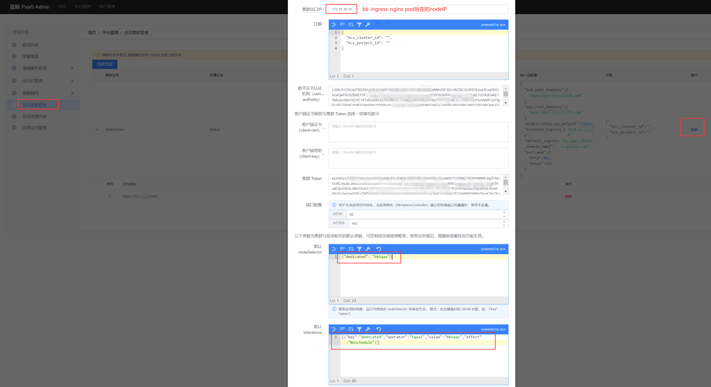

# 配置 SaaS 专用 node
我们通过 k8s 的污点（`taint`）来实现专机专用。

## 配置 node 污点
假设该节点名为 `node-1`，给该 node 配置 label 和污点，确保 `pod` 默认不会分配到这些 `node`。
``` bash
kubectl label nodes node-1 dedicated=bkSaas
kubectl taint nodes node-1 dedicated=bkSaas:NoSchedule
```
## 在 PaaS 页面配置污点容忍
1. 先登录。访问 `http://bkpaas.$BK_DOMAIN` （需替换 `$BK_DOMAIN` 为您配置的蓝鲸基础域名。）
2. 访问蓝鲸 PaaS Admin（如果未登录则无法访问）： `http://bkpaas.$BK_DOMAIN/backend/admin42/platform/clusters/manage/` 。
3. 点击集群 最右侧的编辑按钮。
4. 在 **集群出口 IP** 栏填写 `bk-ingress-nginx` pod 所在 **k8s node** 的 IP。
5. 在 **默认 nodeSelector** 栏填写：
    ``` json
    {"dedicated": "bkSaas"}
    ```
6. 在 **默认 tolerations** 栏填写：
    ``` json
    [{"key":"dedicated","operator":"Equal","value":"bkSaas","effect":"NoSchedule"}]
    ```

最终配置效果如下图所示，确认无误后点击保存按钮。



## SaaS 专用 node 问题排查
如果发现 SaaS 的 Pod 调度到了其他 `node`，请检查 PaaS 页面的配置是否正确。

如果因为资源不足导致 SaaS 运行异常，请先参考 **添加 k8s-node** 完成 k8s 扩容，然后参考 **配置 node 污点** 完成专机配置。

如果保存时报错 `engine 服务错误: ingress_config: frontend_ingress_ip`，请填写 **集群出口 IP** 。
