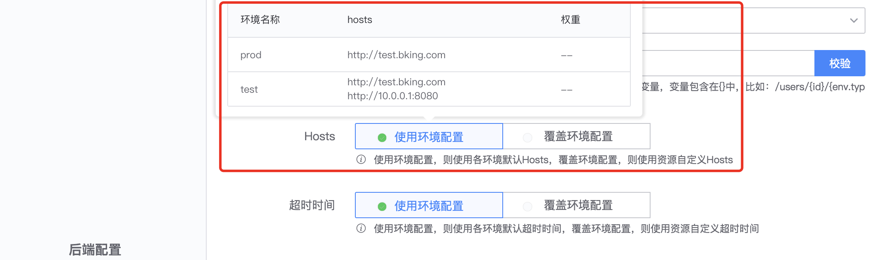

# 负载均衡

API 网关请求后端接口时，通过负载均衡将流量分发到多个服务器，以优化资源使用，提高后端接口可靠性。

API 网关将后端服务 Hosts 单独配置，便于维护。网关可在环境中，配置该环境下，网关调用后端服务的默认 Hosts；
在资源中，可使用各环境默认 Hosts，也可以覆盖环境配置，使用资源自定义 Hosts。

## 负载均衡类型

负载均衡类型，支持以下两种：
- 轮询(Round-Robin)，将请求轮流分配给后端服务器。
- 加权轮询(Weighted Round-Robin)，根据不同处理能力，给每个服务器分配不同权重，使其接受相应权重比例的请求。

可参考[What Is Round-Robin Load Balancing](https://www.nginx.com/resources/glossary/round-robin-load-balancing/)

## 环境负载均衡配置

环境『代理配置』中的`负载均衡类型`、`Hosts`，用于管理环境的负载均衡配置。

`Hosts` 可配置多个后端服务的域名或 IP（不包括 Path），比如：http://test.bking.com，http://10.0.0.1:8000。

当负载均衡类型为`加权轮询(Weighted Round-Robin)`时，可配置每个 Host 的权重，权重取值范围为：1 ~ 10000。

## 资源负载均衡配置

资源使用各环境的负载均衡配置，可选择`使用环境配置`，用户通过环境访问资源时，网关将使用对应环境的负载均衡配置访问后端服务。

若资源不使用环境中默认 Hosts，可选择`覆盖环境配置`，资源自定义 Hosts，配置项与环境中的相同。

