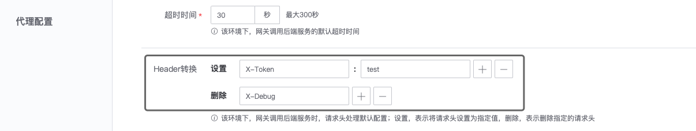
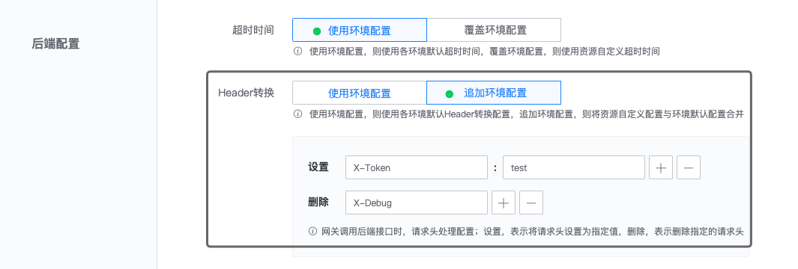

# 请求 Header 转换

网关 API 被访问时，网关会将用户传入的请求 Header，传递给后端接口。
如果网关需要传递固定的请求 Header，或删除指定的请求 Header，可通过请求 Header 转换实现。

请求 Header 转换，可在环境和资源中配置:
- 环境 Header 转换，作为该环境下请求 Header 转换的默认配置
- 资源 Header 转换，可使用默认的环境 Header 转换配置，或者追加环境配置，将资源自定义配置与环境默认配置合并

Header 转换，支持`设置`和`删除`两种配置：
- 设置：表示将请求头设置为指定值，如可将 Header X-Token 设置为 test
- 删除：表示删除指定的请求头，如可删除 Header X-Debug

## 环境中配置 Header 转换

## 资源中配置 Header 转换

