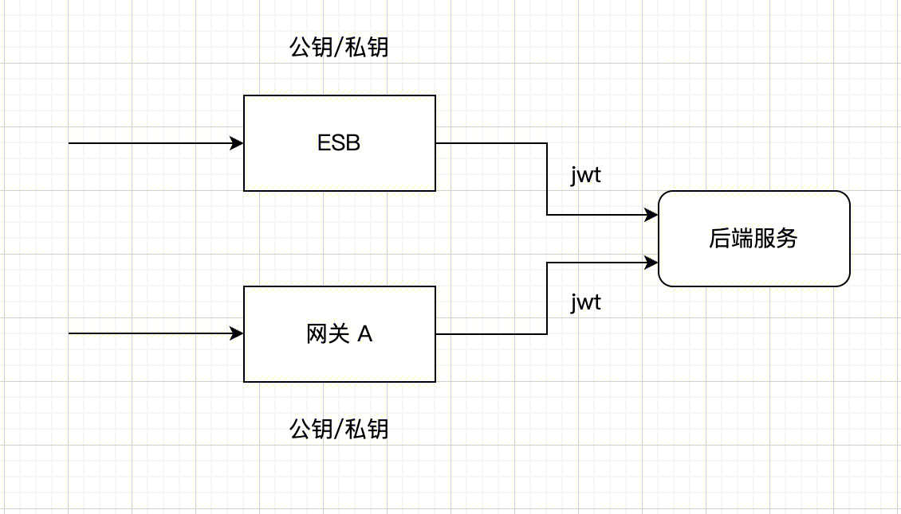
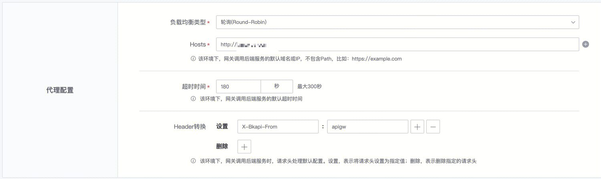
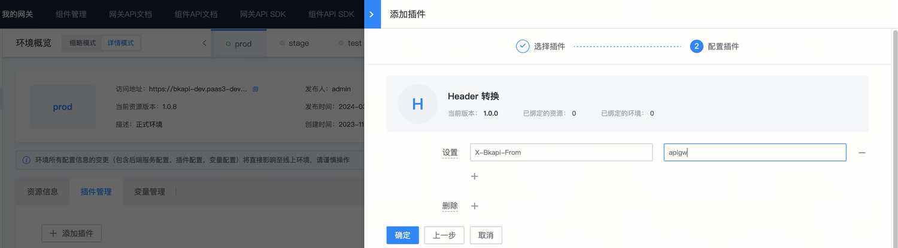
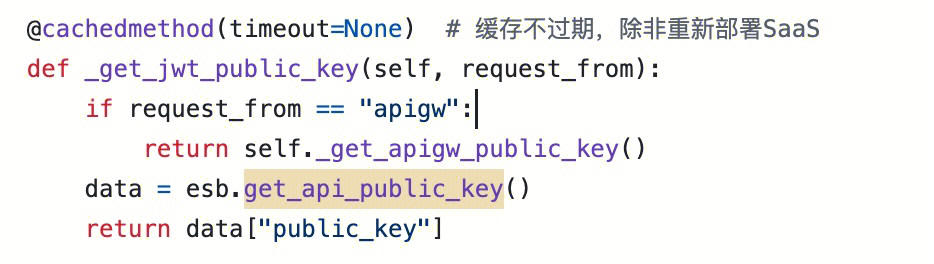

## 背景

有些系统，原先已经接入了 ESB，现在想需要接入 APIGateway，并且同时也支持原先来自 ESB 的调用，应该如何操作


## 机制

接入 ESB 与接入独立某个网关（例如网关 A），本质上没有差别，可以把 ESB 理解为编码封装好一系列接口后提供服务的一个`特殊`网关



唯一的区别是，ESB 持有的公私钥与网关 A 的公私钥是不一样的，这样带来的差异是，请求经过网关之后，通过私钥签发的 JWT 是不一样的。（关于 JWT 更多信息可以参考 [概念说明：X-Bkapi-JWT](../../Explanation/jwt.md)）

意味着，如果后端服务想同时接入 ESB 以及网关 A，

那么需求：
1. 区分是来自于 ESB 的请求，还是来自于网关的请求
2. 根据请求来源，调用不同接口获取公钥，解析 JWT

## 处理

### 1. 区分请求是来自于网关还是 ESB

如果是 1.12 网关老版本，新建网关后，在 `环境管理` 编辑环境，在`代理配置`中，通过增加一个自定义`header`，标识请求是来自于网关



如果是 1.13 新版本，在 `环境概览` 编辑环境，在`插件管理`中绑定一个 `Header 转换插件`



这样，在后端服务被调用时，可以通过请求 header 头中的`X-Bkapi-From=apigw`来确定是从网关来的请求，没有这个头则是从 ESB 来的请求


### 2. 根据请求来源，确定从哪里获取公钥后进行 JWT 解析


在 Django 中可以这么判断

```python
request.META.get("HTTP_X_BKAPI_FROM", "") == "apigw"
```

- 如果来自于 ESB，那么调用 ESB 的 `get_api_public_key`接口获取公钥：`/api/c/compapi/v2/esb/get_api_public_key` （如果原先接入了 ESB，那么应该已经有相应的代码）
- 如果是来自于 APIGateway，那么调用网关的接口获取公钥：`https://bkapi.example.com/api/bk-apigateway/prod/api/v1/apis/{gateway_name}/public_key/` (注意其中`example.com`替换为具体环境地址，`{gateway_name}`替换为自己的网关名）
    - 注意，也可以通过 SDK 或者直接获取的方式配置，具体参考 [如何获取网关公钥](https://github.com/TencentBlueKing/bkpaas-python-sdk/tree/master/sdks/apigw-manager#%E5%A6%82%E4%BD%95%E8%8E%B7%E5%8F%96%E7%BD%91%E5%85%B3%E5%85%AC%E9%92%A5)


只有`public_key`的获取有差异，JWT 解析的逻辑网关与 ESB 完全一致，无需特殊处理

代码示例：（强烈建议从接口获取的做下内存缓存，提高接口性能）


