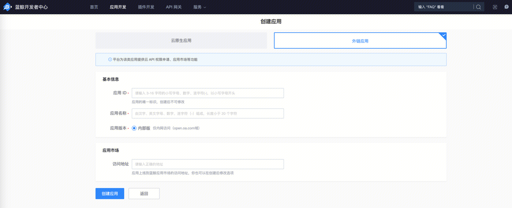
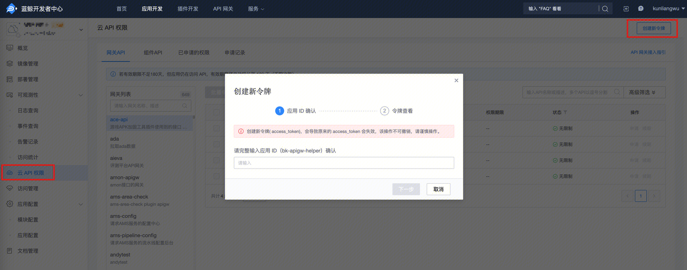
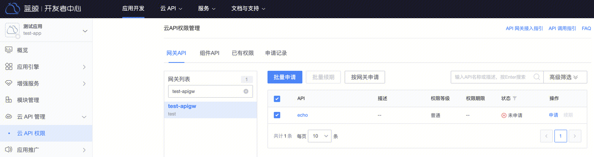
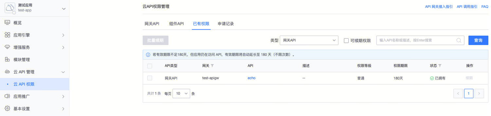
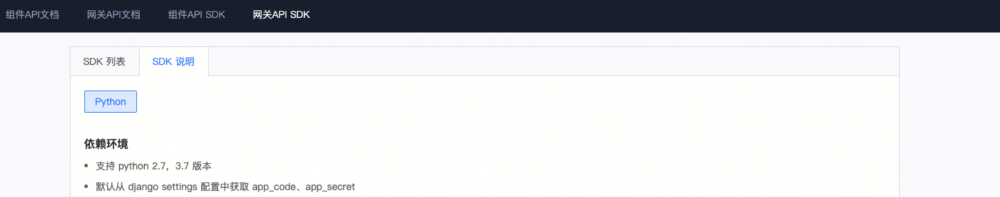

# 调用网关 API

[toc]

## 1. 获取蓝鲸应用身份

访问云 API 时，如果云 API 开启了**应用认证**，则调用时需要提供蓝鲸应用账号。更多认证相关解释见 [认证](../Explanation/authorization.md)

以下步骤引导您创建蓝鲸应用，并获取蓝鲸应用账号（应用 ID：`bk_app_code`、应用秘钥：`bk_app_secret`）。

### 1.1 确定应用类型并创建应用

进入 蓝鲸开发者中心 - 创建应用

蓝鲸开发者中心提供了两种应用类型：
- 如仅需调用网关接口，创建**外链应用**即可
- 如后续有应用开发和部署需求的，可以选择**云原生应用**



### 1.2 获取应用账号

访问 蓝鲸开发者中心 - 应用开发，搜索应用，并进入应用的管理页。

在应用管理页，展开左侧菜单**应用配置**，点击**基本信息**。
右侧页面鉴权信息中的`bk_app_code`和`bk_app_secret`，即为访问云 API 所需的蓝鲸应用账号。


## 2. 获取蓝鲸用户身份

访问云 API 时，如果云 API 开启了**用户认证**，则调用时需要提供代表用户身份的信息。更多认证相关解释见 [认证](../Explanation/authorization.md)

目前，网关支持的蓝鲸用户身份信息有以下两种：
- 用户登录态：用户登录蓝鲸后，存储在浏览器 Cookies 中的用户登录凭证，一般有效期不超过 24 小时
- 用户 access_token：用户登录蓝鲸后，利用用户登录态换取的用户 access_token，有效期 180 天

### 2.1 用户登录态

> 推荐优先使用

用户登录蓝鲸后，在浏览器 Cookies 中会存储用户的登录凭证，此登录凭证，即可代表用户身份。

蓝鲸用户的登录态信息如下：

| Cookies 字段 | 说明 |
|--------------|------|
| bk_token | 用户登录态 |

### 2.2 用户 access_token

> 离线任务/脚本等场景使用

利用用户登录态，调用 bkoauth 接口，可以换取用户 access_token + refresh_token；
该 access_token 有效期 **180** 天，可以使用 refresh_token 进行刷新。

可以在开发者中心直接生成


可以使用 api, 具体见 [access_token](../Explanation/access-token.md)

## 3. 申请对应网关 API 调用权限

本节将引导您为蓝鲸应用申请网关 API 的访问权限。

申请网关 API 访问权限有两种方案：应用负责人申请，网关管理员主动授权。

### 3.1 应用负责人申请

访问 蓝鲸开发者中心 - 应用开发，搜索应用，并进入应用的管理页。

点击左侧菜单**云 API 权限**，进入云 API 权限管理页，切换到**网关 API**页。

在网关列表中，筛选出待申请权限的网关，点击网关名，然后，在右侧页面选中需访问的网关 API，点击**批量申请**。
在申请记录中，可查看申请单详情。待权限审批通过后，即可访问网关 API。



### 3.2 网关管理员主动授权

应用负责人提供蓝鲸应用 ID（即`bk_app_code`）和待申请权限的网关 API 列表，联系网关管理员主动授权。

### 3.3 查看应用的网关 API 权限

访问 蓝鲸开发者中心 - 应用开发，搜索应用，并进入应用的管理页。

点击左侧菜单**云 API 权限**，进入云 API 权限管理页，点击**已有权限**，类型选择`网关 API`，可查看应用当前拥有的网关 API 权限列表。



## 4. 调用 API

更多认证相关解释见 [认证](../Explanation/authorization.md)

### 4.1 HTTP 直接调用

请求参数：
- 请求协议：请求方法及请求地址，可在网关 API 文档中查看
- 认证信息：应用信息 (`bk_app_code + bk_app_secret`)、用户信息 (`用户登录态` 或 `access_token`)，通过请求头`X-Bkapi-Authorization`传递，值为 JSON 格式字符串。
- 网关 API 参数：可在网关 API 文档中查看

curl 调用示例：
```powershell
curl 'http://bkapi.example.com/prod/users/' \
    -H 'X-Bkapi-Authorization: {"bk_app_code": "x", "bk_app_secret": "y", "access_token": "z"}' \
    -d '{"bk_biz_id": 1}'

```

python 调用示例：

```python
import json
import requests

requests.post(
    "http://bkapi.example.com/prod/users/",
    headers={
        "X-Bkapi-Authorization": json.dumps({
            "bk_app_code": "x",
            "bk_app_secret": "y",
            "access_token": "z"
        })
    },
    json={"bk_biz_id": 1}
)
```

### 4.2 通过 SDK 调用

访问  API 帮助中心 - 网关 API SDK

- 在**SDK 列表**页，可搜索网关的 SDK。若网关未提供 SDK，可联系网关管理员生成网关 SDK。
- 在**SDK 说明**页，可查看如何使用网关 SDK



注意，需要配合使用 **蓝鲸开发框架** + **蓝鲸开发者中心** 运行时注入 `BK_API_URL_TMPL` 才能调通

本地开发的话，需要 export 这个环境变量

> 也可以直接使用`蓝鲸云 API 客户端(Golang)` golang sdk 来直接调用，具体使用方式见：https://github.com/TencentBlueKing/bk-apigateway-sdks/tree/main/core


## 5. 其他问题

### 5.1 能否使用 gzip 来提升接口性能？

内部上云版，nginx 接入层默认启用了 gzip；外发版本，默认没有启用 gzip；（不影响 client 代码逻辑，是兼容的）

一般来说无需特殊指定，但是内部上云版数据量比较大，会导致某些请求的响应体非常大。

当请求的 response body 比较大的时候，例如 5M 或者 10M，那么可以尝试在发起请求的时候指定 header `Accept-Encoding: gzip`，然后如果服务端支持 gzip，那么会将 response body 压缩后返回，各种语言的 http client 正常会自动解析 gzip，无需开发者额外处理；

- [python requests FAQ: Encoded Data?](https://requests.readthedocs.io/en/latest/community/faq/#encoded-data)
- golang net/http client 默认会加`Accept-Encoding: gzip`并自动解压，不需要手动指定 header(如果手动指定，需要自行解压 response.Body
- 其他语言或库，请阅读相关文档后确认

可以自行测试开启/不开启对应接口的性能差异

使用 curl 测试

```
$ curl -vv http://example.com/path -H "Accept-Encoding: gzip" | gunzip -

> GET /path HTTP/1.1
> Host: example.com
> User-Agent: curl/8.4.0
> Accept: */*
> Accept-Encoding: gzip   # 注意这里的请求头
>
< HTTP/1.1 200 OK
< Content-Type: application/json
< Connection: keep-alive
< X-Bkapi-Request-ID: ec460a99-594b-491b-adf8-1addbca691ee
< X-Request-ID: 8ab564901eebff619fbe2f02a2f4c2a5
< content-encoding: gzip   # 这个响应头代表gzip生效，返回的是压缩过的body
< transfer-encoding: chunked
<
{
}
```
