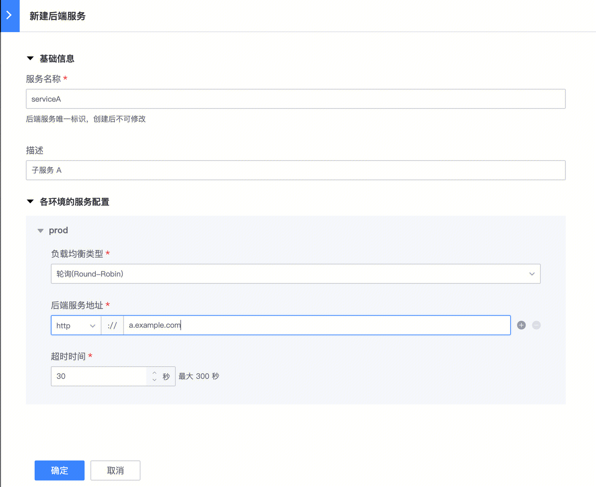
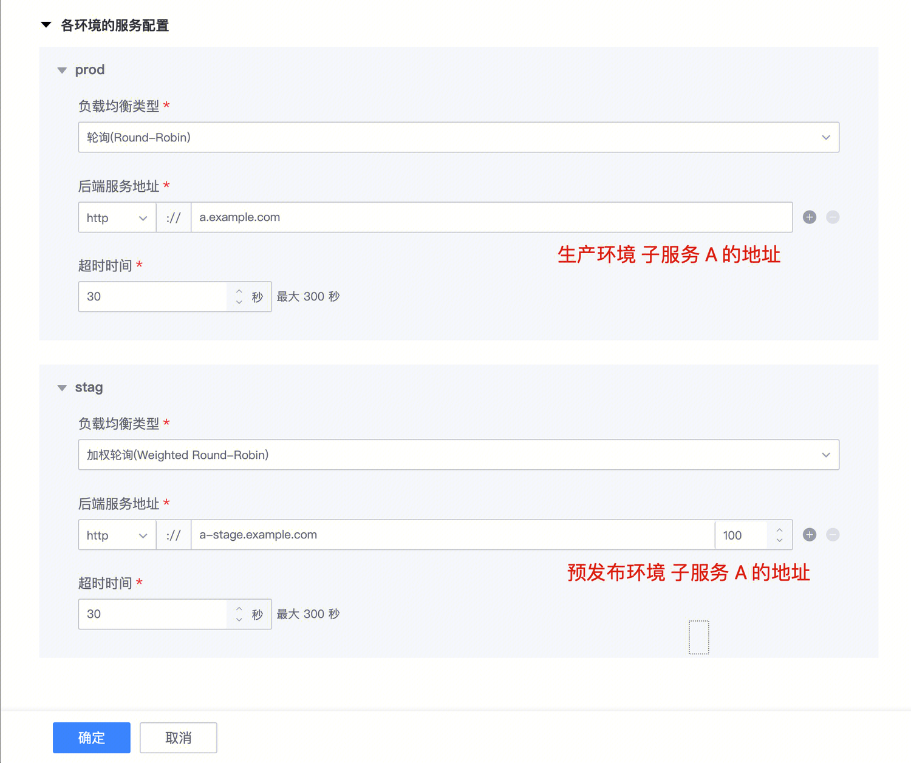
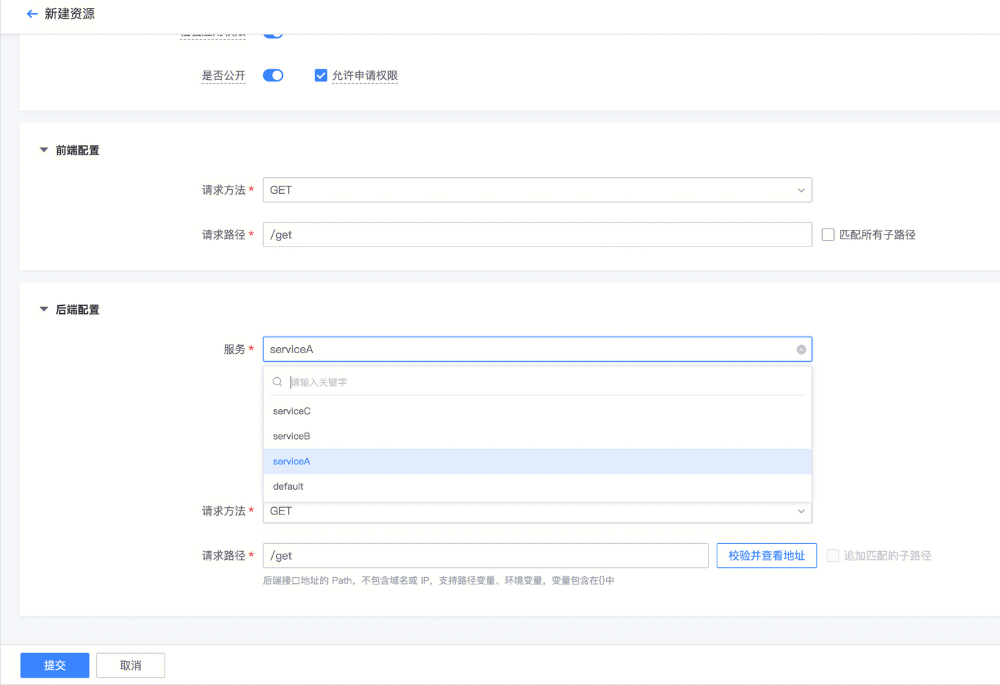
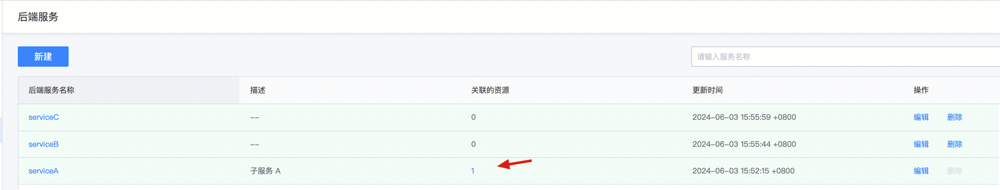
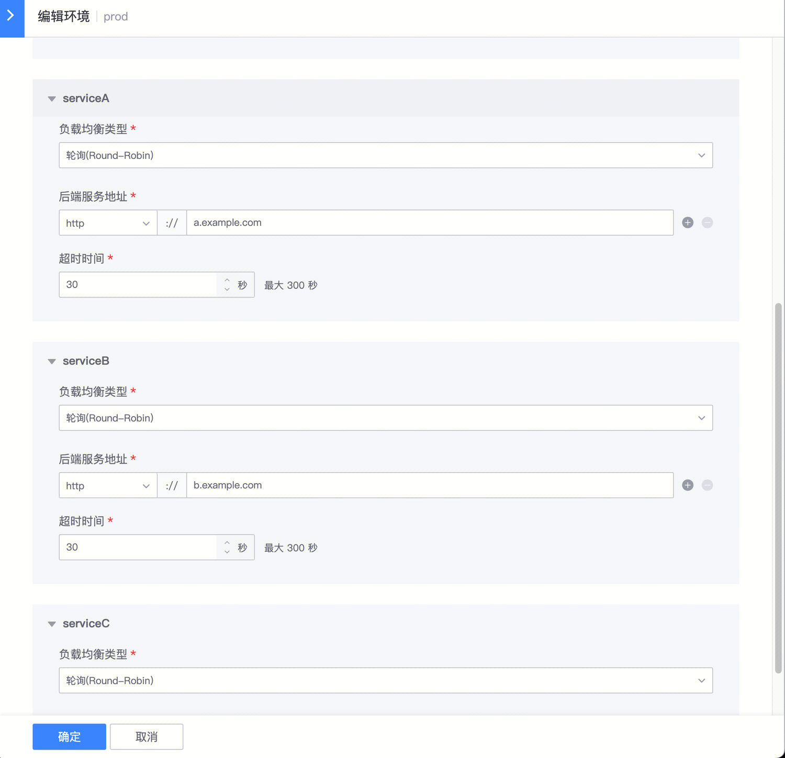

## 使用场景

某个系统，是微服务架构，同时存在 A/B/C 三个子服务需要提供接口给到外部系统调用；此时需要使用同一个网关，那么可以通过后端服务，支持同一个网关代理请求到多个服务

## 如何使用

### 新建后端服务

左侧菜单【后端服务】

如果有多个环境，例如 Prod(正式)/Stag(预发布)，那么需要填写对应环境子服务 A 的地址；

### 新建资源时，选择后端服务

那么，当调用方通过网关这个资源地址`/get`调用时，将会代理到后端服务 `serviceA`对应地址 `http://a.example.com/get`

### 每个后端服务关联的资源

在【后端服务】列表页，可以看到当前每个后端服务关联的资源数量，点击这个数量，会跳转到【资源列表】页面并过滤出对应后端服务关联的资源列表

## 更多说明

### 环境 与 后端服务是什么关系？

是一个矩阵关系

例如：有 prod/stag 2 个环境，有 serviceA/serviceB/serviceC  3 个后端服务，那么实际需要填写 `2*3=6` 个地址

从【后端服务】菜单进入，以后端服务的视角，需要填写每个环境这个后端服务的【后端服务地址】

从【环境概览】菜单进入环境编辑页面，以环境的视角，需要填写这个环境下每个后端服务的【后端服务地址】

### `default` 后端服务

新建网关时，会自动创建一个名为`default`的后端服务；大部分只有一个后端服务的网关可以直接用。

`default`不能修改/删除，但是你可以在实际配置中使用自己新建的后端服务

### 可否多个环境的同一个后端服务填写相同的地址？

【后端服务地址】没有任何限制，但是强烈不建议这么做。

建议做严格的环境隔离，确保不通环境网关调用请求落入对应的环境，避免可能的 bug 及事故。

### 导入导出是否支持多个后端服务

1.13 之前的版本，是通过配置环境变量，然后在资源中引用环境变量来实现 一个网关多个后端服务这种场景；

1.13 开始，自动化导入将会支持多个后端服务（开发中，coming soon)
