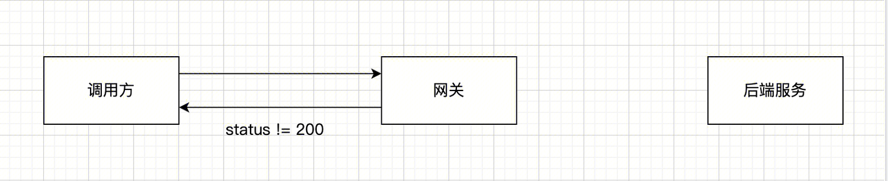
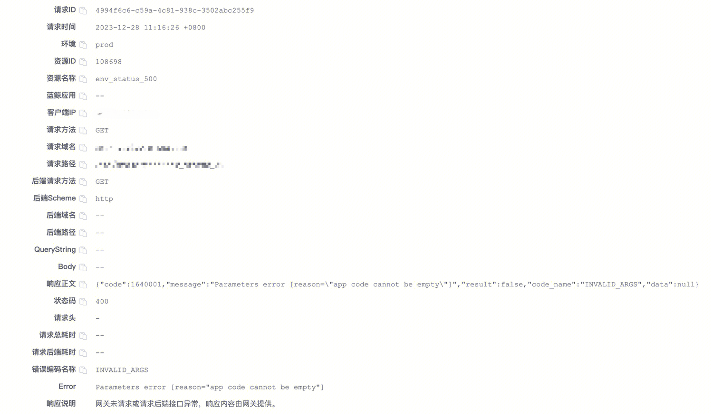
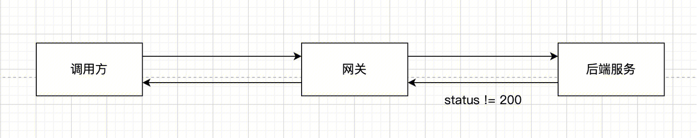
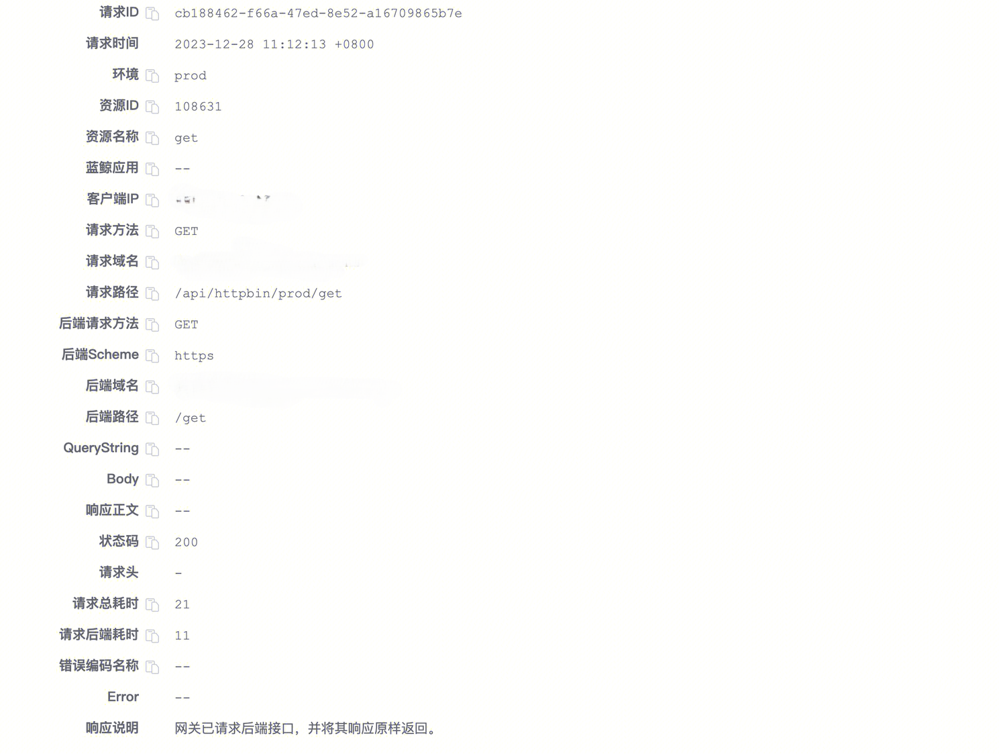
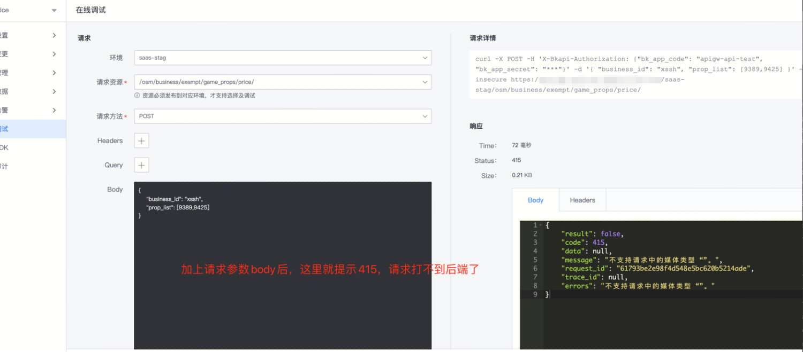

# 如何确认错误的 response 是网关还是后端服务返回的？

[TOC]


## 问题排查步骤

1. 获取响应的状态码/响应体
2. 通过下面的问题，确认是 **网关返回的 response** 还是 **后端接入层或后端服务返回的 response**
3. 如果是 **网关返回的 response**
	- 3.1  可以在 [网关错误响应说明](./error-response.md) 找到所有目前网关返回的非 200 错误详情/可能原因及解决方案，根据方案处理
4. 如果是 **后端接入层或后端服务返回的 response**
    - 4.1 一般状态码 40x 是请求不符合接口要求，查看网关接口文档确认请求是否按要求传递数据
    - 4.2  状态码 50x 可以联系**网关负责人**协助处理，提供必要的信息，网关负责人确认其 **后端接入层或后端服务** 是否有问题 (其接入层和后端服务的流水日志中应该能找到请求记录)
        - 网关 API 文档，输入网关名检索，结果表第三列为网关负责人


## 网关返回的 response



请求经过网关的时候，会经过一系列插件，里面包含一些逻辑例如应用认证，用户认证，频率控制等等，官方插件可能返回非 200 的响应体

但是，所有非 200 的响应体，网关都有统一捕获并做封装，所以会存在固定特征

例如应用认证失败返回状态码 400 的样例：

```json
{
  "code": 1640001,
  "data": null,
  "code_name": "INVALID_ARGS",
  "message": "Parameters error [reason=\"app code cannot be empty\"]",
  "result": false
}
```

**特征**:
- 格式是 `json`
- 错误码`code`, 以 `16`开头
- 字段 `code`,  `data`,  `code_name`,  `message`, `result`
- response header 中存在头 `X-Bkapi-Error-Code` 和 `X-Bkapi-Error-Message`

另外，可以在 网关管理页面 - 运行数据 - 流水日志 中通过日志查看到，响应说明中是 `网关未请求或请求后端接口异常，响应内容由网关提供。`




## 后端接入层或后端服务返回的 response



如果不满足 `网关返回 response`特征的，大概率是**后端接入层或后端服务返回的 response**

确认：
1. 后端接入层以及后端服务的流水日志中有请求记录
2. 在 网关管理页面 - 运行数据 - 流水日志 中通过日志查看到，响应说明中是 `网关已请求后端接口，并将其响应原样返回。`




> 实际调试中，可以使用 curl -vv -L  http://xxxx 来查看实际的调用详情/redirect 跳转过程等

### 1. 返回 一个 html 页面，后端服务流水日志中没有对应的请求记录

**一般是智能网关/后端服务接入层返回的 response, 会有 nginx/openresty/apisix 等关键字**

```json
<html>
<head><title>404 Not Found</title></head>
<body>
<center><h1>404 Not Found</h1></center>
<hr><center>nginx/1.15.5</center>
</body>
</html>

<html>
<head><title>503 Service Temporarily Unavailable</title></head>
<body>
<center><h1>503 Service Temporarily Unavailable</h1></center>
<hr><center>stgw</center>
</body>
</html>

<html>
<head><title>504 Gateway Time-out</title></head>
<body>
<center><h1>504 Gateway Time-out</h1></center>
<hr><center>nginx</center>
</body>
</html>

```

### 2. 返回一个 html 页面或 json, 后端服务流水日志中有对应的请求记录

**后端服务框架返回的 response**

例如 Django 的 [ALLOWED_HOSTS](https://docs.djangoproject.com/en/3.2/ref/settings/#allowed-hosts) 中如果没有配置网关的域名，会出现 400, 并且 response body 是

```html
<h1>Bad Request (400)</h1>
```

例如有些后端服务直接返回一个 json, 但是错误码不是`16`开头的：**后端服务返回的，可以在后端服务流水日志中找到对应请求记录**

```json
# 例子 1
{
  "code": 9900403,
  "permission": {
    "system_name": "配置平台",
    "system_id": "bk_cmdb",
    "actions": [
      {
        "related_resource_types": [
          {
            "system_name": "配置平台",
            "type": "biz",
            "type_name": "业务",
            "system_id": "bk_cmdb",
            "instances": [
              [
                {
                  "type_name": "业务",
                  "type": "biz",
                  "id": "36",
                  "name": "abc"
                }
              ]
            ]
          }
        ],
        "id": "find_business_resource",
        "name": "业务访问"
      }
    ]
  }
}
# 例子 2
{
  "result": false,
  "message": "you have no permission to call this api.",
  "code": 3540100,
  "trace_id": "5ddbc49db2554edbbdf26e6c15ca6884",
  "request_id": "c9d7fe1fcade42869f4ec6b4ac6434f1",
  "data": null
}
```

### 3. 后端返回 status code 415

- `415 Unsupported Media Type`
- `415 不支持请求中的媒体类型`



返回 status code 415 表示后端不支持对应的 `content-type`, 需要 client 发起请求时指定正确的`content-type`，例如如果服务端要求使用 json，那么调用时需要在请求中增加 header `content-type: application/json`

### 4. 后端返回 status code 308

如果在网关的`【环境管理】 - 【代理配置】`中的负载均衡 Host 中配置后端服务地址为 `http://xxx.com`，而 `xxx.com` **只支持 https 访问**，其在接入层可能做了 redirect，也可能直接拒绝访问

此时，调用会出现 308 之类的状态码 (如果调用方的 client 支持 redirect，会继续请求重定向后的接口，状态码是重定向接口返回的）

处理：确认后端服务真实的 scheme

### 5. 后端服务或其接入层存在 IP 白名单

会导致网关转发过去的请求被拒绝。

此时需要将网关的出口 IP，配置到对应后端服务，才能访问。