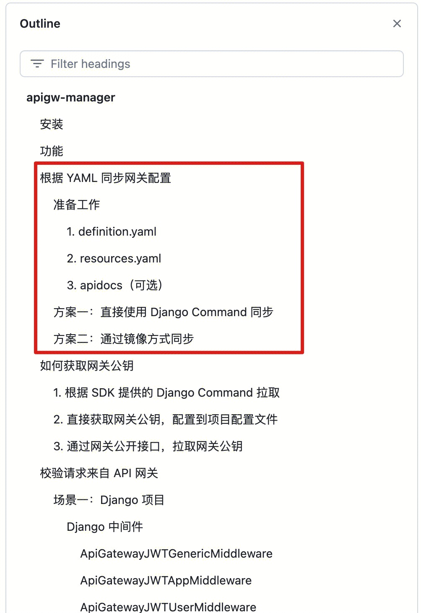

使用网关提供的 SDK / 镜像，各系统可以在发布时自动化新建网关/注册接口/导入资源/导入文档/发布版本等

场景：
- k8s 容器化部署，每次发布都执行接口同步 + 发布，这样就能做到发布版本的同时，更新 API 网关

具体见： [apigw-manager ](https://github.com/TencentBlueKing/bkpaas-python-sdk/tree/master/sdks/apigw-manager) 文档

建议：
1. 使用 Django 的项目，直接安装 apigw-manager SDK 后使用 django command 同步
2. 非 Django 项目，使用镜像方式同步
3. 参考 [如何维护网关文档](manage-document.md) 在开源仓库下维护`doc`目录
4. **如果是原来在 esb 有接入的系统，接入网关的时候，建议评估本身系统容量以及主要调用方的 QPS，配置频率控制（避免来自某个上游的突发流量把本身系统打满，影响到其他系统使用**

