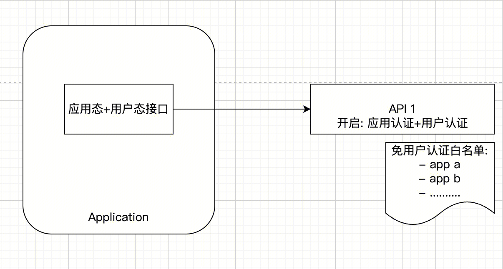
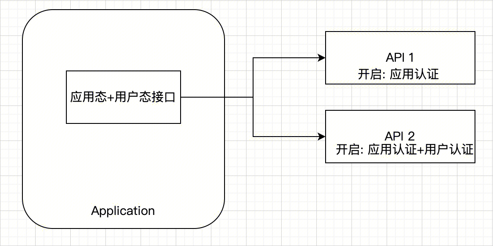
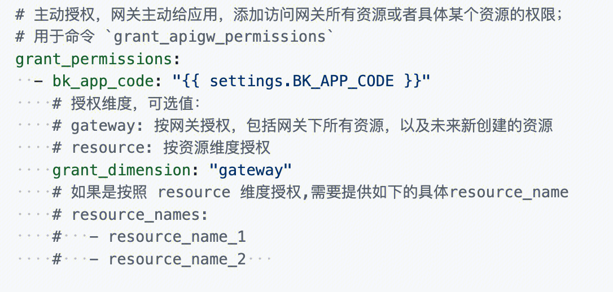
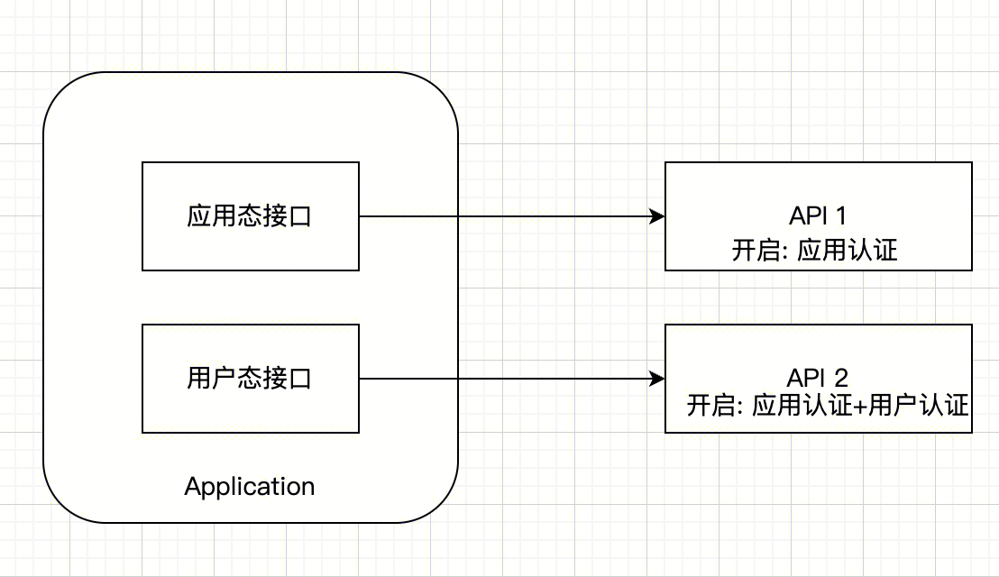

## 背景

目前很多系统在将接口接入网关，或者将原先接入`ESB`的接口迁移到网关。

由于历史原因以及目前的蓝鲸体系限制，原来很多系统的接口都是一套，即开启`应用认证` + `用户认证`(相关文档：[认证](./authorization.md))

跨系统之间的调用有两种用法：

1. 直接用 `admin`
2. 使用虚拟账号

但是，调用接口要求将调用方的`bk_app_code`加入到`免用户认证应用白名单`, 相当于不校验用户，调用方传`bk_username`不受限制，例如传`admin`有所有业务权限，这样的风险非常高

我们希望优化这个机制，所以在新版的网关接入中，不再支持`免用户认证应用白名单`, 将会推动彻底下掉这种用法

未来：

1. bkauth 支持完备的 access_token 逻辑，不再需要`免用户认证应用白名单`
2. 用户管理支持更完善的虚拟账号，或者权限中心支持基于应用的权限管控 (目前只支持自然人), 那么系统之间的调用将支持`权限控制`

## 建议

- `应用态接口` 校验应用，不校验用户
	- **如果接入网关的接口根本不会使用到网关检验后 jwt 中的 bk_username 做业务逻辑，那么请使用·应用态接口·**，即关闭·用户认证·
- `用户态接口` 校验应用，也校验用户

### 网关层面区分`应用态接口` 和 `用户态接口`

> 相当于一个接口，接入网关变量两个 API

> 原先**免用户认证应用白名单** = `应用态接口` + **精确授权**

`应用态接口`需要：

1. **不公开/不允许申请权限**

2. 自助接入使用 grant_permission 直接给 bk_app_code 做**精确授权**(bk_app_code+ 具体资源)

### 系统层面区分`应用态接口` 和 `用户态接口`

> 相当于有两个接口

