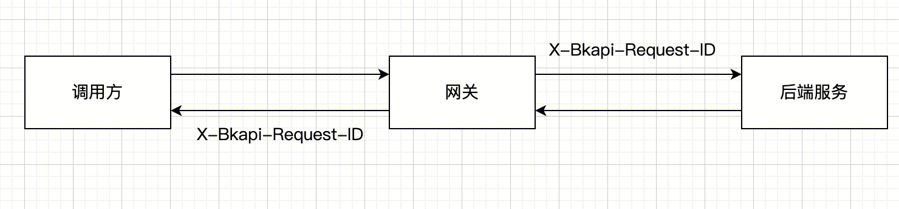
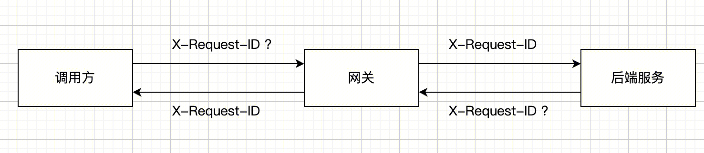

调用网关接口时，网关会在响应的`header`中返回两个头：

```
# 直接调用
curl -v ...

< X-Bkapi-Request-ID: 8a7e599d-0320-452b-b817-760149262621
< X-Request-ID: 8a7e599d0320452bb817760149262621

# 设置了业务 request_id
curl -v -H "X-Request-ID: 123456" ...

< X-Bkapi-Request-ID: 23bfd9de-7787-43f1-b7aa-b1c236f9ded5
< X-Request-ID: 123456
```


| header | X-Bkapi-Request-ID | X-Request-ID |
| ------ | ------ | ------ |
| 说明 | 网关 request_id | 业务 request_id |
| 生成逻辑 | 每个请求经过网关，都会生成唯一的`request_id`, 用于标识这个请求在网关的唯一性; | 如果调用方传递了`X-Request-ID`, 会使用这个值; 如果调用方没有传递`X-Request-ID`, 会使用 `$(X-Bkapi-Request-ID).replace("-", "")`;  |
| 示例 | 8a7e599d-0320-452b-b817-760149262621 | 8a7e599d0320452bb817760149262621 |
| 格式 | 36 位 uuid | 调用方设置的格式 / 32 位 uuid |
| 网关侧是否唯一 | 是 | 不一定，取决于调用方 |
| 网关流水日志查询语法 | `request_id: 8a7e599d-0320-452b-b817-760149262621` | `x_request_id: 8a7e599d0320452bb817760149262621` |


## 网关 request_id: X-Bkapi-Request-ID

请求在经过网关时，网关会生成唯一的 `request_id` 放入 requeest header 传递给后端服务，同时放入 response header.

通过这个`request_id`, 将调用方/网关/被调用方的日志串接起来，例如在网关可以通过`request_id`查询当次请求的日志

建议调用方及被调用方在流水日志以及异常日志中记录这个`X-Bkapi-Request-ID`, 便于问题排查。参考  [请求日志查询语法](./access-log.md)




## 业务 request_id: X-Request-ID

调用方以及上游的代理层，因为业务需求可能会预设一个 header 头 `X-Request-ID` 用于追踪自身的请求

并且这个值**可能不是全局唯一的**, 例如某些场景一次操作调用三次网关接口，使用的同一个 `X-Request-ID`用来标记是同一个操作产生的请求




## FAQ

### 为什么发起调用时没有设置`X-Request-ID`, 返回响应中 `X-Request-ID` 不是 `$(X-Bkapi-Request-ID).replace("-", "")`

发起的请求经过了某些代理 (例如 nginx), 这些代理也会执行一样的操作，检查请求头中如果没有`X-Request-ID`就加上一个; 此时到达蓝鲸 API 网关的时候，已经有了`X-Request-ID` 不会被重新设置

### 为什么发起了调用设置了 `X-Request-ID`, 返回响应中`X-Request-ID` 不是我设置的值？

调用方到网关，网关是`respect`请求中的`X-Request-ID`(不会重置), 然后传递给后端服务;

如果后端服务没有`respect`请求中的`X-Request-ID`, 并且在响应中设置了自己的`X-Request-ID`, 那么这个`X-Request-ID`会被网关`respect`, 返回给到调用方

这就导致 调用设置的`X-Request-ID`跟响应中的`X-Request-ID`不一致;

建议：
1. 后端服务在响应体中不要设置`X-Request-ID`;
2. 后端服务如果要设置`X-Request-ID`, 那么必须使用当次请求 request 中的`X-Request-ID`


