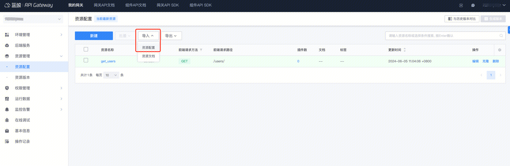
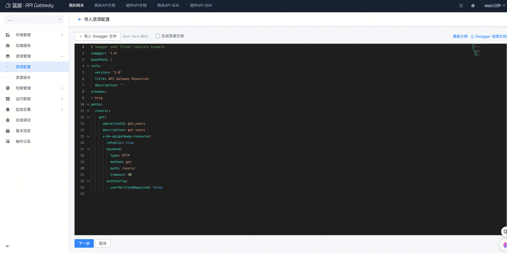
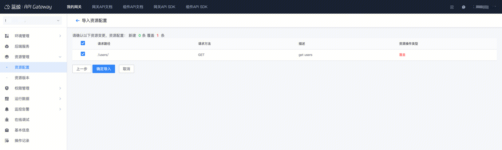
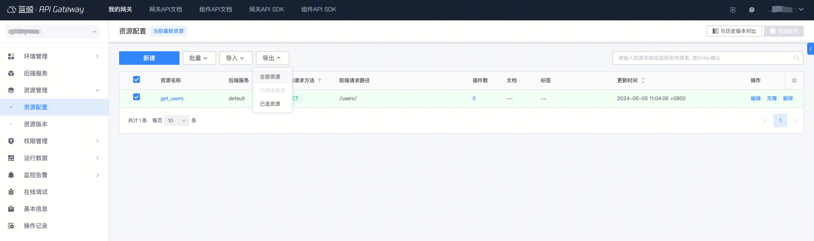
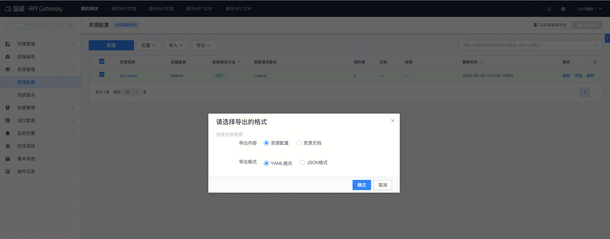

### 注意事项


从网关 1.13 版本开始，支持插件配置导出，即资源的插件配置会随着资源一起被导出，然后如果使用这份配置文件去导入，那么对应插件配置会生效。

所以，**如果是环境相关的配置，例如 IP 白名单/CORS 等，在资源导出之后，需要根据实际情况编辑配置文件，去掉不必要的插件配置**。

### 导入资源
1.在资源管理的列表页选择 `导入`/`资源配置`



2. 提供 swagger 文件或者直接编辑资源配置的 swagger 内容。




> 具体 `swagger`配置说明见：[swagger](./swagger-explain.md)

3. 点击下一步，确定导入即可。




> 资源导入的同时也可以直接导入文档，具体见：[如何维护网关文档](./manage-document.md)


### 资源导出

1. 在资源列表页选择你要导入的资源，然后点击 `导出`



2. 选择导出的格式，选中导出即可。




```yaml

swagger: '2.0'
basePath: /
info:
  version: '2.0'
  title: API Gateway Resources
  description: ''
schemes:
- http
paths:
  /users/:
    get:
      operationId: get_users2
      description: get users
      tags:
      - test
      responses:
        default:
          description: ''
      x-bk-apigateway-resource:
        isPublic: true
        allowApplyPermission: true
        matchSubpath: false
        backend:
          name: default
          method: get
          path: /users/
          matchSubpath: false
          timeout: 30
        pluginConfigs:
        - type: bk-rate-limit
          yaml: |
            rates:
              bk_demo:
              - period: 1
                tokens: 300
              __default:
              - period: 1
                tokens: 100
        authConfig:
          userVerifiedRequired: false
          appVerifiedRequired: true
          resourcePermissionRequired: true
        descriptionEn:


```


