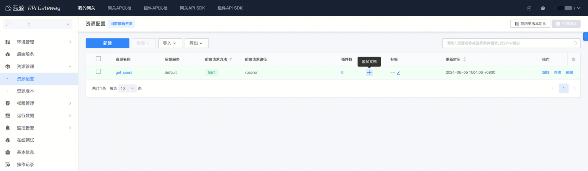
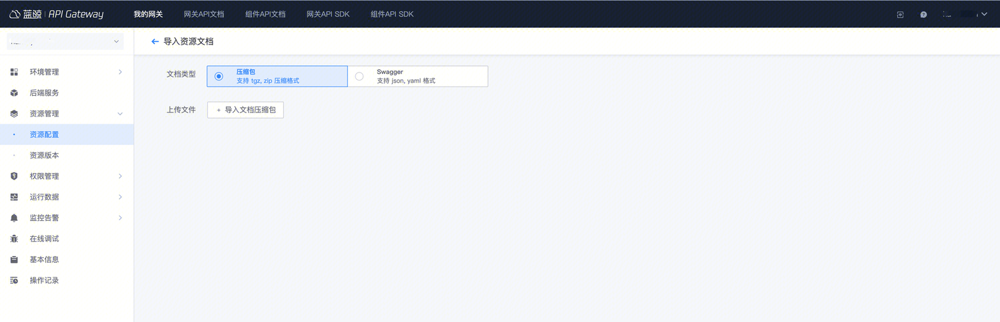
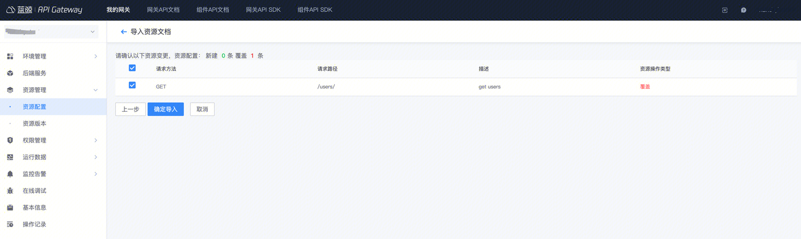
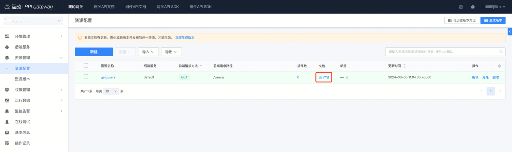
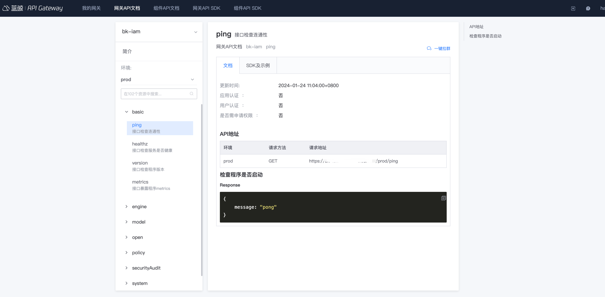

## 1. API 资源文档规范

API 资源文档使用 markdown 语法编辑

### 1.1 文档组成

1. **资源描述**: 描述当前的资源，便于使用者了解资源
2. **输入参数**: 使用表格描述请求参数，建议使用表头：字段、类型、必选、描述
3. **调用示例**: 给出请求参数的示例
4. **响应示例**: 资源返回的结果说明，根据实际情况填写返回字段
5. **响应参数说明**: 根据实际输出，填写相应的表格项，建议使用表头：字段、类型、描述

### 1.2 示例

#### 1.2.1 中文文档示例：

````markdown
### 描述

这是一个描述

### 输入参数
| 参数名称     | 参数类型     | 必选   | 描述             |
| ------------ | ------------ | ------ | ---------------- |
| demo         | string       | 否     | 这是一个样例     |


### 调用示例
```python
from bkapi.smoke.shortcuts import get_client_by_request

client = get_client_by_request(request)
result = client.api.api_test({}, path_params={}, headers=None, verify=True)
```

### 响应示例
```json
```

### 响应参数说明
| 参数名称     | 参数类型   | 描述                           |
| ------------ | ---------- | ------------------------------ |
|              |            |                                |
````

#### 1.2.2 英文文档示例：

````markdown
### Description

This is a description

### Parameters

| Name         | Type         | Required   | Description      |
| ------------ | ------------ | ---------- | ---------------- |
| demo         | string       | Yes        | This is a demo   |

### Request Example
```python
from bkapi.smoke.shortcuts import get_client_by_request

client = get_client_by_request(request)
result = client.api.api_test({}, path_params={}, headers=None, verify=True)
```

### Response Example
```python

```

### Response Parameters
| Name         | Type       | Description                    |
| ------------ | ---------- | ------------------------------ |
|              |            |                                |
````

## 2. 文档维护方式

两种方式维护文档：
1. 在网关管理端 - 资源列表，编辑维护对应接口文档
- 如果网关**没有外发需求**, 只在当前环境有，并且**资源数量不多**, 那么可以使用这种方式维护

2. 在代码仓库中维护文档 markdown 文件，使用压缩包导入
- 如果网关有外发需求 (例如有对外版本，也需要同时发布到 bkop/sg 等环境), 那么建议使用这种方式维护
- 支持 jinja2 模板渲染，并且文本编辑器可以批量进行编辑，效率更高
- 外发时，可以 通过 [自动化接入](./auto-connect-gateway.md) 直接在开源项目中维护一个 doc 目录，使用 [apigw-manager](https://github.com/TencentBlueKing/bkpaas-python-sdk/tree/master/sdks/apigw-manager#3-apidocs%E5%8F%AF%E9%80%89) SDK/镜像完成文档导入

## 3. 方案：维护文档 markdown 文件，使用压缩包导入

### 3.1 编写 markdown 格式资源文档

#### 3.1.1 文档目录及命名

资源文档为 markdown 格式，文件名，应为 `资源名称` + `.md` 格式，例如：资源名称为 get_user 时，则其文档文件名应为 get_user.md。

资源的中文、英文文档，应分别放在目录 `zh`、`en` 下。如果某语言的文档不存在，可忽略对应的目录。

网关资源文档的目录结构样例如下：
```
.
├── en
│   ├── create_user.md
│   └── get_user.md
└── zh
    ├── create_user.md
    └── get_user.md
```

#### 3.1.2 在资源文档中引用公共文档片段

> 使用 jinja2 include 复用公共部分

网关采用 [Jinja 模板](https://jinja.palletsprojects.com/en/3.0.x/templates/) 支持文档文件的引用。对于需采用 Jinja 模板渲染的资源文档，需将文件名后缀设置为 `.md.j2`；对于被引用的公共文档片段，文件名可以以下划线（\_）开头。

网关导入文档时，将分别进入 zh、en 目录，处理中文、英文文档，不同类型的文档，处理方式不同：
- `.md` 为后缀的文档，将直接读取文档内容
- `.md.j2` 为后缀的文档，将以文档所在目录为基准，采用 Jinja 模板进行渲染
- 下划线 (\_) 开头的文档，将跳过解析，此类文档为公共文档片段，非具体资源的文档

例如资源 get_user，采用 Jinja 模板渲染时，其文档文件名应为 `get_user.md.j2`，其引用其它文档示例如下：
```
...

{# 引用公共文档片段 _user_model.md.j2 #}

```

资源文档中包含 Jinja 模板文件时，文档的目录结构示例如下：
```
.
├── en
│   ├── create_user.md
│   ├── get_user.md.j2
│   └── _user_model.md.j2
└── zh
    ├── create_user.md
    ├── get_user.md.j2
    └── _user_model.md.j2
```

### 3.2 归档成压缩包

导入文档时，需将资源文档归档为压缩包，压缩包支持 tgz, zip 两种格式。归档压缩包时，需直接将 zh、en 文档目录打包进压缩包。

在 Linux 系统中，你可以执行以下命名创建压缩包：
```
# 可将 my-gateway-name 替换为具体的网关名
zip -rq my-gateway-name.zip zh en
tar czf my-gateway-name.tgz zh en
```

### 3.3 导入压缩包

在网关的管理页，展开左侧菜单 **点击** 资源管理**，在按钮组**导入**中，选择**资源文档**。

文档类型选择"压缩包"，并选择上一步创建的文档压缩包。



文档变更预览，可选择需更新的资源文档，点击**确定导入**。



导入资源文档后，可在**资源管理**中，查看已导入的资源文档。




### 3.4 参考示例

- 蓝鲸权限中心：
    - [文档仓库](https://github.com/TencentBlueKing/bk-iam-saas/tree/master/saas/resources/apigateway/docs)

效果：




