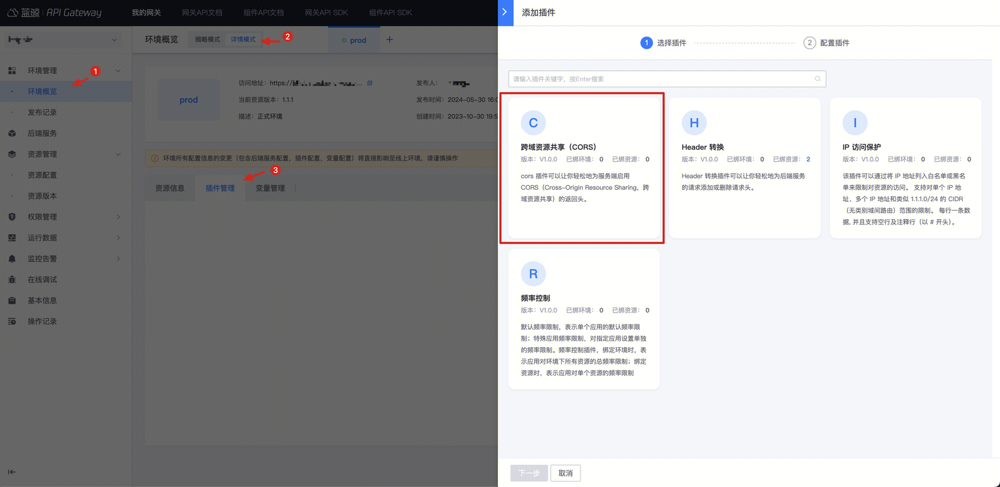
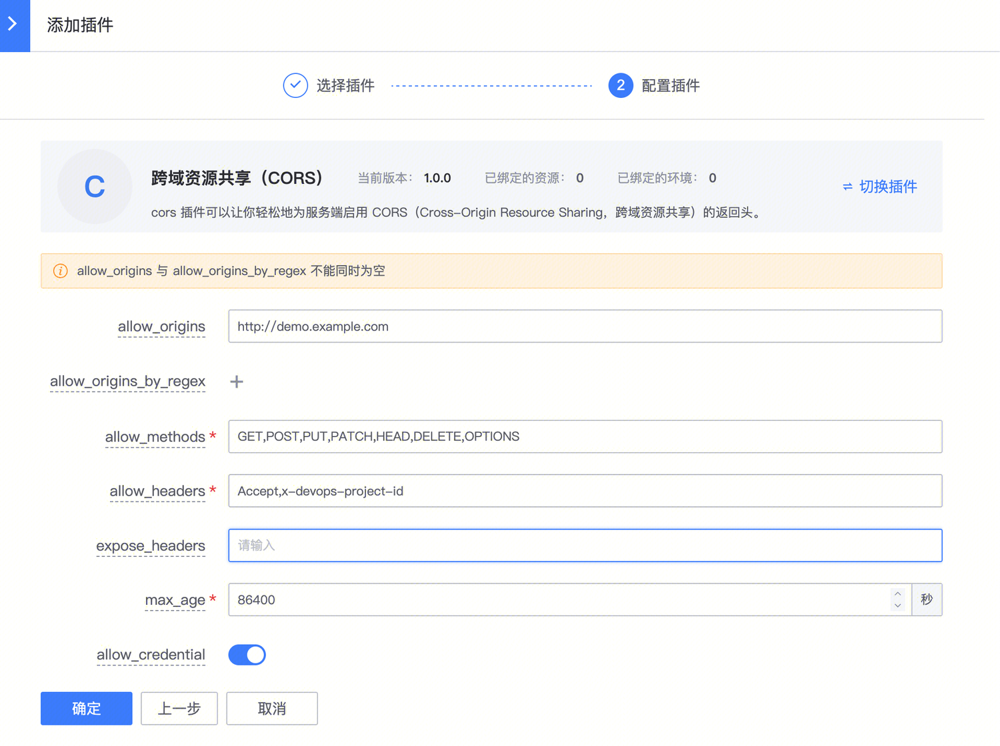
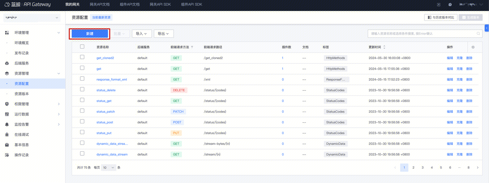
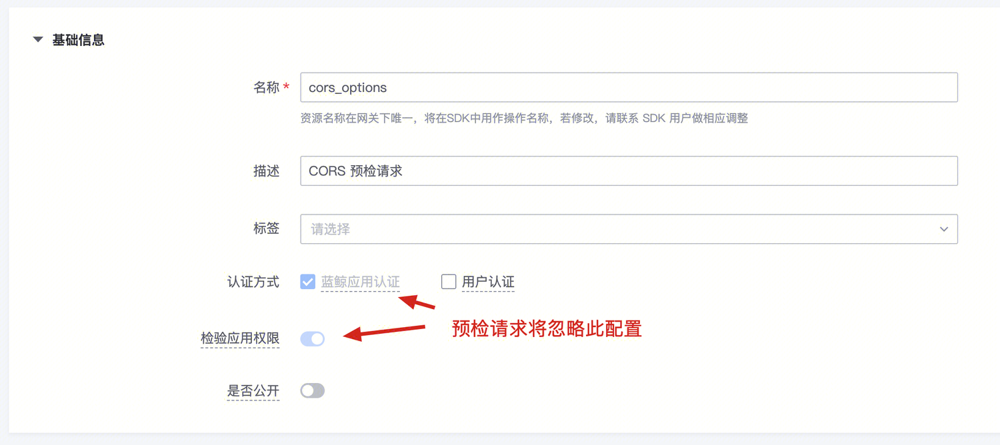
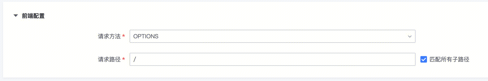
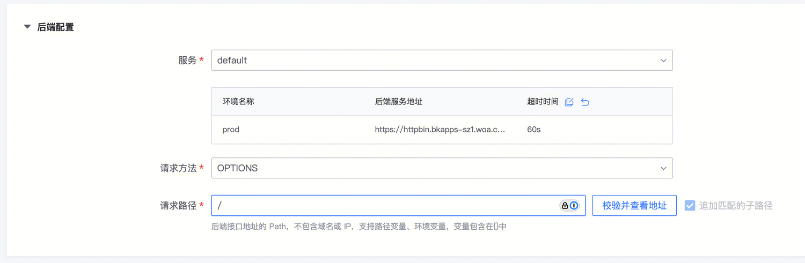
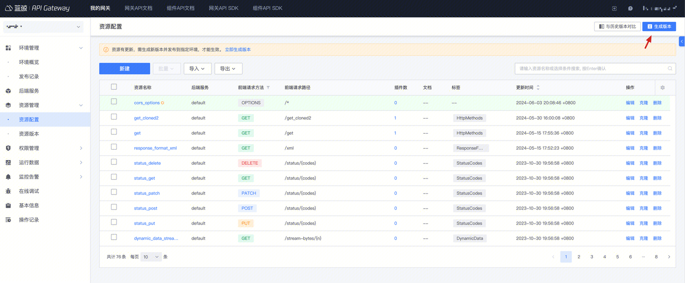
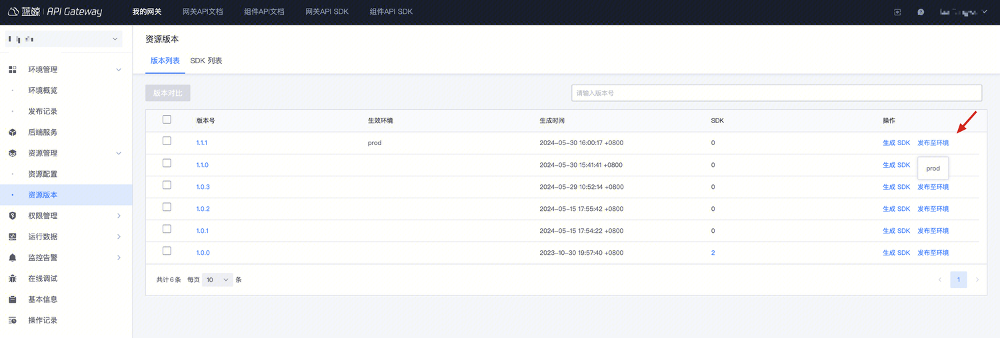

# 支持跨域 CORS


## 背景

[跨域资源共享 (CORS)](https://developer.mozilla.org/zh-CN/docs/Web/HTTP/Access_control_CORS)是一种机制，该机制使用附加的 HTTP 头，支持在浏览器中，Web 应用可以访问另一个源的资源。

出于安全性，浏览器限制脚本内发起的跨源 HTTP 请求。根据同源策略，应用只能请求同一个域的 HTTP 资源，除非响应报文包含了正确 CORS 响应头。

在某些场景，例如蓝盾流水线访问第三方插件接口，如果没有配置跨域，那么将会被浏览器拦截，此时可以将接口接入蓝鲸 API 网关，并且绑定 CORS 插件解决跨域问题。


注意：
- 如果环境和资源都开启了 跨域 CORS，**资源的跨域 CORS 生效（优先级最高）**

## 步骤

### 1. 新建 CORS 插件

#### 入口

在【环境管理】- 详情模式 - 【插件管理】- 【立刻添加】选择【跨域资源共享（CORS）】插件

`注意: 建议在环境中配置 CORS 插件，而不是在资源上，否则预检+需要生效的所有资源都得单独配置; 如果漏配了将会发现不生效`



#### 配置说明



1. **allowed origins**: 首部 `Access-Control-Allow-Origin`，指定允许访问该服务的请求域，如 `http://demo.example.com`
  - **重要**: 一般配置为请求云 API 的浏览器中页面的域名，支持泛域名，此时请配置 **allow_origins_by_regex**(注意 allow_origins、allow_origins_by_regex 只能一个有效)
  - 例如，允许内外所有 example 域名，需要配置为：
    - `^http://.*\.example\.com$`
    - `^https://.*\.example\.com$`
  - 其他示例： `^https://.*\.example\.com:8081$`  此正则允许 https://a.example.com:8081, https://b.example.com:8081
2. **allowed_methods**: 首部 `Access-Control-Allow-Methods`，用于预检请求的响应，指明实际请求所允许使用的 HTTP 方法
3. **allowed_headers**: 首部 `Access-Control-Allow-Headers`，用于预检请求的响应，指明实际请求中允许携带的首部字段
    - **重要**: 如果请求云 API 时，包含了自定义的请求头，则需将此请求头添加到 Allowed headers，例如蓝盾的请求包含请求头 `x-devops-project-id`，则需将此请求头添加到 Allowed headers
4. **expose_headers**: 首部 `Access-Control-Expose-Headers`，表示允许浏览器访问的响应首部字段
5. **max_age**: 首部 Access-Control-Max-Age，表示预检结果的缓存时间，单位秒
6. **allow_credential**: 首部 `Access-Control-Allow-Credentials`，表示是否允许发送身份凭证，如 Cookies、HTTP 认证信息等

### 2. 创建预检请求资源

跨域资源共享规范要求，对可能对服务器数据产生副作用的 HTTP 请求，浏览器必须首先使用`OPTIONS`方法发起一个预检请求`preflight request`，从而获知服务端是否允许该跨域请求。为支持`预检请求`，网关需创建一个请求方法为 OPTIONS 的资源。

#### 入口

在【资源管理】- 【资源配置】 - 【新建】



新建一个资源

#### 配置说明

**基础信息**：
- 名称：cors_options
- 描述：CORS 预检请求
- 认证方式
  - 应用认证：是/否（预检请求，将忽略此配置）
  - 用户认证：否
- 校验访问权限：否（预检请求，将忽略此配置）
- 是否公开：否



**前端配置**:
- 请求方法：OPTIONS
- 请求路径：/，匹配所有子路径：是



**后端配置**:
- 服务：default（或其他生效的后端服务）
- 请求方法：OPTIONS
- 请求路径：/，追加匹配的子路径：是


### 3. 生成版本并发布

新增资源需要生成版本并发布到环境，才生效

入口：【资源管理】- 【资源配置】- 【生成版本】



生成版本后，发布到目标环境（第一步新建 CORS 插件对应的环境）



### 4. 验证是否生效

模拟预检请求，调用对应接口，确认响应头中是否带了第一步 CORS 中的配置

- Origin 替换为源站点的地址
- url 替换为访问的网关 api url

```bash
curl -vv -XOPTIONS  -H "Origin: https://demo.example.com"  https://bkapi.example.com/xxxxx/prod/aaa/bbb/ccc
```

## 其他

### 如果同时后端也配置了 CORS 相关响应头，哪个生效？

如果环境或资源配置了`跨域资源共享(CORS)`插件，而后端接口也生成了 CORS 相关的响应头，将**优先使用网关生成的 CORS 响应头**

```
# 网关生成 CORS 响应头
Access-Control-Allow-Origin: http://demo.example.com
Access-Control-Allow-Credentials: true

# 后端接口生成响应头
Access-Control-Allow-Origin: http://demo2.example.com
Access-Control-Allow-Credentials: true

# 请求方获取到的 CORS 响应头
Access-Control-Allow-Origin: http://demo.example.com
```