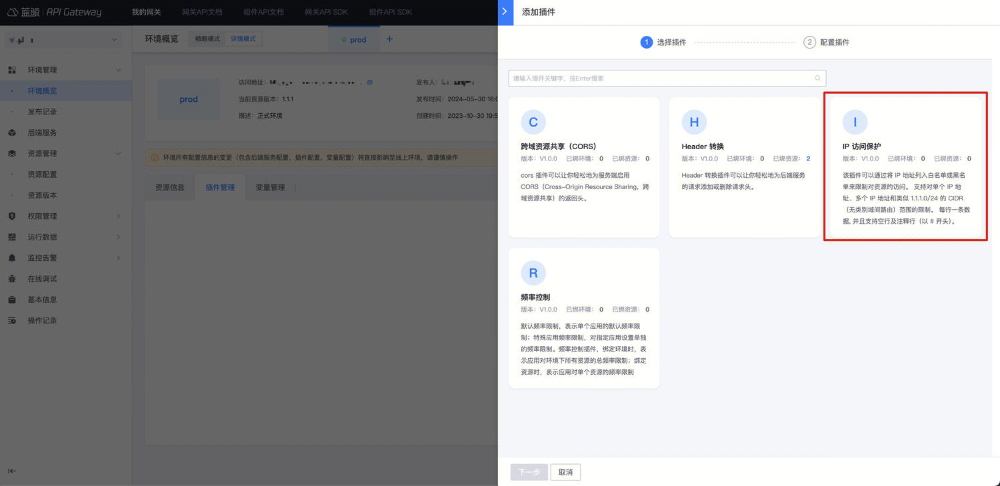
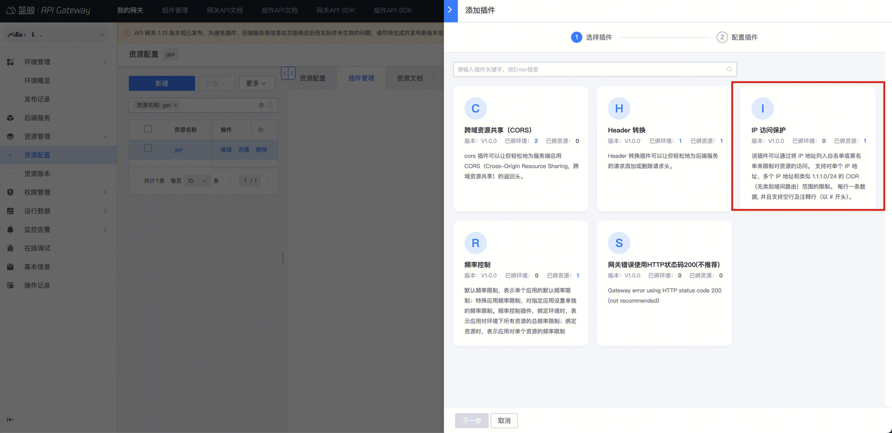
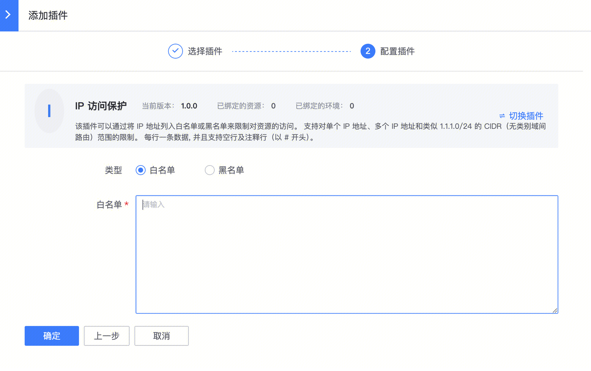

# 开启 IP 访问控制

## 背景

IP 访问控制，用于“允许”或“拒绝”某些请求来源的 IP 访问资源，实现基于请求来源 IP 的权限控制。
- “允许”IP 访问，即设置 IP 白名单，只有指定的 IP 可以访问资源
- “拒绝”IP 访问，即设置 IP 黑名单，拒绝指定的 IP 访问资源，其它未指定的 IP 可以访问资源

注意：
- 如果环境和资源都开启了 IP 访问控制，**资源的 IP 访问控制生效（优先级最高）**

## 步骤

### 选择环境或者资源

如果相对一个环境下的所有资源生效，那么可以在环境上新建【IP 访问保护】插件
入口：【环境概览】- 【详情模式】- 【插件管理】

如果仅针对某个资源生效，可以在资源上新建【IP 访问保护】插件
入口：【资源管理】- 【资源配置】- 找到资源 - 点击插件名称或插件数 -  【添加插件】

### 配置【IP 访问保护】插件

按需选择白名单或黑名单，每行一个 IP 或 CIDR，并且支持空行以及注释（`#`号开头的行）

### 确认是否生效

- 如果是在环境上新建插件，立即生效
- 如果是在资源上新建插件，需要生成一个资源版本，并且发布到目标环境