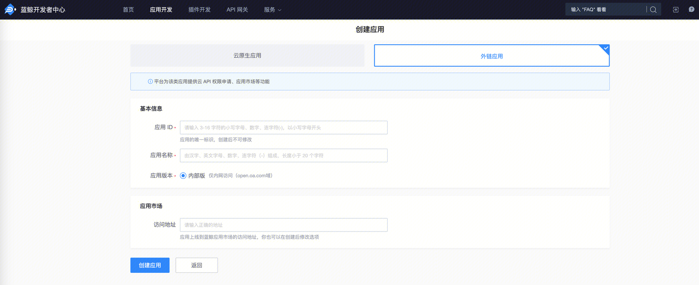

# 调用 ESB API

[toc]

## 1. 获取蓝鲸应用身份

访问云 API 时，如果云 API 开启了**应用认证**，则调用时需要提供蓝鲸应用账号。更多认证相关解释见 [认证](../Explanation/authorization.md)

以下步骤引导您创建蓝鲸应用，并获取蓝鲸应用账号（应用 ID：`bk_app_code`、应用秘钥：`bk_app_secret`）。

### 1.1 确定应用类型并创建应用

进入 蓝鲸开发者中心 - 创建应用

蓝鲸开发者中心提供了两种应用类型：
- 如仅需调用网关接口，创建**外链应用**即可
- 如后续有应用开发和部署需求的，可以选择**云原生应用**



### 1.2 获取应用账号

访问 蓝鲸开发者中心 - 应用开发，搜索应用，并进入应用的管理页。

在应用管理页，展开左侧菜单**应用配置**，点击**基本信息**。
右侧页面鉴权信息中的`bk_app_code`和`bk_app_secret`，即为访问云 API 所需的蓝鲸应用账号。


## 2. 获取蓝鲸用户身份

访问云 API 时，如果云 API 开启了**用户认证**，则调用时需要提供代表用户身份的信息。更多认证相关解释见 [认证](../Explanation/authorization.md)

目前，网关支持的蓝鲸用户身份信息有以下两种：
- 用户登录态：用户登录蓝鲸后，存储在浏览器 Cookies 中的用户登录凭证，一般有效期不超过 24 小时
- 用户 access_token：用户登录蓝鲸后，利用用户登录态换取的用户 access_token，有效期 180 天

### 2.1 用户登录态

> 推荐优先使用

用户登录蓝鲸后，在浏览器 Cookies 中会存储用户的登录凭证，此登录凭证，即可代表用户身份。

使用 Chrome 浏览器，登录任意一个蓝鲸站点，F12-Application-Cookies，搜索`bk_token`

蓝鲸用户的登录态信息如下：

| Cookies 字段 | 说明 |
|--------------|------|
| bk_token | 用户登录态 |

### 2.2 用户 access_token

> 离线任务/脚本等场景使用

利用用户登录态，调用 bkoauth 接口，可以换取用户 access_token + refresh_token；
该 access_token 有效期 **180** 天，可以使用 refresh_token 进行刷新。

具体见 [access_token](../Explanation/access-token.md)

## 3. 申请对应 ESB API 调用权限

访问 蓝鲸开发者中心 - 应用开发，搜索应用，并进入应用的管理页。

点击左侧菜单**云 API 权限**，进入云 API 权限管理页，切换到**组件 API**页。


在系统列表中，筛选出待申请权限的组件系统，点击系统名，然后，在右侧页面选中需访问的组件 API，点击**批量申请**。

在申请记录中，可查看申请单详情。待权限审批通过后，即可访问组件 API。


进入云 API 权限管理页，切换到**已有权限**页，类型选择`组件 API`，可查看应用当前拥有的组件 API 权限列表。


## 4. 调用 API

### 4.1 HTTP 直接调用

请求参数：

- 请求协议：请求方法及请求地址，可在组件 API 文档中查看
- 认证信息：应用信息 (`bk_app_code + bk_app_secret`)、用户信息 (`用户登录态` 或 `access_token`)，通过请求头`X-Bkapi-Authorization`传递，值为 JSON 格式字符串。
- 组件 API 参数：可在组件 API 文档中查看

curl 调用示例：
```shell
curl -XPOST ' https://bkapi.example.com/xxxxx/prod/aaa/bbb/ccc' \
    -H 'X-Bkapi-Authorization: {"bk_app_code": "x", "bk_app_secret": "y", "bk_token": "z"}' \
    -d '{"bk_biz_id": 1}'
```

python 调用示例：

```python
import json
import requests

requests.post(
    " https://bkapi.example.com/xxxxx/prod/aaa/bbb/ccc",
    headers={
        "X-Bkapi-Authorization": json.dumps({
            "bk_app_code": "x",
            "bk_app_secret": "y",
            "bk_token": "z"
        })
    },
    json={"bk_biz_id": 1},
)
```

### 4.2 通过 SDK 调用

访问  API 帮助中心 - 组件 API SDK

- 在**SDK 列表**页，可查看或下载当前提供的最新版本组件 SDK
- 在**SDK 说明**页，可查看如何使用组件 SDK


注意：
1. 需要配合使用 **蓝鲸开发框架** + **蓝鲸开发者中心** 运行时注入 `BK_COMPONENT_API_URL` 才能调通
2. 本地开发如果想要调用，需要 export 这个环境变量，否则会报异常 `EndpointNotSetError`
