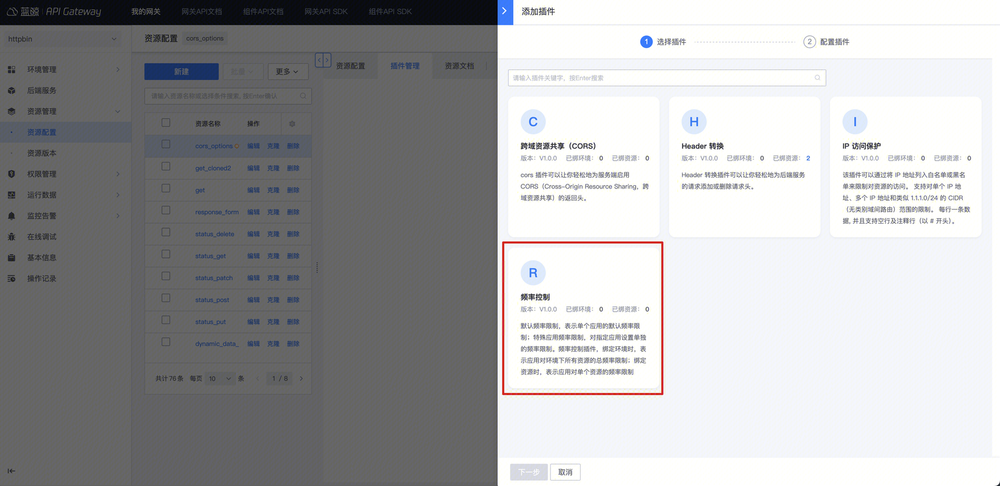
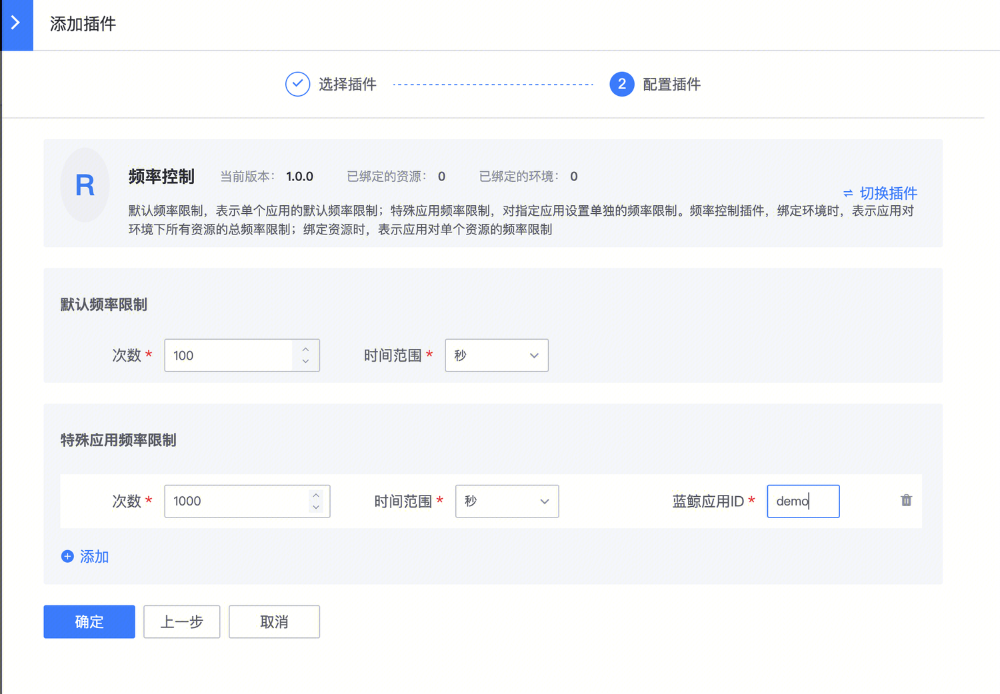

# 开启频率限制

## 背景

某些场景下，网关需要对上游调用方进行频率限制。避免因为上游短时间的大流量导致后端服务受影响。

频率控制插件
- 支持按秒、分、小时、天为单位进行限制
- 支持配置默认的频率限制（对每个应用生效），对特殊应用配置单独的频率限制（可以对特殊应用调整大小）

注意：
- 如果在环境上配置频率控制插件，表示**对应用访问环境下所有资源的总访问频率进行限制**
- 如果在资源上配置频率控制插件，表示**对应用访问单个资源的频率进行限制**
- 如果在环境和资源上都配置了频率控制插件，那么**两个都会生效**，先校验资源的频率限制，再校验环境的总频率限制

其他：
- 网关将直接拒绝应用超过频率限制部分的请求，对其它应用的请求无影响。
- 响应状态码是 [429](../../FAQ/error-response.md)
- 网关采用 fixed window 算法。存在一些缺陷

## 步骤

### 选择环境或者资源

如果相对一个环境下的所有资源生效，那么可以在环境上新建【频率控制】插件
入口：【环境概览】- 【详情模式】- 【插件管理】

如果仅针对某个资源生效，可以在资源上新建【频率控制】插件
入口：【资源管理】- 【资源配置】- 找到资源 - 点击插件名称或插件数 -  【添加插件】

### 配置【频率控制】插件

### 确认是否生效

- 如果是在环境上新建插件，立即生效
- 如果是在资源上新建插件，需要生成一个资源版本，并且发布到目标环境