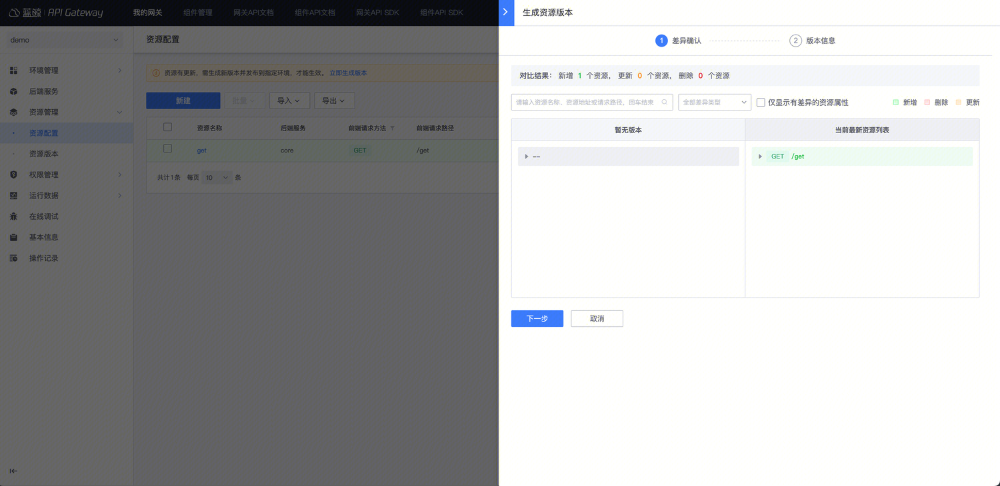
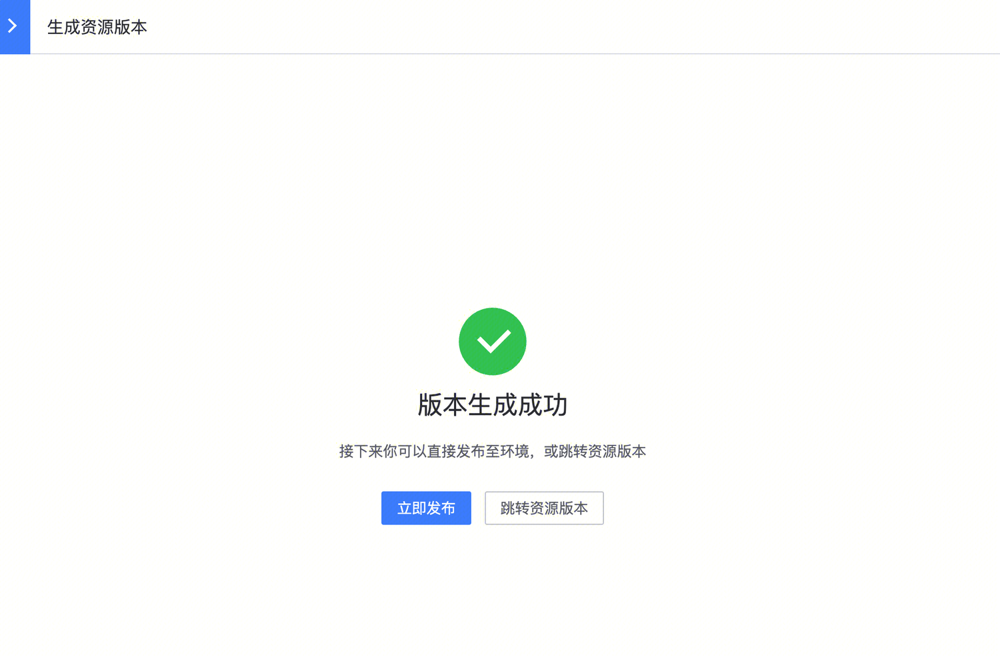
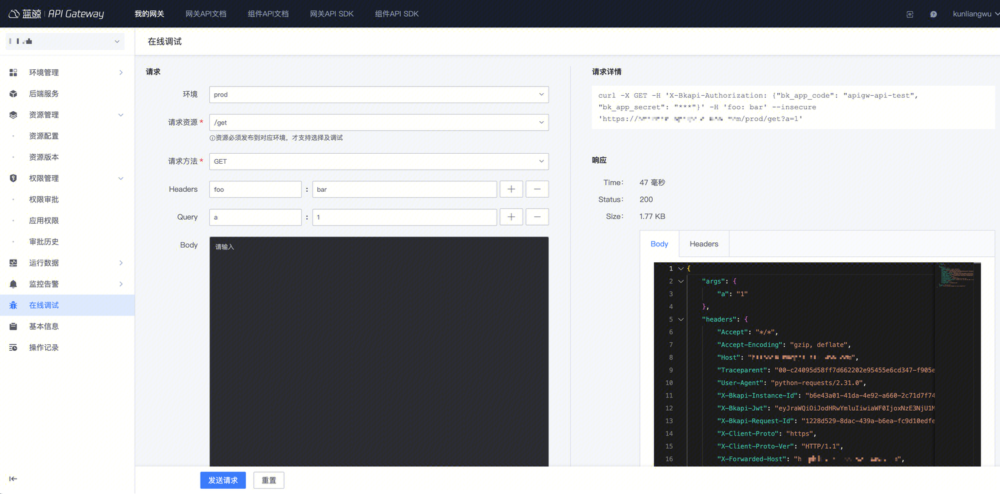
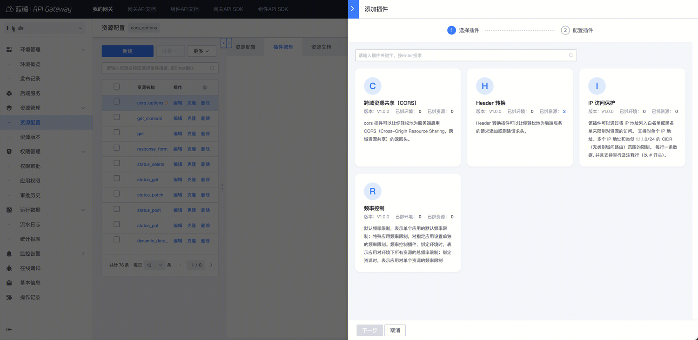
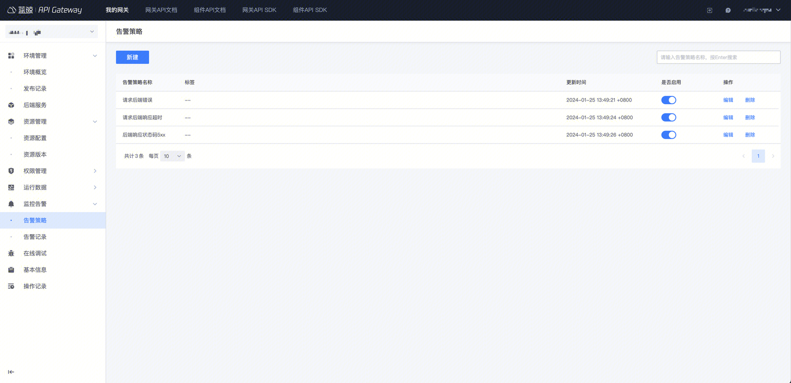

# 接入网关
## 1. 创建网关及发布资源

### 1.1 创建网关

进入  `蓝鲸 APIGateway` 官网首页，点击【新建网关】

输入网关名，维护人员和描述

是否公开选择【是】
1. 用户可以在 `蓝鲸开发者中心` - 【云 API 权限】查看到网关公开的 API，申请权限
2. 用户可以在 `网关 API 文档` 查看到网关介绍/负责人和详细文档

是否公开选择【否】
1. 网关对用户不可见，无法申请权限/查看文档等；仅用于内部私有服务使用，只能通过网关管理员在【权限管理】主动授权

### 1.2 新建环境

网关支持多环境，即，可以同时创建生产/预发布/开发联调环境，然后将对应环境的后端服务地址配置好，就能实现，同一套 API 资源，发布到不同的环境；

举例：新建一个 API，发布到开发联调环境，此时请求将转发到测试环境对应后端服务，可以用于联调，确认无误后，可以将这个版本发布到生产环境。

默认，网关会创建一个`prod`环境；

- 如果使用默认`prod`环境，直接编辑即可；
- 如果需要更多环境，则点击【+】新建环境

说明：
- 环境名称，会作为方外地址的一部分且不可变更，建议命名简短意义明确，例如开发环境 dev，测试环境 test，预发布环境 stage，生产环境 prod
- 描述
- 后端服务配置：后端服务说明详见 [概念说明：后端服务](../../Explanation/backend.md)

### 1.3 新建后端服务

[概念说明：后端服务](../../Explanation/backend.md)

后端服务用于支持一个网关代理请求到多套后端服务的场景，适用于后台有多个模块或者微服务需要提供同一的网关给到外部。

默认系统会新建一个后端服务`default`

- 如果使用默认的`default`后端服务，直接编辑即可；
- 如果需要更多的后端服务，在左侧菜单【后端服务】- 【新建】

说明：
- 服务名称：建议以模块名或微服务名称命名，这样在配置接口转发到的目标后端服务时，可以明确知道转发到哪个模块
- 描述
- 各环境的服务配置：需要填写每个环境对应的这个后端服务的地址，例如生产环境 core 模块地址是`http://core.xxx.com`，测试环境 core 模块地址是`http://test.core.xxx.com`；（也可以是 IP+ 端口号）

注意：
- 这里的服务地址是`域名`或 `IP+端口号`, 不包含路径部分
- 需要选择合适的超时时间，不建议过大

### 1.4 新建资源

> 一个网关资源，等于一个对外暴露的 API

入口：左侧菜单【资源管理】-【资源配置】- 【新建】

#### 1.4.1 基本信息

说明：
- 资源名称：资源名称将用作网关 SDK 中的方法名，请设置一个含义明确的名称
- 认证方式：是否认证应用和用户，详见 [概念说明：认证](../../Explanation/authorization.md)
- 校验应用权限：需要应用开发者到蓝鲸开发者中心申请 应用调用该 API 的权限，审批通过后，这个蓝鲸应用才能调用这个 API, 否则会返回无权限，详见 [概念说明：认证](../../Explanation/authorization.md)
- 是否公开：若勾选，则表示公开，用户可查看文档、申请权限，否则，对用户隐藏
- 允许申请权限：若勾选，则蓝鲸应用可主动申请权限，否则，申请权限中不展示，只能网关主动为蓝鲸应用授权

#### 1.4.2 前端配置

> 用户请求网关 API 接口地址 = 网关环境地址 + 前端配置的请求路径
> 请求网关 API 接口方法=前端配置的请求方法

说明：
- 请求路径中可配置路径变量，例如 `/blog/{blog_id}`

#### 1.4.3 后端配置

> 后端配置决定了这个接口请求将会转发到哪里，转发的目标请求方法和路径是什么

说明：
- 选择后端服务，例如这个 API 将会转发到后端服务 core (选择后，会展示明确的后端服务地址和超时配置)
- 配置请求方法和路径，配置后，可以点击【校验并查看地址】，可以看到最终的地址

### 1.5 生成版本

资源配置新增或修改/删除后，需要生成版本，发布到目标环境才能生效；（类似 git 打 tag 后，将 tag 发布到目标环境）；本质上生成版本是为了生成一个配置的`快照`，通过版本发布到目标环境，避免在管理端的修改影响到线上正在处理的请求

入口：左侧菜单【资源管理】-【资源版本】- 【生成版本】

点击【生成版本】后，会首先对比 当前编辑区的数据与最后一个版本的差异，即本次变更了什么（类似 git diff）

确认对比出来的变更都是预期内的，可以点击【下一步】

此时需要确认版本信息，填写版本号和版本日志，点击【确定】

此时可以【立即发布】或者【跳转到资源版本】查看最新生成的版本

### 1.6 发布

入口：
1. 生成版本后的【立即发布】
2. 左侧菜单【资源管理】-【资源版本】找到版本记录，选择【发布至环境】
3. 左侧菜单【环境管理】- 【环境概览】找到目标环境，选择【发布资源】

点击【下一步】，会再次出发对比逻辑，会对比当前环境生效版本，与即将发布版本的差异

点击【确认发布】

再次确认，即开始进行发布

## 2. 管理及调试

### 2.1 权限管理

- 【权限管理】- 【权限审批】：可以看到应用开发者在蓝鲸开发者中心 - 云 API 中申请的单据，进行审批，审批后应用才有调用网关 API 的权限
- 【权限管理】- 【应用权限】：可以看到当前的权限信息，并可进行【主动授权】
- 【权限管理】- 【审批立式】：可以看到所有权限审批记录

说明：
- 主动授权中，可以按网关或按资源维度授权，`按网关`维度代表应用有权限调用网关的所有接口（包括现有及未来新增的）； `按资源`维度代表应用仅有部分接口权限

### 2.2 在线调试

新建或更新资源以及相关插件，生成版本并发布到目标环境后，可以在【在线调试】，选择环境，请求资源，填写相关的参数进行调试。

注意，新增或修改的资源，必须生成版本并发布到目标环境，这里才能看到/生效

### 2.3 运行数据

可以在【运行数据】- 【流水日志】中查看到网关流水日志，并可以根据时间/环境/状态码/request_id 等条件过滤得到关注的数据

注意：状态码 200 的请求不会记录响应体 (response body)

可以在【运行数据】-【统计报表】查看到统计图表

## 3. 增强功能

### 3.1 配置插件

如果相对一个环境下的所有资源生效，那么可以在环境上新建插件
入口：【环境概览】- 【详情模式】- 【插件管理】

如果仅针对某个资源生效，可以在资源上新建插件
入口：【资源管理】- 【资源配置】- 找到资源 - 点击插件名称或插件数 - 【添加插件】

当前支持的插件：

- [支持跨域 CORS](../Plugins/bk-cors.md)
- [开启 IP 访问控制](../Plugins/bk-ip-restriction.md)
- [开启频率限制](../Plugins/bk-rate-limit.md)
- [请求 header 转换](../Plugins/bk-header-rewrite.md)
- [bk-mock](../Plugins/bk-mock.md)
- [API 熔断](../Plugins/api-breaker.md)
- [请求校验](../Plugins/request-validation.md)
- [故障注入](../Plugins/fault-injection.md)
- [响应重写](../Plugins/response-rewrite.md)
- [重定向](../Plugins/redirect.md)
- [Access token 来源](../Plugins/bk-access-token-source.md)
- [用户名必填](../Plugins/bk-username-required.md)
- [请求体大小限制](../Plugins/bk-request-body-limit.md)
- [用户限制](../Plugins/bk-user-restriction.md)
- [代理缓存](../Plugins/proxy-cache.md)
- [URI 拦截](../Plugins/uri-blocker.md)

### 3.2 提供文档

在左侧菜单【资源管理】-【资源配置】- 资源列表中，可以点击【添加文档】

更多详见  [如何维护网关文档](manage-document.md)

文档编辑完成后，可以生成并发布，即可在【[网关 API 文档]】中在线查看。

注意：只有网关、资源均为公开时，可在线查看文档。

### 3.3 生成 SDK

在左侧菜单【资源管理】-【资源版本】的版本列表中，可以点击【生成 SDK】

配置相关信息，选择对应语言后，点击确定，即生成 SDK；

生成后，

如果网关是公开的，那么在 `网关 API SDK` 的列表中可见，开发者可以下载/安装 SDK

### 3.4 配置监控告警

网关请求后端接口失败时，可配置告警规则，告警给网关维护者或其他通知对象。

目前，网关支持为三种类型的后端错误，配置告警规则
- 后端响应状态码 5xx，后端接口正常响应，但是响应的状态码为 500 ~ 599 时告警
- 请求后端响应超时，后端接口响应时间，超过了资源设置的超时时间时告警
- 请求后端 502 错误，请求后端接口时，出现网络错误等情况时告警

创建网关时，将默认创建三种类型的告警策略。
在网关的管理页，展开左侧菜单**监控告警**，点击**告警策略**，打开告警策略管理页。网关管理员可新建、编辑、或禁用告警策略。

### 3.5 自助接入及导入导出

详见：

- [如何导入导出资源](import-and-export.md)
- [自动化接入](auto-connect-gateway.md)

