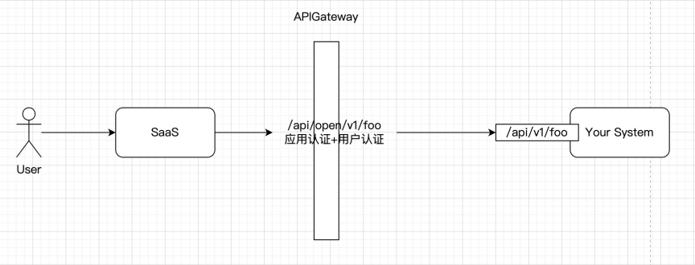
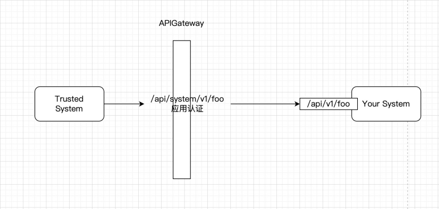
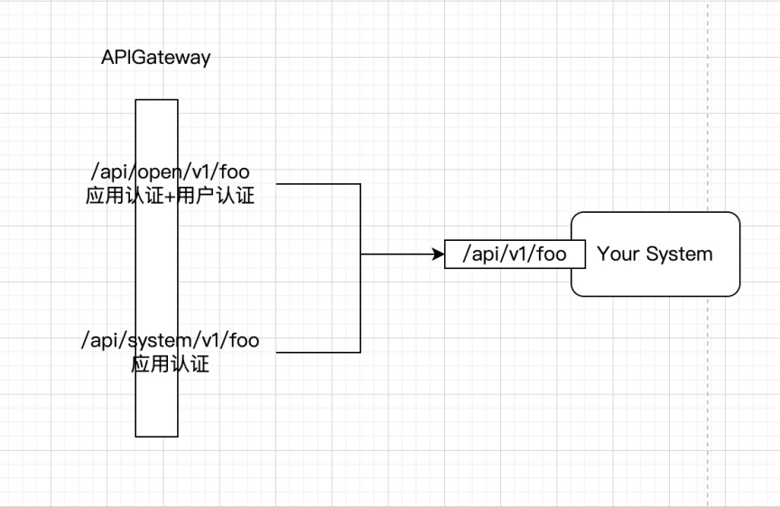
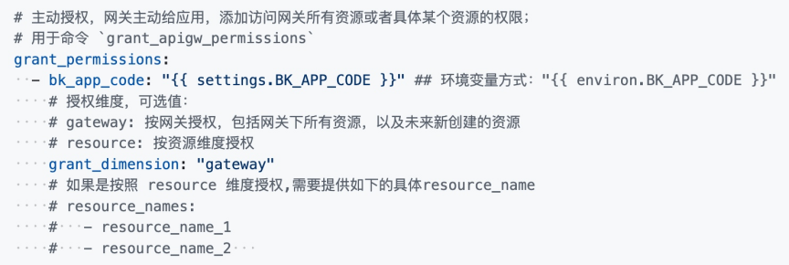
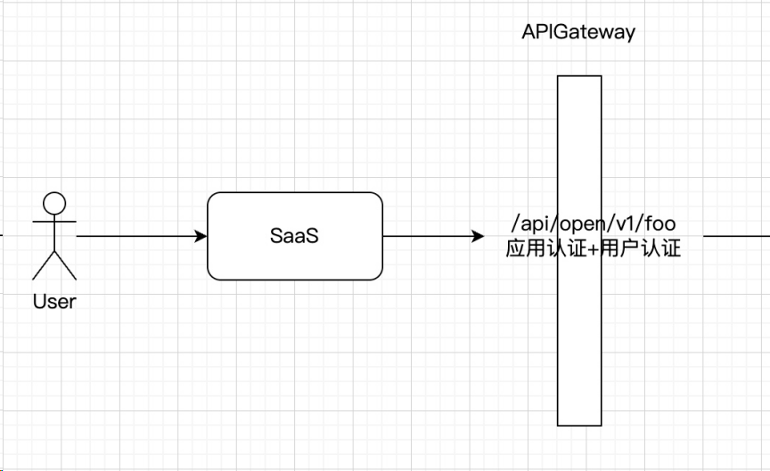
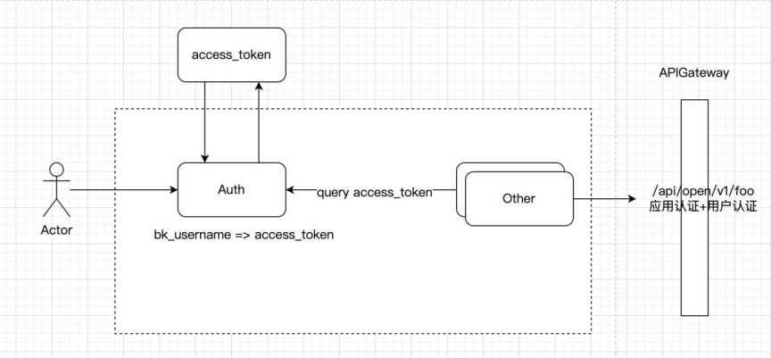

# 迁移：规范使用应用态接口以及用户态接口

## 之前蓝鲸 API 网关及 ESB 存在的问题

系统 A 提供了一个接口 `/api/v1/foo`，并且同时开启了应用认证+用户认证；
此时意味着调用方调用时需要同时传递

1. `bk_app_code+bk_app_secret+bk_token`

2. `access_token`  （本质上也是拿 `bk_app_code+bk_app_secret+bk_token` 换取的）

此时

- 系统 B，需要以 admin 超管的身份调用系统 A 接口，由于无法提供 admin 用户态，要求人工配置免用户认证应用白名单

- 系统 C，需要以自然人用户（即使用系统 C 的用户）的身份调用系统 A 接口，某些场景下无法提供用户态，要求人工配置免用户认证应用白名单

- 系统 D，觉得获取用户态或者管理 `access_token` 过于麻烦，也要求配置免用户认证应用白名单

经年累月，这份`免用户认证应用白名单`无法溯源/无法审计/也无法确保每个系统后续的维护者正确使用，无法进一步收敛风险。

例如系统 C/D 加白之后，随时可以以 admin 身份调用系统 A 接口，执行一些危险操作，例如删除全业务数据

所以`免用户认证应用白名单`这个需求本身就是不合理的，不应该支持的；一时的方便而带来极大的风险。

## 决策

各系统接入蓝鲸 API 网关时，请按规范重新梳理 API 鉴权以及上下游依赖，网关不会提供任何免用户认证的自动化途径

后续不会有`免用户认证应用白名单`，存量也会逐步推动下掉！

## 接入方

需要区分 API 的调用方和调用场景

### 1. For SaaS

如果接口的调用方是一个 SaaS 或者有产品页面的上层系统，这些系统是可以拿到用户登录态的/或者拿用户登录态换取 access_token，此时 API 建议同时开启 应用认证+用户认证 （跟原先一致）

举例：

1. 你自己的 SaaS 跟底层服务
2. 第三方 SaaS 或系统需要调用你的 API

### 2. For Trusted System

如果你的系统是另一套系统 A 的基石（缺了本系统，A 系统无法运作），并且系统 A 是**内部系统**，**可信**，此时 API 建议只开启 `应用认证`，即 `bk_username` 是可信的；（相当于原先的 `应用认证+用户认证+免用户认证应用白名单`）

举例：

1. 标准运维依赖与 JOB，JOB 应该提供应用态接口给标准运维
2. JOB 依赖于 GSE，GSE 应该提供应用态接口给 JOB

### 3. Both

如果同一个 API `/api/v1/foo`，既需要提供给普通 SaaS/第三方 SaaS，又需要提供给内部系统使用，那么需要将后端服务的一个 API，接入网关成为两个 API

1. `/api/system/v1/foo` 只开启`应用认证`，权限来源：主动授权或应用申请权限审批
2. `/api/open/v1/foo` 同时开启`应用认证+用户认证`， 权限来源：开发者中心应用申请权限

另外，系统级的接口可以选择不公开（在网关文档中不可见）/不允许申请权限（在开发者中心云 API 权限不可见），只通过主动授权的方式添加权限 （页面或自动注册的 [definition.yaml](https://github.com/TencentBlueKing/bkpaas-python-sdk/tree/master/sdks/apigw-manager#1-definitionyaml)）

## 调用方

### 1. SaaS 或有产品页面的上层系统

可以拿到用户登录态 bk_token，可以直接拿来调用

### 2. 上层系统

强烈建议梳理清楚后推动下游提供方处理

要求你的基石系统提供应用态接口，并且在各环境及自助接入的配置中做主动授权，然后直接调用；

注意：

- 需要确保，你这边的`bk_username`是经过校验的，并且需要规避一些可能的漏洞（例如`bk_username`应该是系统内的，不应该让用户填）
- 有详细的流水日志/审计日志
- 没有一些 trick 的越权行为，例如拿`bk_username=admin`调用本该`bk_username=普通用户`调用的接口

### 3. 微服务系统

有产品页面，但是也有底层的多个模块，底层的这些模块需要调用 API，但是又不能直接拿到登录态；或者底层的系统是异步/定时任务，执行时并没有登录态；（不能自己拿得到登录态，丢弃了登录态，然后要求被调用方不校验登录态）

那么此时，系统中应该有一个模块，统一管理用户的`access_token`

1. 用户登陆时，通过登录态 `bk_token` 换取 `access_token`，并进行存储，`bk_username - access_token`

2. 其他所有模块，在调用 API 时，拿 `bk_username` 换取 `access_token`

3. 这个模块需要有定时任务维护 `access_token` 的生命周期（通过 `refresh_token` 刷新），如果`refresh_token` 也过期了，需要用户重新登录；（或者每次用户登录都重新生成以最大化 `access_token` 的有效时间/可续期时间）

## 相关文档

- [概念说明：认证](../../Explanation/authorization.md)

- [概念说明：access_token](../../Explanation/access-token.md)

- [概念说明：应用态接口 vs 用户态接口](../../Explanation/app-and-user-state-api.md)

- [自动化接入：apigw-manager SDK](https://github.com/TencentBlueKing/bkpaas-python-sdk/tree/master/sdks/apigw-manager)
