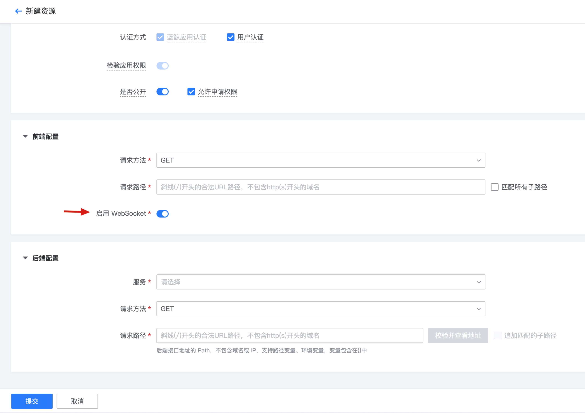

# 支持 WebSocket

## 背景

从 蓝鲸 APIGateway 1.15 版本开始，我们提供了对 WebSocket 的支持

如果后端服务支持 WebSocket， 那么开启后可以使用网关代理 WebSocket 流量，同时复用网关的认证/流量控制等能力；

注意： 如果后端服务不支持 WebSocket，那么这个开关是无效的

## 如何配置

新建资源时，开启 启用 WebSocket 开关



然后**生成一个新的版本，发布到环境中**【发布后生效】

WebSocket 访问地址：\[http/https/ws/wss\]://bkapi.xxx.com/api/{gateway_name}/{stage_name}/*

## 验证是否生效

使用 curl

```bash
curl --http1.1 -i -N  \ 
     -H 'Sec-Websocket-Version: 13' \ 
     -H 'Sec-Websocket-Key: QUo86XL2bHszCCpigvKqHg==' \ 
     -H "Connection: Upgrade" \ 
     -H "Upgrade: websocket" \ 
     -H 'X-Bkapi-Authorization: {"bk_app_code": "x", "bk_app_secret": "y", "bk_token": "z"}' \ 
"https://bkapi.o.woa.com/api/{gateway_name}/{stage_name}/{your_ws_path}/"
```

使用 python 脚本

依赖 [websocket-client](https://github.com/websocket-client/websocket-client) pip install websocket-client

```python
# -*- coding: utf-8 -*-
import json
import websocket
import time

def on_message(ws, message):
    print(f"Received: {message}")

def on_error(ws, error):
    print(f"Error: {error}")

def on_close(ws, close_status_code, close_msg):
    print("Connection closed")

def on_open(ws):
    print("Connection opened")

if __name__ == "__main__":
    header = {
	"X-Bkapi-Authorization": json.dumps({"bk_app_code": "x", "bk_app_secret": "y", "bk_token": "z"})
    }
    ws = websocket.WebSocketApp(url="wss://bkapi.o.woa.com/api/{gateway_name}/{stage_name}/{your_ws_path}/",
	                        header=header,
                                on_open=on_open,
                                on_message=on_message,
                                on_error=on_error,
                                on_close=on_close)

    # Send PING every 10 seconds and expect PONG within 5 seconds
    ws.run_forever(ping_interval=10, ping_timeout=5)
```

## 建议

### 1. client 支持重连

- 默认 60s 无数据传输，连接会断开，需要做好重连机制
- 网关数据面发布时，会导致 WebSocket 断连，使用方需要增加重连机制

### 2. client 支持 heartbeat

- 某些场景下，可以使用 client 默认发送心跳维持连接，避免因无操作而断连；【注意，需要谨慎使用，避免产生过多的无用连接】
- 如果没有心跳，默认 60s 无数据传输，连接会断开
