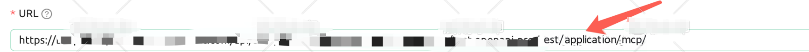
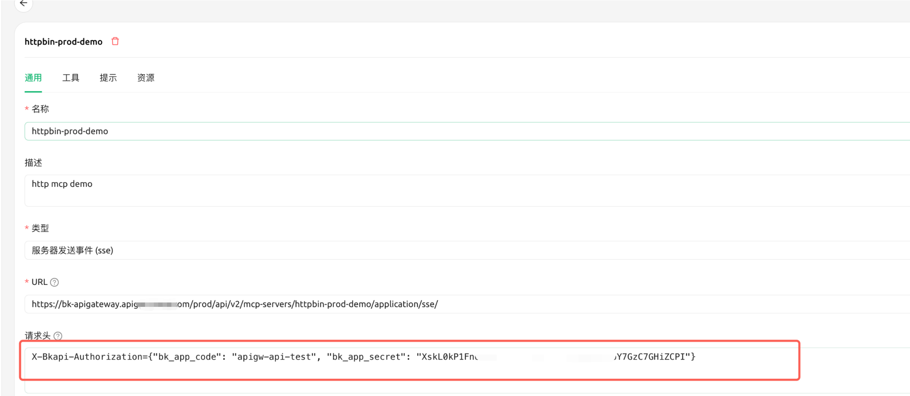
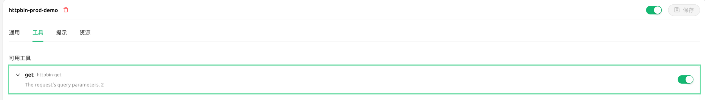
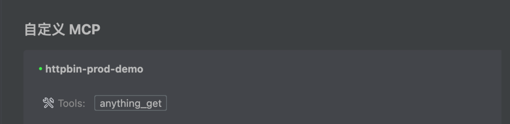
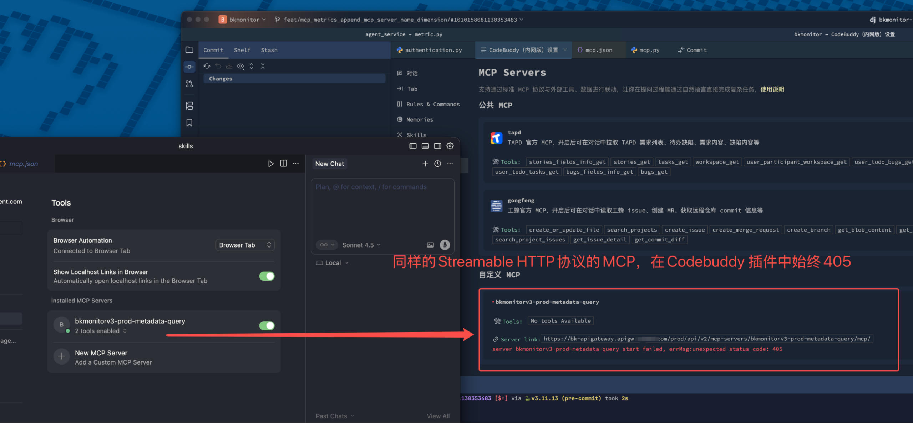

# MCP Server 配置使用指南

## 配置前提

注意给对应的`bk_app_code` 授权，需要检查所有工具的认证方式

- 如果工具中包含任意应用认证+用户认证，直接使用页面上的 URL； 调用接口需要传递 `bk_app_code + bk_app_secret + bk_token` 或用户态 `access_token`

- 如果只是应用认证，使用的 URL 可以加上`/application/`（代表不需要认证用户）；调用接口只需要传递 `bk_app_code + bk_app_secret` 或应用态 `access_token`



## 配置示例

### 1.**cherry-studio**

```json
{
    "mcpServers": {
      "httpbin-prod-demo": {
        "type": "http",
        "url": "https://xxxx.apigw.xxx.com/prod/api/v2/mcp-servers/xxxxx/mcp/",
        "description": "http mcp demo"
      }
    }
}
```

cherry-studio 认证请求头需要在页面才能配置。



效果：



### 2.cursor

```json
{
  "mcpServers": {
    "httpbin-prod-demo": {
      "type": "http",
      "url": "https://xxxx.apigw.xxx.com/prod/api/v2/mcp-servers/xxxxx/mcp/",
      "description": "http mcp demo",
      "headers": {
        "X-Bkapi-Authorization": "{\"bk_app_code\": \"xxxxxxx\", \"bk_app_secret\": \"xxxxxx\"}",
        "Content-Type": "application/json"
      }
    }
  }
}
```

### 3.CoddeBuddy

```json
{
  "mcpServers": {
    "httpbin-prod-demo": {
      "url": "https://xxxx.apigw.xxx.com/prod/api/v2/mcp-servers/xxxxx/mcp/",
      "timeout": 20000,
      "headers": {
        "X-Bkapi-Authorization": "{\"bk_app_code\": \"xxxx\", \"bk_app_secret\": \"xxxxx\"}"
      },
      "disabled": false
    }
  }
}
```

效果：




调用接口需要传递 `bk_app_code + bk_app_secret + bk_token` 或用户态 `access_token`

#### FAQ

1. Codebuddy 插件中 Streamable HTTP 协议 MCP 405？



配置的时候可以补充添加一个协议字段：

```json
"transportType": "streamable-http"
```
