# 普通网关 API to MCP Server

## 说明

网关管理员，可以新建一个 MCP Server， 将网关中的一些接口作为 MCP Server 的 tools 提供给使用方。

而应用开发者可以在 MCP 市场查找到对应的 MCP Server，并在开发者中心申请权限后，配置到 Agent 中。

## 步骤

### 1. 新建 MCP Server （推荐使用 StreamableHTTP）

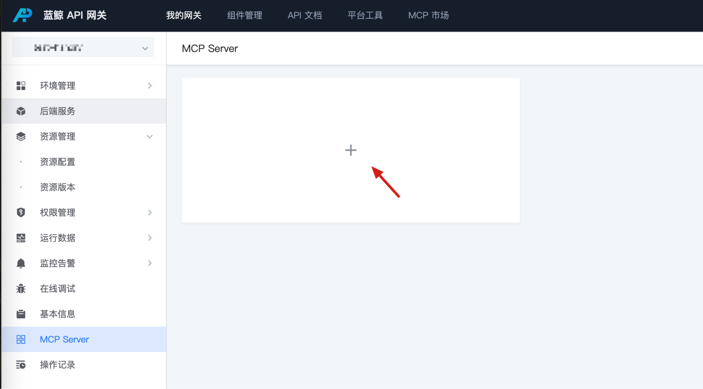

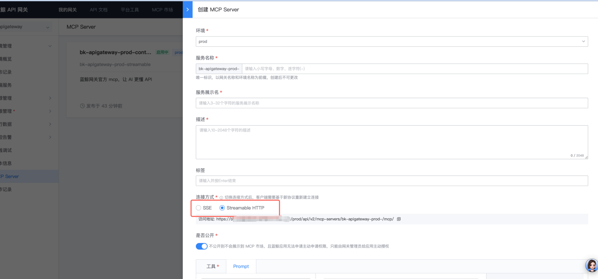

### 2. 配置对应的工具列表（必须配置）

选择已经发布环境，所有 API 会出现在工具列表中，选中一批 API 作为工具。

注意，MCP 需要每个 API 提供 Open API 的请求参数和响应参数定义，选择工具时会检测是否已经配置，如果未配置，需要到资源列表编辑后，重新发布版本后才能选中。

参数配置推荐使用标准的 openapi3.0 的配置

注意，如果选择不公开，那么将不会发布到 MCP 市场，仅自己可见，可以通过主动授权的方式配置权限。

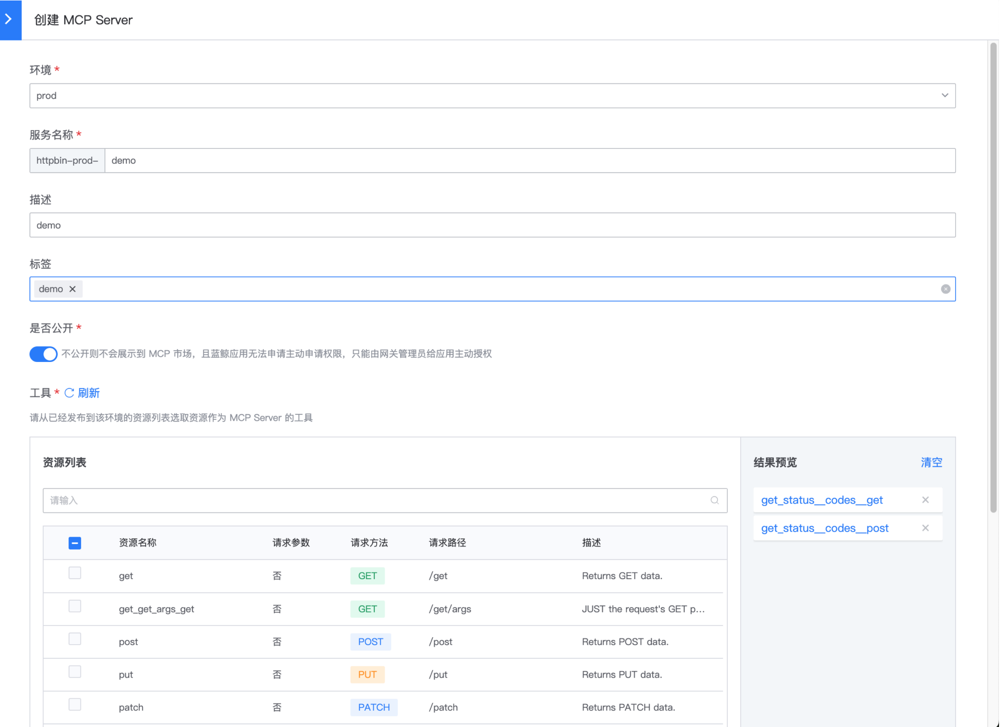

### 3. 配置 prompt （按需配置）

目前网关可配置的 prompt 均来源于 bkaidev 市场


mcp server 编辑时可以在这里进行关联

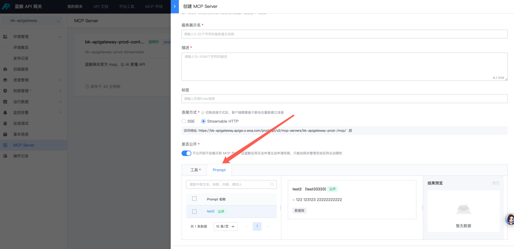

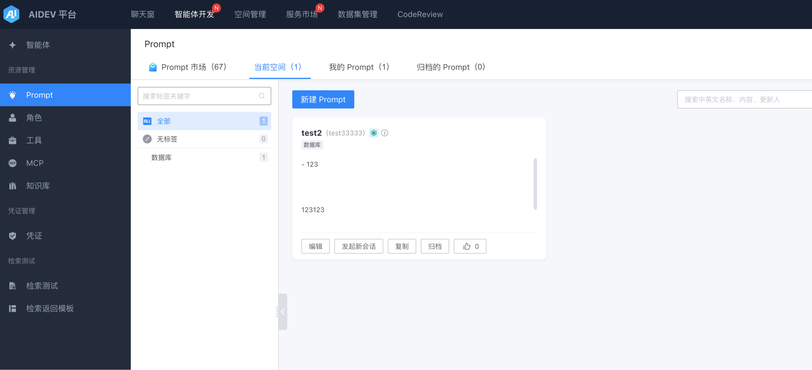

### 4. 配置自定义指南（按需配置）

这里点进去

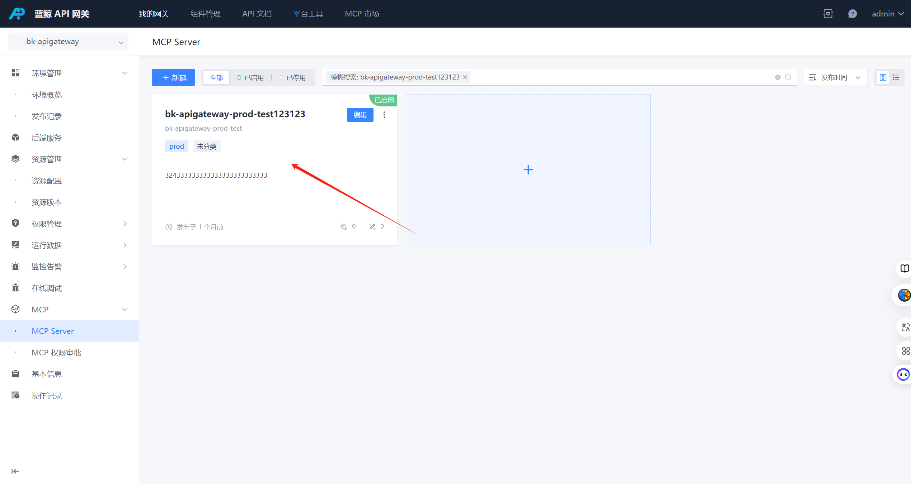

添加自定义使用指引

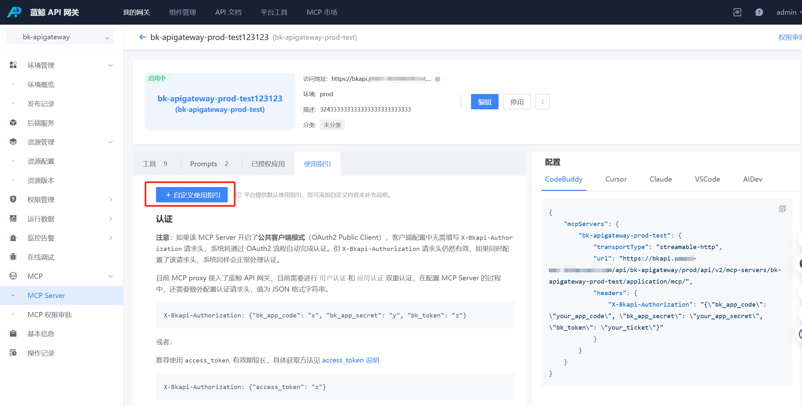

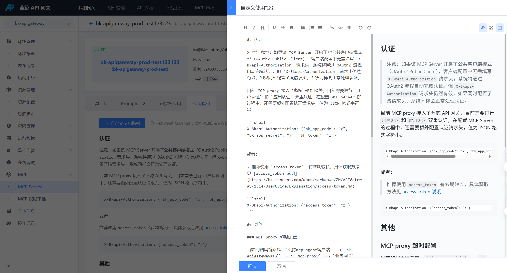

### 5. 主动授权

MCP Server 新建后，网关管理员可以在 MCP Server 详情页做主动授权。

应用开发者可以在 蓝鲸开发者中心申请对应 MCP Server 权限，网关管理员在 MCP Server 详情页的 【权限审批】中进行审批。

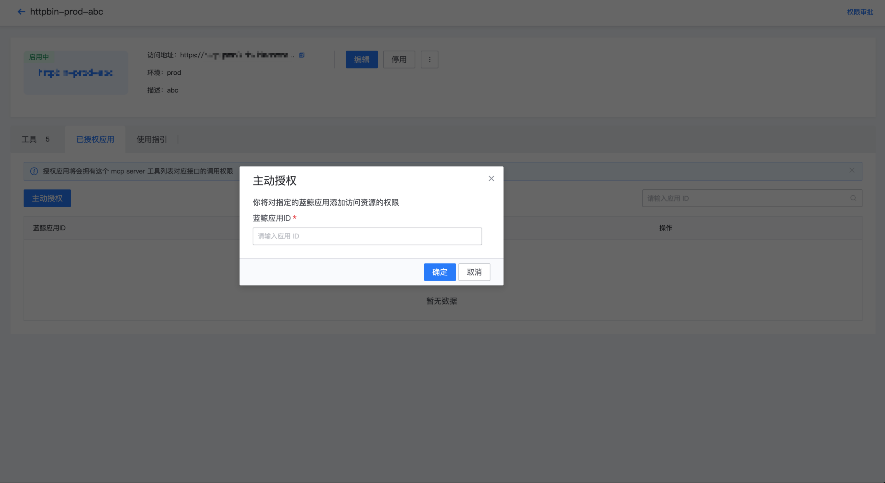

### 6. 在 MCP 市场查看

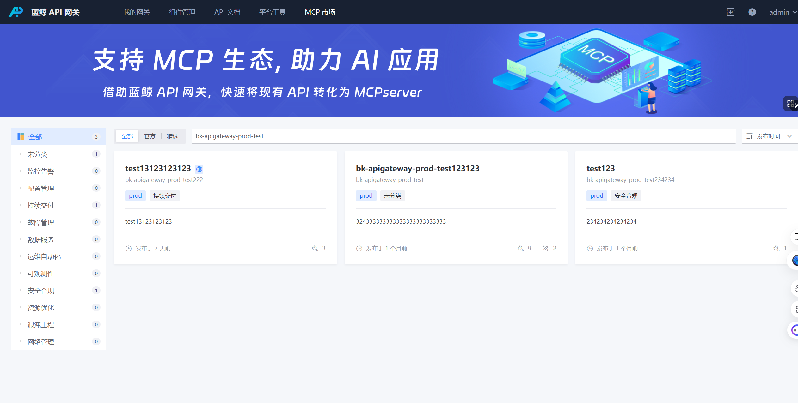

- 工具列表：展示该 MCP Server 提供的工具
- 使用指引：开发者可以根据文档配置 MCP Server 到 Agent

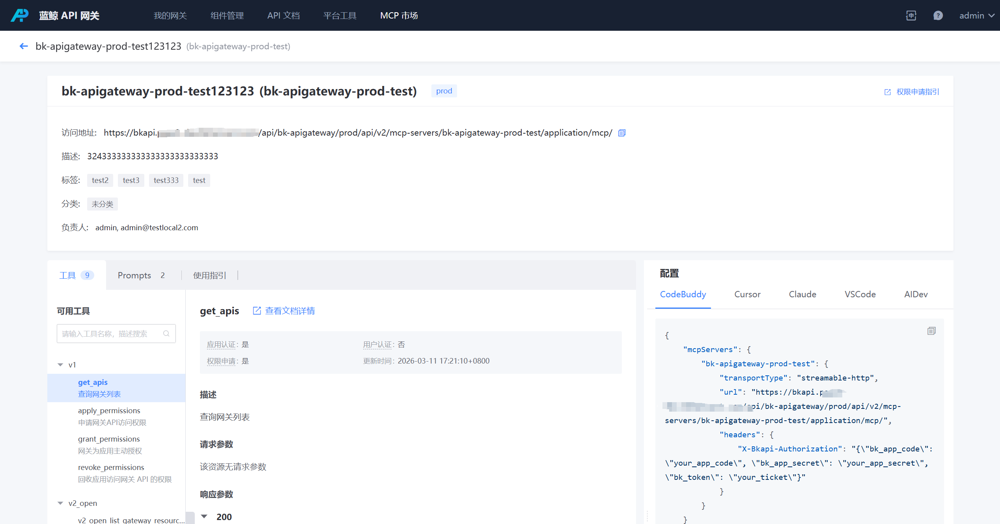

### 7. 在 Agent 中配置使用

- 需要点击右上角的权限申请指引，根据指引申请 MCP Server 的权限需要点击右上角的权限申请指引，根据指引申请 MCP Server 的权限
- 根据使用指引，直接复制配置到 Agent 中

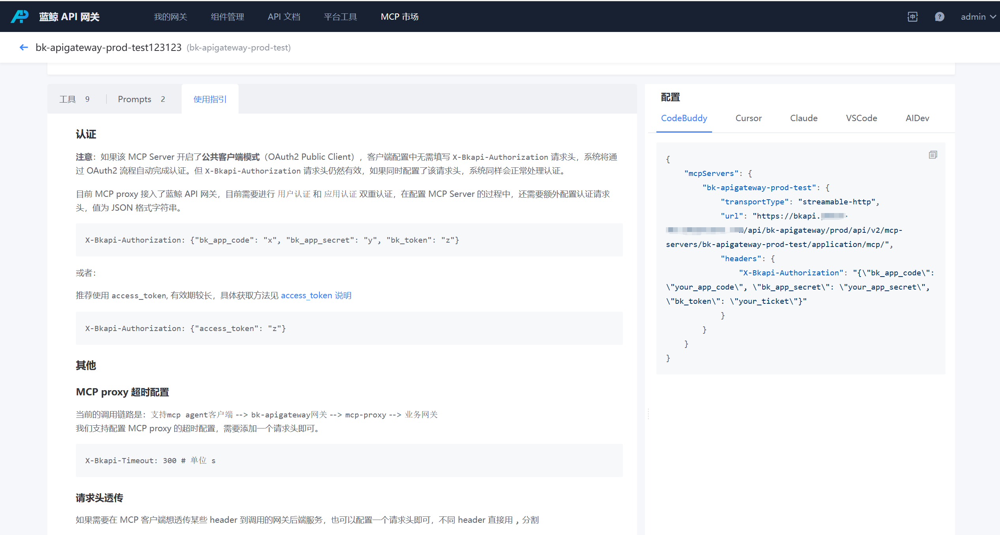

### FAQ

#### 1. 纯应用生态

如果 MCP Server 的工具对应接口权限都是应用态认证的， 那么 Agent 可以只配置 `bk_app_code + app_secret` 

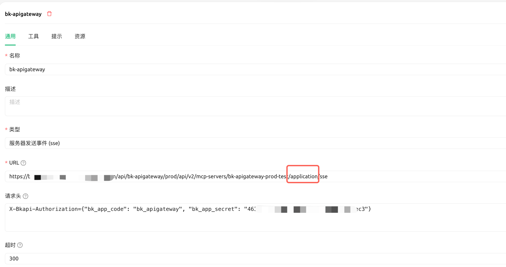

#### 2.the user indicated by auth parameter is not verified, verified by inner-jwt-verifier

原因： MCP Server 工具对应的接口需要用户态认证，但是 Agent 中没有配置对应的应用态只配置了`bk_app_code+bk_app_secret`

```json
{
  "params": {},
  "response": {
    "content": [
      {
        "type": "text",
        "text": "call tool:[name:anything_get,url:bkapi.bk-dev.woa.com/api/httpbin/prod/anything, method:GET] error:call tool err (status 400): {\"request_id\":\"7691f4b7-bc89-4a88-b656-45fcb92b0e92\",\"response_body\":{\"code\":1640001,\"code_name\":\"INVALID_ARGS\",\"data\":null,\"message\":\"Parameters error [reason=\\\"the user indicated by auth parameter is not verified, verified by inner-jwt-verifier\\\"]\",\"result\":false},\"status_code\":400}\n"
      }
    ],
    "isError": true
  }
}
```

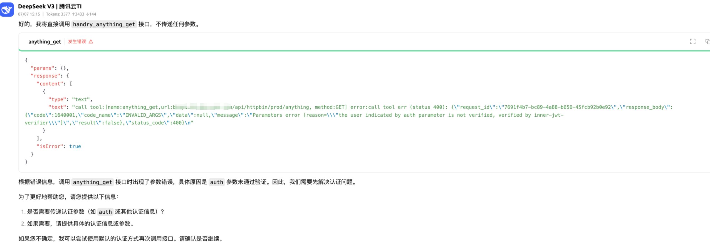

#### 3. 后端服务如何判断请求来自于哪个 MCP Server

对应来着 MCP Server 的请求大家可以通过这两个请求头判断：

X-Bkapi-Mcp-Server-Id

X-Bkapi-Mcp-Server-Name

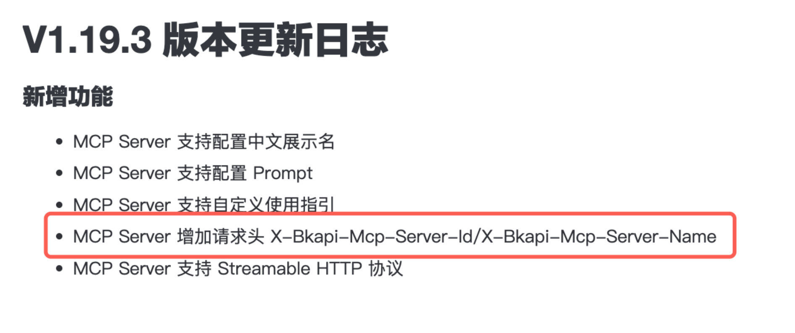
