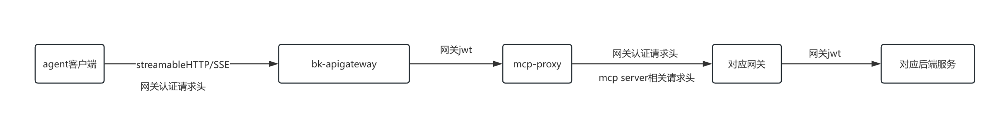
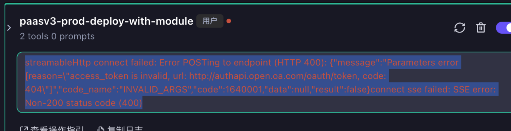
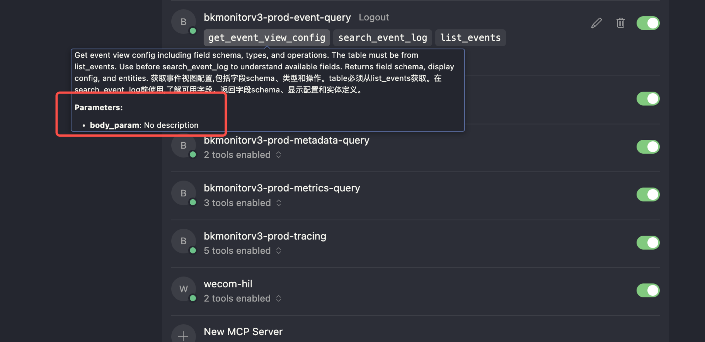

# MCP Server FAQ

## 1. **使用了网关的 API to MCP , 后端服务如何拿到用户的信息？**

目前对于 api to mcpserver 这种整体的调用链路是：



- 网关认证请求头主要是： X-Bkapi-Authorization, 详情见： [认证](../../Explanation/authorization.md)

- 网关 jwt 见： [X-Bkapi-JWT](../../Explanation/jwt.md)

- mcp server 相关请求头如下：

  X-Bkapi-Mcp-Server-Id: 调用 api 的来源 mcpserve id

  X-Bkapi-Mcp-Server-Name：调用 api 的来源 mcpserver name

所以可以直接从网关的 jwt 数据里面获取用户信息

## 2.**agent 获取 mcp 工具失败？**



```json
{"result": false, "code": 500, "message": "\u83b7\u53d6MCP\u5de5\u5177\u5217\u8868\u5931\u8d25:  HTTPStatusError - Client error '400 Bad Request' for url 'https://bk-apigateway.apigw.xxx.com/prod/api/v2/mcp-servers/xxxx/mcp/'\nFor more information check: https://developer.mozilla.org/en-US/docs/Web/HTTP/Status/400", "data": null}
```

- 考虑对应 app_code 是否有 mcpserver 权限

access_token 失效的问题：

- 可以去到增强服务的数据库里面，更新一下 bkoauth_access_token 表的数据

- 删掉 access_token ， 重新访问一下这个智能体，获取生成的 access_token

## 3.**IDE 中工具参数无法正常展示**



原因：参数是一个嵌套的 json，目前相关 IDE 还不支持展示
