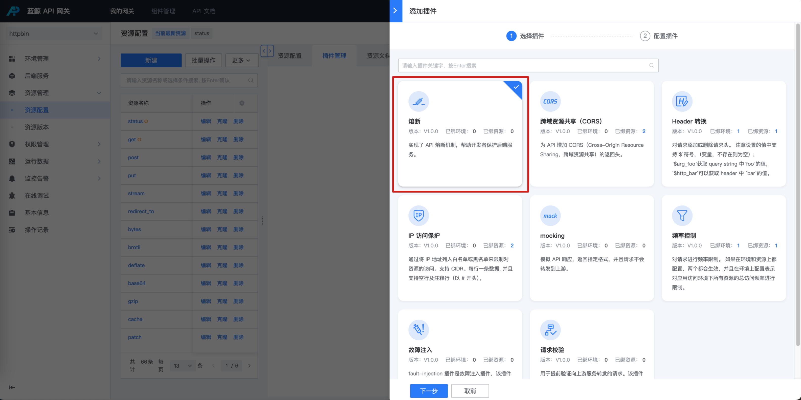

# API 熔断

## 网关版本

bk-apigateway >= 1.15.x

## 背景

某些场景下，当上游处于不健康的状态，持续进来的请求可能会导致服务恶化直到崩溃。此时我们可以通过配置熔断插件，当出现不健康的响应时触发熔断，保护上游服务。

建议查看 apisix 插件 [api-breaker](https://apisix.apache.org/zh/docs/apisix/3.2/plugins/api-breaker/) 官方文档了解更多配置说明。

## 步骤

### 选择资源

在资源上新建 【 熔断】插件

入口：【资源管理】- 【资源配置】- 找到资源 - 点击插件名称或插件数 - 【添加插件】

### 配置【熔断】插件

- 熔断响应状态码/熔断响应体/熔断响应头： 配置当熔断发生时，调用方接收到的响应信息
- 最大熔断时间：默认 300s，首次熔断 2 秒，再次触发将递增 4 秒/ 8 秒/16 秒，直到最大熔断时间
- 不健康状态码/不健康次数：什么响应认为上游服务是不健康的，出现多少次触发熔断
- 健康状态码/健康次数：什么响应认为上游服务是健康的，出现多少次解除熔断

### 确认是否生效

- 持续发送请求
- 主动让后端服务不可用/后端接口返回熔断不健康相关的状态码
- 观察请求的响应，确认熔断是否生效
- 后端服务恢复健康/接口返回熔断健康相关状态码
- 确认熔断解除

## 最佳实践

1. 配置 unhealthy 状态码为 [503, 504], healthy 状态码为 [200, 201, 204]

## FAQ

### 服务熔断的最大持续时间

第一次触发不健康状态时，熔断 2 秒。

超过熔断时间后，将重新开始转发请求到上游服务，如果继续返回 unhealthy.http_statuses 状态码，记数再次达到 unhealthy.failures 预设次数时，熔断 4 秒。依次类推（2，4，8，16，……），直到达到预设的 max_breaker_sec 值。

### 熔断的 key

目前使用的是 uri 作为熔断 health/unhealth 计数的 key

这样可能存在的问题

1. 如果 同一个 url 存在 GET/POST 两个 APi，那么这两个 API 熔断计数是一起的；

2. 如果 url 中存在路径参数，熔断计数是以渲染后的 url 为准；

### 为什么达到了熔断阈值没有立即触发

熔断是实例级别的，流量被负载均衡到网关生产环境的 12 个实例，意味着每个实例都得达到阈值触发熔断，后端才能完全收不到代理过去的请求
