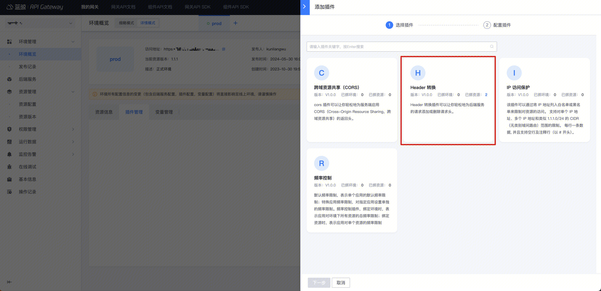

# 请求 header 转换

## 背景

默认，调用方的请求中的 Header 会被透传给网关的后端服务；某些场景，需要对 Header 进行一些处理，例如，删除掉某个固定的 Header，或者，给所有的请求加入一个新的 Header 头。

此时，可以使用【Header 转换】插件实现

请求 Header 转换，可在环境和资源中配置：
- 在环境中配置，对环境下所有资源生效；
- 在某个资源上配置，仅对这个资源生效；如果此时环境上也配置了这个插件，那么优先执行环境的 Header 转换，然后执行资源的 Header 转换

## 步骤

### 选择环境或者资源

如果相对一个环境下的所有资源生效，那么可以在环境上新建【Header 转换】插件
入口：【环境概览】- 【详情模式】- 【插件管理】

如果仅针对某个资源生效，可以在资源上新建【Header 转换】插件
入口：【资源管理】- 【资源配置】- 找到资源 - 点击插件名称或插件数 -  【添加插件】

### 配置【Header 转换】插件

Header 转换，支持`设置`和`删除`两种配置：
- 设置：表示将请求头设置为指定值，如可将 Header X-Token 设置为 test
- 删除：表示删除指定的请求头，如可删除 Header X-Debug

### 确认是否生效

- 如果是在环境上新建插件，立即生效
- 如果是在资源上新建插件，需要生成一个资源版本，并且发布到目标环境

## 高级配置

### set 的键值中支持 `$`符号获取变量

如果设置中的值带了 `$` 符号，会被认为是变量被变量的值替换

1.  `$arg_foo`可获取 query string 中`foo`的值，如果`/get?foo=1`，那么此时这个 header 值为`1`
2.  `$http_bar`可以获取 header 中 `bar`的值，如果请求中存在 header `bar=2`，那么此时这个 header 值为`2`
3.  `123$not_exists` 如果变量值不存在，会被渲染成`123`;
