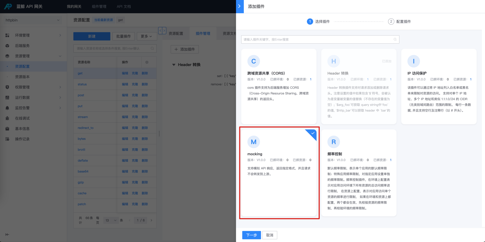
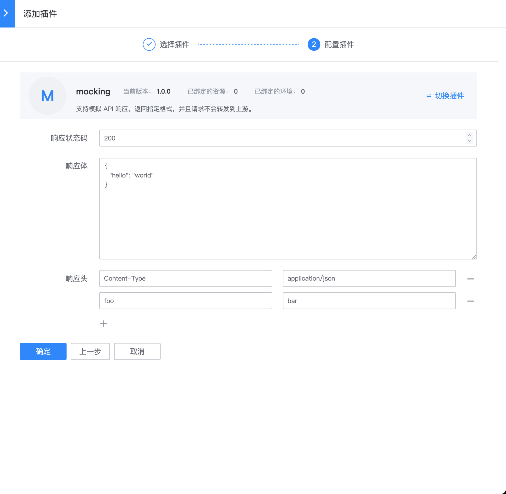

# bk-mock 插件

## 网关版本

bk-apigateway >= 1.15.x

## 背景

某些接口返回固定的响应体，或者在联调阶段后端尚未上线前，可以 mock 对应接口的响应体。

当调用方请求这个网关 API 时，会直接返回 mocking 插件中配置的响应，请求不会被转发到后端服务。

## 步骤

### 选择资源

在资源上新建 【mocking】插件

入口：【资源管理】- 【资源配置】- 找到资源 - 点击插件名称或插件数 - 【添加插件】

### 配置 【mocking】 插件

- 响应状态码：合法的 http 状态码
- 响应体：对应的 response body
- 响应头：对应的 response headers

### 确认是否生效

需要生成一个资源版本，并且发布到目标环境

然后在【在线调试】或者使用工具请求这个 API，确认响应是否同 【mocking】插件中配置的一致
