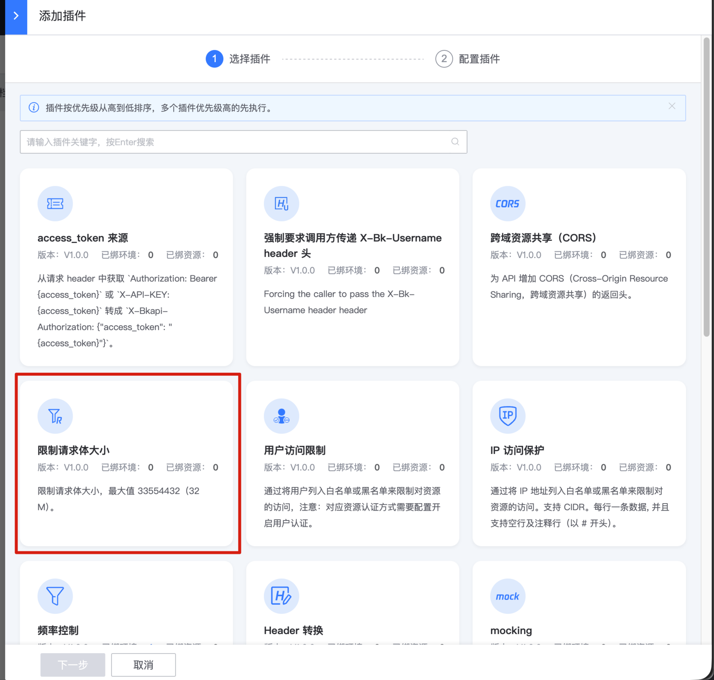
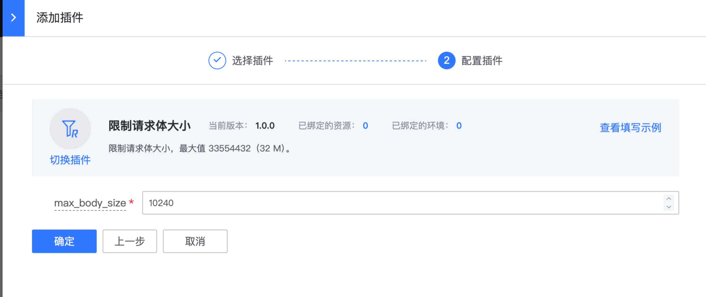

# 请求体大小限制

## 网关版本

bk-apigateway >= 1.18

## 背景

蓝鲸共享网关默认限制请求体大小 40M，某些场景中，用户需要限制接口请求体大小到更小的值

## 步骤

### 选择资源

在资源上新建 【限制请求体大小】插件

入口：【资源管理】- 【资源配置】- 找到资源 - 点击插件名称或插件数 - 【添加插件】

### 配置【限制请求体大小】插件

### 确认是否生效

- 如果是在环境上新建插件，立即生效
- 如果是在资源上新建插件，需要生成一个资源版本，并且发布到目标环境