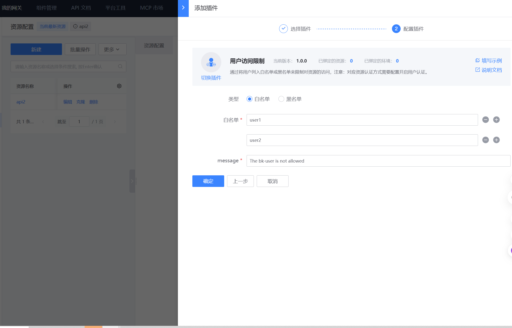
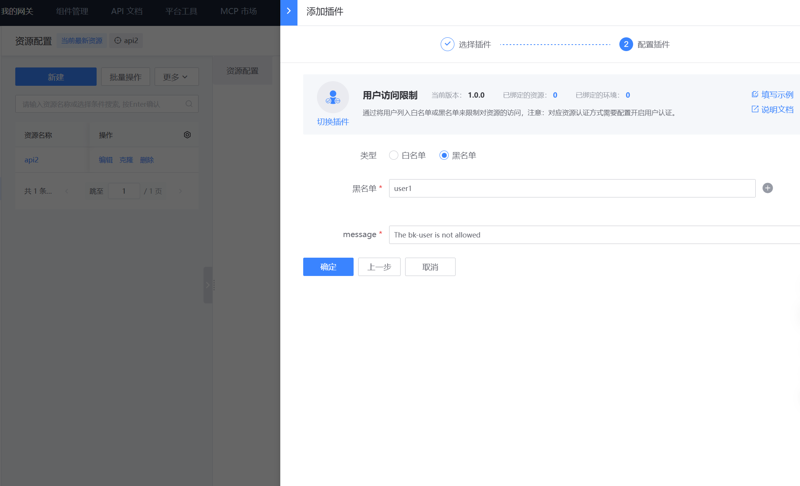

# 用户限制

## 网关版本

bk-apigateway >= 1.19.x

## 背景

类似于 ip 访问控制，用户访问控制支持配置用户白名单或者黑名单，实现仅允许白名单用户调用该接口，或者禁止黑名单用户调用该接口。

使用场景：

1. 小规模灰度时，仅对部分用户开放接口
2. 存在异常流量时，快速禁用某些用户调用接口

## 前置条件

- 接口应该开启**用户认证**([相关文档](../../Explanation/authorization.md))
- 其他：使用免用户认证应用白名单调用的请求，由于其用户没有被认证，所以不会受这个插件影响；直接忽略

## 配置示例





## 命中请求的响应

状态码： 403

```json
{
  "code_name": "BK_USER_NOT_ALLOWED",
  "message": "Request rejected by user restriction",
  "result": false,
  "data": null,
  "code": 1640303
}
```
