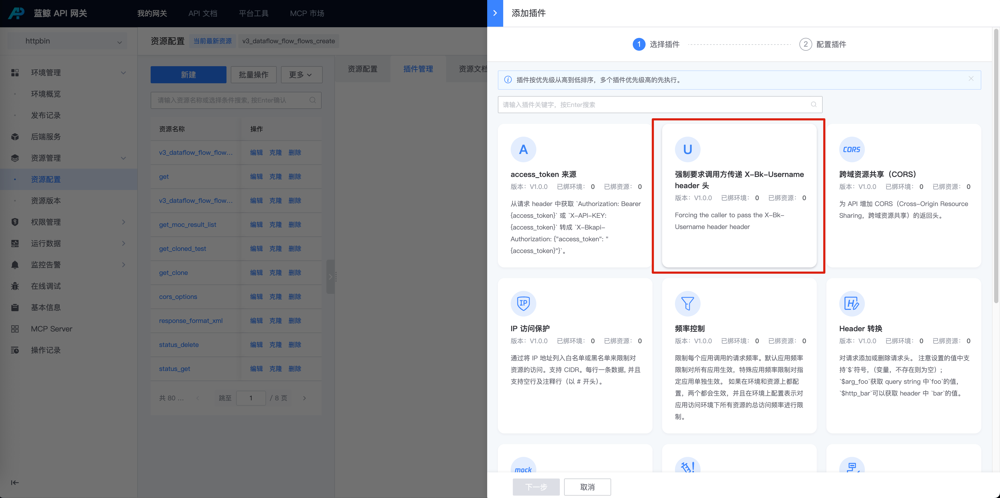
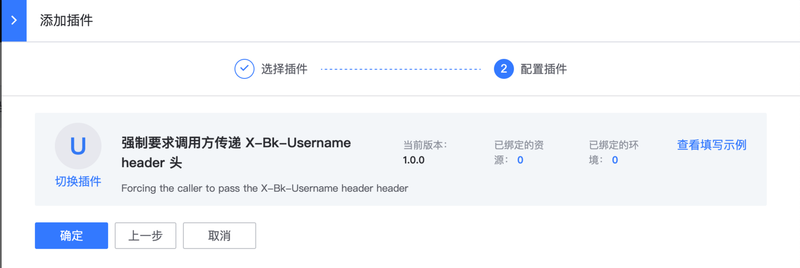

# 用户名必填

## 网关版本

bk-apigateway >= 1.17.1x

## 背景

在蓝鲸认证体系中，如果接口是应用态接口，此时不校验用户，无法拿到用户名。

但是很多系统是需要拿用户名做进一步的权限校验的。 所以此时需要强制要求调用方传递 bk_username。

开启插件后

- 将会强制要求调用方传递`X-Bk-Username` **header** 头， 并且同时**兼容**之前通过 X-Bkapi-Authorization 传递 bk_username 的方式

- 开启这个插件的 API 到达后端服务，其请求头中一定有 X-Bk-Username

注意： 这个插件只保证调用方一定有传递 bk_username，但是这个 bk_username 是没有经过认证的，调用方可以**任意指定**，例如配置为 admin； 所以需要认证用户的，请开启用户认证（用户态接口）。

## 步骤

### 选择资源

在资源上新建 【强制要求调用方传递 X-Bk-Username header 头】插件

入口：【资源管理】- 【资源配置】- 找到资源 - 点击插件名称或插件数 - 【添加插件】



### 配置【强制要求调用方传递 X-Bk-Username header 头】插件



无需配置任何参数

### 确认是否生效

- 如果是在环境上新建插件，立即生效
- 如果是在资源上新建插件，需要生成一个资源版本，并且发布到目标环境

调用示例：

```bash
# 推荐
curl -H 'X-Bk-Username: tom' https://example.com/...

# 另外，之前存量通过  `X-Bkapi-Authorization` 传递 bk_username 的也会生效
# 存量，不推荐再使用这种方式
curl -H 'X-Bkapi-Authorization: {"bk_username": "tom"}' https://example.com/...
```

后端服务将可以从请求头中拿到 header

X-Bk-Username: tom

另外，如果后端服务想要做向前兼容，可以：

1. 从请求头中拿 header X-Bk-Username

2. 拿不到，还是走原先的逻辑，从 JWT 解析中拿 user.bk_username

3. 拿不到，报错

## 其他

### 校验存在及非空

启用该插件之后，将会检查来源头是否存在/值非空，不存在直接 400

没有传递

```json
{
  "message": "Parameters error [reason=\"No `X-Bk-Username` header or no `bk_username` in the `X-Bkapi-Authorization` header\"]",
  "code": 1640001,
  "data": null,
  "result": false,
  "code_name": "INVALID_ARGS"
}
```

空值

```json
{
  "message": "Parameters error [reason=\"The `X-Bk-Username` header is empty\"]",
  "code": 1640001,
  "data": null,
  "result": false,
  "code_name": "INVALID_ARGS"
}
```

#### 如果同时都传递，使用 X-Bk-Username

```bash
curl 
  --H 'X-Bk-Username: tom' \ 
  --H 'X-Bkapi-Authorization: {"bk_usernmae": "jerry"}' 
```

后端服务将会拿到 X-Bk-Username: tom

## 相关文档

- [应用态接口 vs 用户态接口](../../Explanation/app-and-user-state-api.md)

- [迁移：规范使用应用态接口以及用户态接口](../Connect/standardized-use-app-and-user-state-api.md)

- [认证](../../Explanation/authorization.md)

- [X-Bkapi-JWT](../../Explanation/jwt.md)
