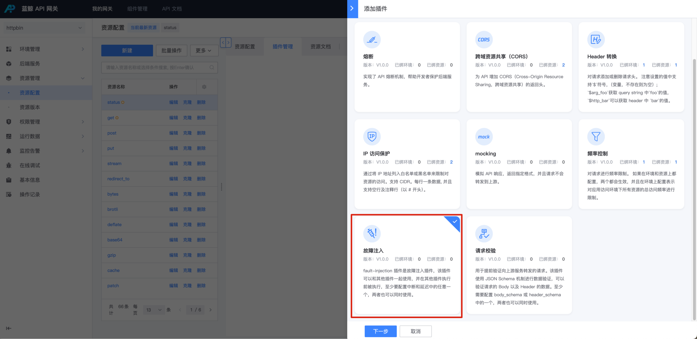
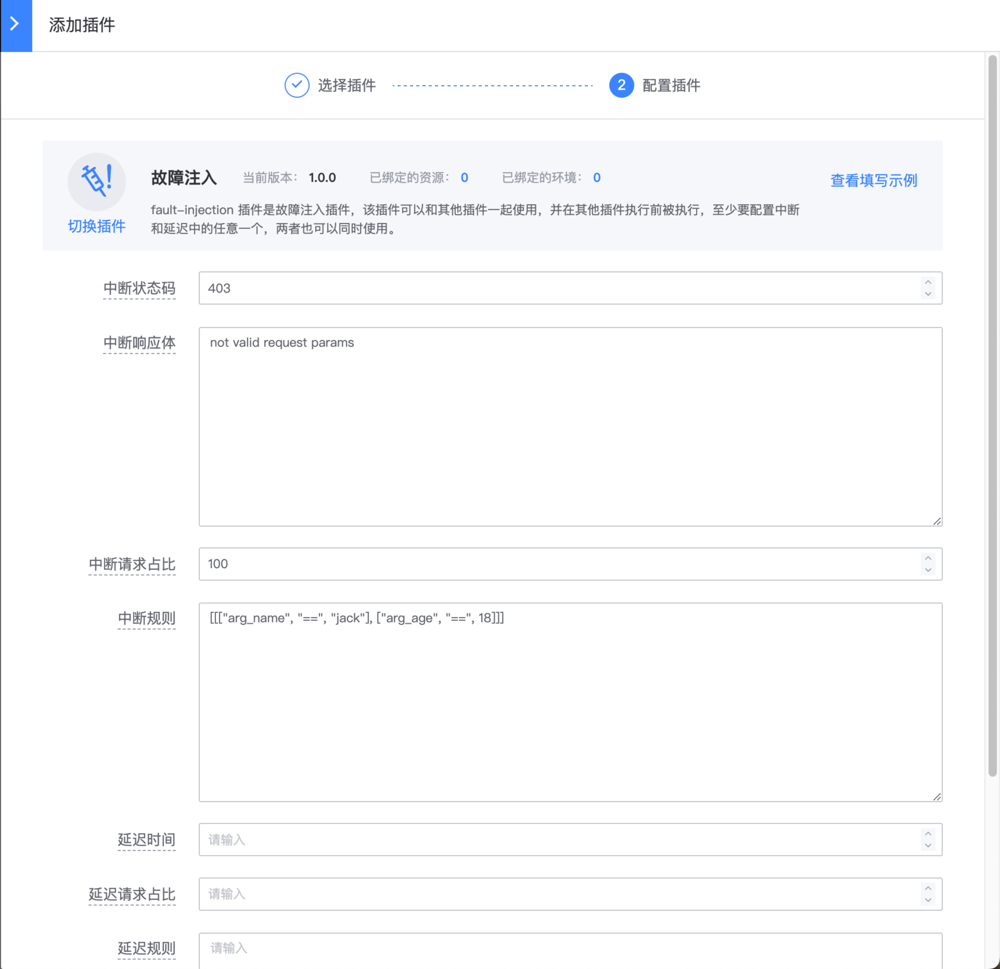

# 故障注入

## 网关版本

bk-apigateway >= 1.15.x

## 背景

某些情况下，需要做故障注入，符合某些条件时，返回特定响应体，或者延迟特定时间再响应，以测试调用方是否处理对应的响应。

建议查看 apisix 插件 [plugin: fault-injection](https://apisix.apache.org/docs/apisix/3.13/plugins/fault-injection/) 官方文档了解更多配置说明。

## 步骤

### 资源选择

在资源上新建 【故障注入】插件

入口：【资源管理】- 【资源配置】- 找到资源 - 点击插件名称或插件数 - 【添加插件】



### 配置插件

分为终端和延迟两种配置，至少要配置中断和延迟中的任意一个，两者也可以同时使用。

- 中断：按照比例中断，或者命中规则执行故障注入中断；直接返回给客户端指定的响应码并且终止其他插件的执行。
  - 中断状态码/中断响应体：中断发生时的响应
  - 中断请求占比：0-100，按比例执行中断
  - 中断规则：命中规则则执行注入

- 延迟：按照比例延迟一定时间；将延迟某个请求，并且还会执行配置的其他插件。
  - 延迟时间，可以指定小数
  - 延迟请求占比：0-100，按比例执行延迟
  - 延迟规则：命中规则则执行延迟



## 配置示例

### 一个例子

```json
{
  "abort": {
    "http_status": 403,
    "body": "Fault Injection!\n",
    "vars": [
      [
        [
          "arg_name",
          "==",
          "jack"
        ]
      ]
    ]
  },
  "delay": {
    "duration": 2,
    "vars": [
      [
        [
          "http_age",
          "==",
          "18"
        ]
      ]
    ]
  }
}
```

- 当 query string 中参数 name=jack 的时候，会返回 403，`response body = Fault Injection!\n`
- 当 header 头中包含 `age=18` 的时候，会延时 2s 之后再响应

### vars 表达式

单个

```json
[
    [
        [ "arg_name","==","jack" ]
    ]
]

AND 和 OR
[
    [
        [ "arg_name","==","jack" ],
        [ "arg_age","==",18 ]
    ],
    [
        [ "arg_name2","==","allen" ]
    ]
]
```

以上示例表示前两个表达式之间的关系是 `AND`，而前两个和第三个表达式之间的关系是 `OR`
