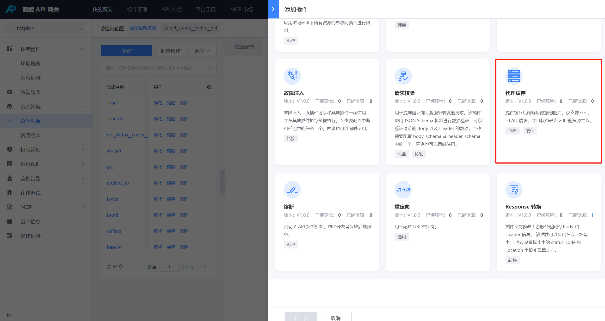
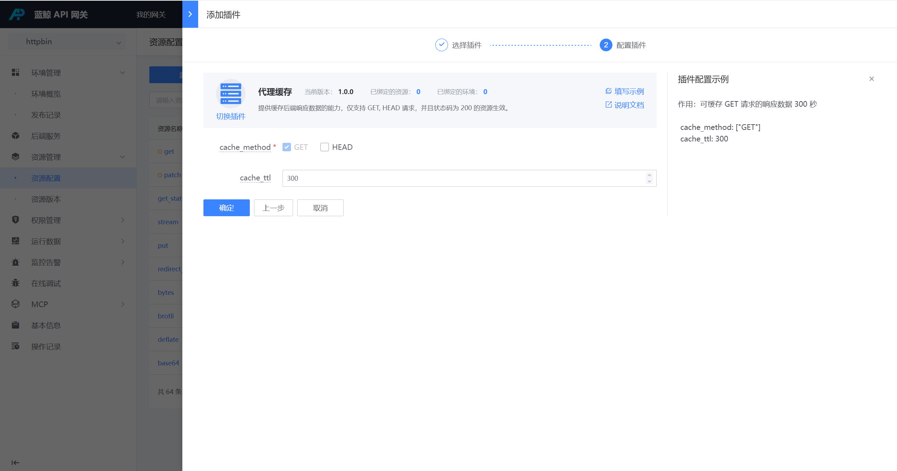

# 代理缓存

## 网关版本

bk-apigateway >= 1.19.x

## 背景

某些接口，后端性能比较差，可以考虑开启代理缓存，会直接将对应接口在网关层进行缓存，后续请求如果命中缓存会直接返回，不会代理到后端服务。

## 步骤

### 选择资源

在资源上新建 【 熔断】插件

入口：【资源管理】- 【资源配置】- 找到资源 - 点击插件名称或插件数 - 【添加插件】

### 配置【代理缓存】插件

