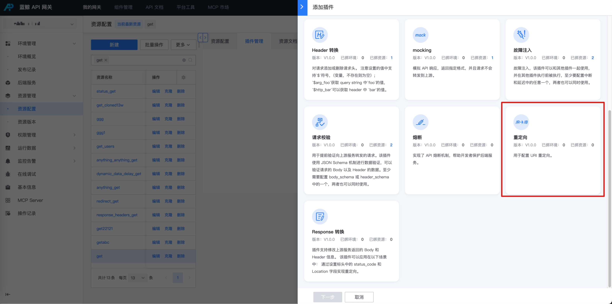
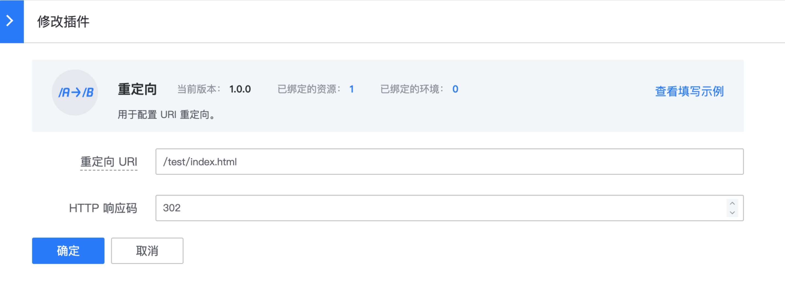

# 重定向

## 网关版本

bk-apigateway >= 1.16.x

## 背景

某些场景，接口已下线或迁移，需要配置存量接口重定向到新接口。

建议查看 apisix 插件 [plugin: redirect](https://apache-apisix.netlify.app/zh/docs/apisix/3.2/plugins/redirect/) 官方文档了解更多配置说明。（仅开放了部分字段配置）

## 步骤

### 选择资源

在资源上新建 【重定向】插件

入口：【资源管理】- 【资源配置】- 找到资源 - 点击插件名称或插件数 - 【添加插件】

### 配置插件

仅能配置 重定向 uri 和响应状态码

