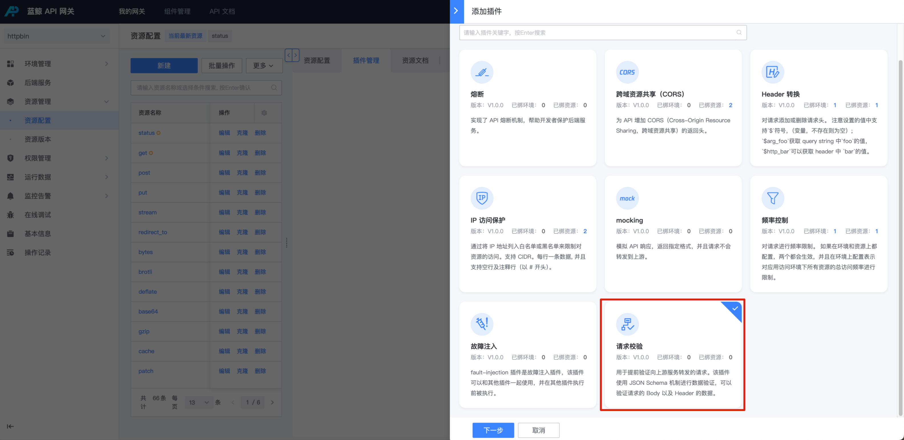
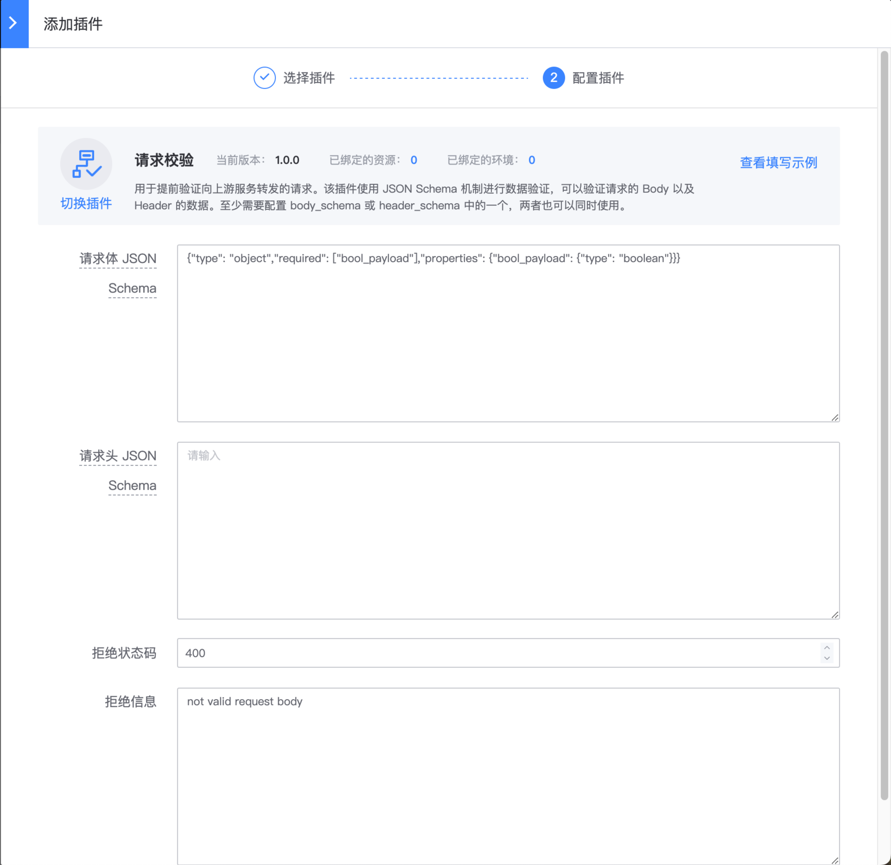

# 请求校验

## 网关版本

bk-apigateway >= 1.15.x

## 背景

如果请求体是 json， 那么可以在网关层增加前置的合法性校验，如果请求不合法直接拒绝，不会转发到上游。

这个插件用于提前验证向上游服务转发的请求。该插件使用 [JSON Schema](https://github.com/api7/jsonschema) 机制进行数据验证，可以验证请求的 body 及 header 数据

建议查看 apisix 插件 [request-validation](https://apisix.apache.org/zh/docs/apisix/3.2/plugins/request-validation/) 官方文档了解更多配置说明。

## 步骤

### 选择资源

在资源上新建 【请求校验】插件

入口：【资源管理】- 【资源配置】- 找到资源 - 点击插件名称或插件数 - 【添加插件】



### 配置插件

- 请求体 JSON Schema: 用于校验 body
- 请求头 JSON Schema: 用于校验 header
- 拒绝状态码/拒绝信息：当校验失败时的响应



## 配置示例

建议请求 body， 在 [jsonschema validator](https://www.jsonschemavalidator.net/) 测试通过后再配置

### body_schema

```json
{
 "type": "object",
 "required": [
   "required_payload"
 ],
 "properties": {
   "required_payload": {
     "type": "string"
   },
   "boolean_payload": {
     "type": "boolean"
   }
 }
}
```

以上配置

```bash
# 校验失败
curl -X POST -d '{}' http://xxxxx
{
    "result": false,
    "data": null,
    "code": 1640001,
    "code_name": "INVALID_ARGS",
    "message": "Parameters error [reason=\"property \"required_payload\" is required\"]"
}

# 校验通过
curl -X POST -d '{"required_payload": "abc"}' http://xxxxx
```

### header_schema

```json
{
 "type": "object",
 "required": [
   "required-payload"
 ],
 "properties": {
   "required-payload": {
     "type": "string"
   }
 }
}
```

注意：

- header 在匹配前会被转换为小写（大小写不敏感，建议使用全小写）
- header 的 key 和 value 类型都是 string， 不支持校验 integer/boolean 等类型
- header 中不要包含下划线_，请使用-

以上配置

```bash
# reject, no required-payload header
curl -X GET -H  http://xxxxx

# ok
curl -X GET -H 'required-payload: abc' http://xxxxx
```
