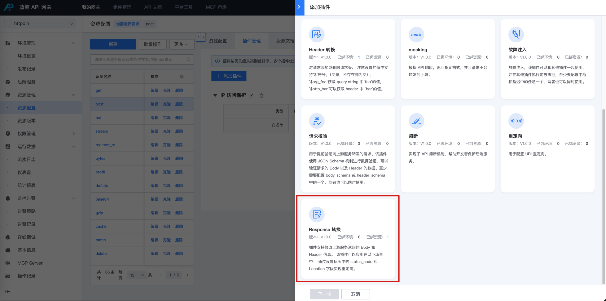
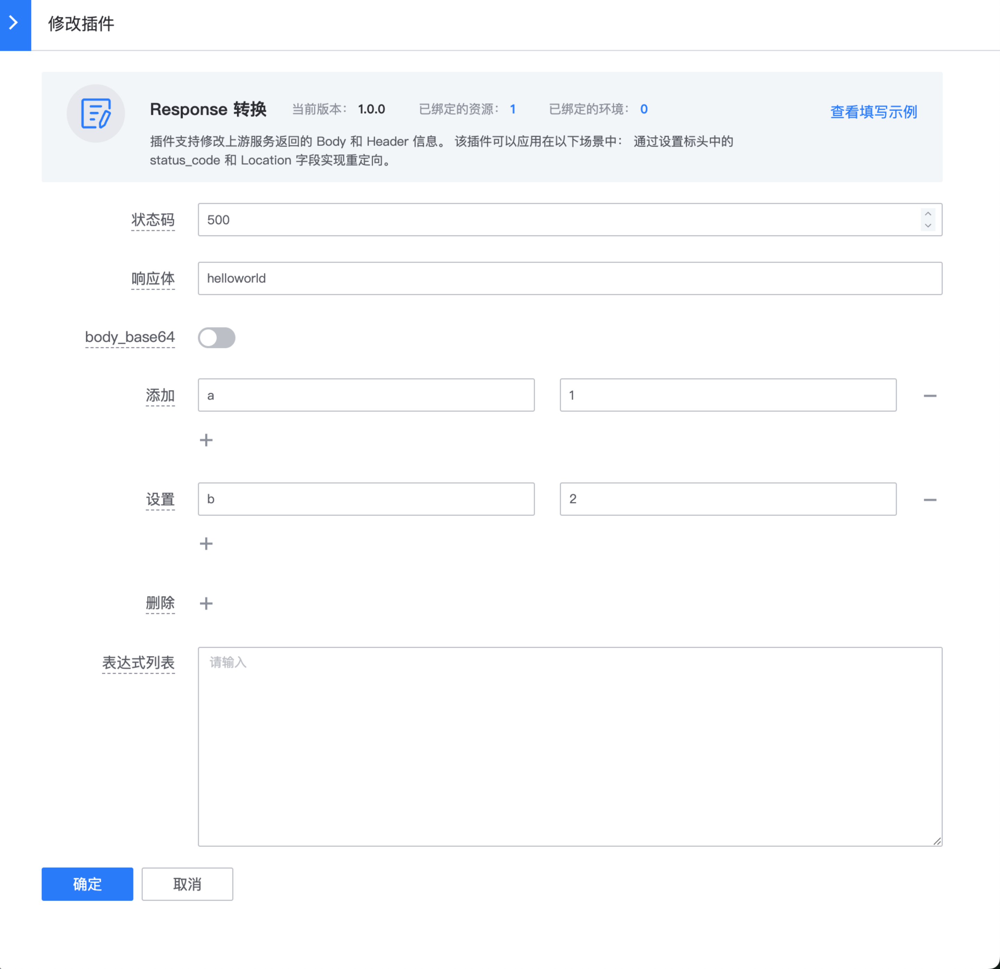
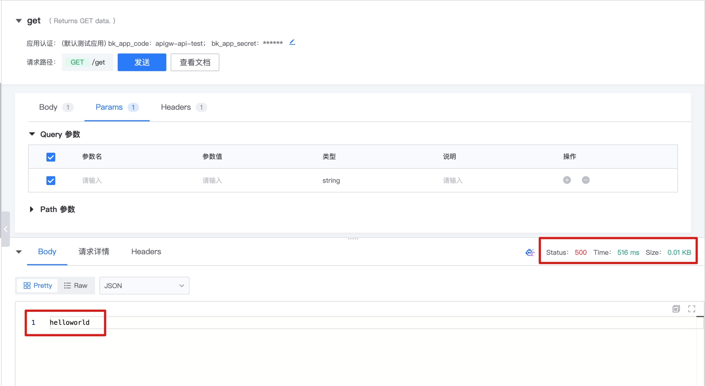
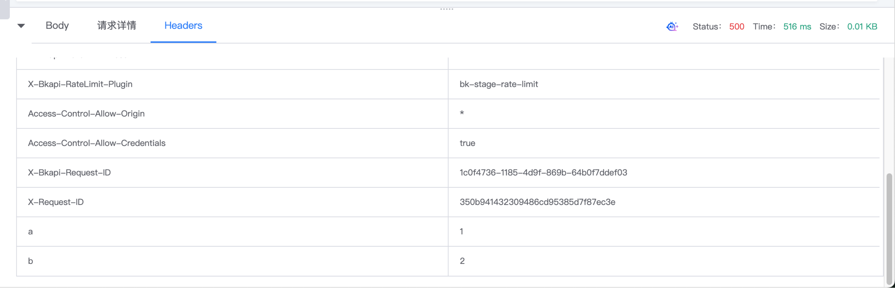
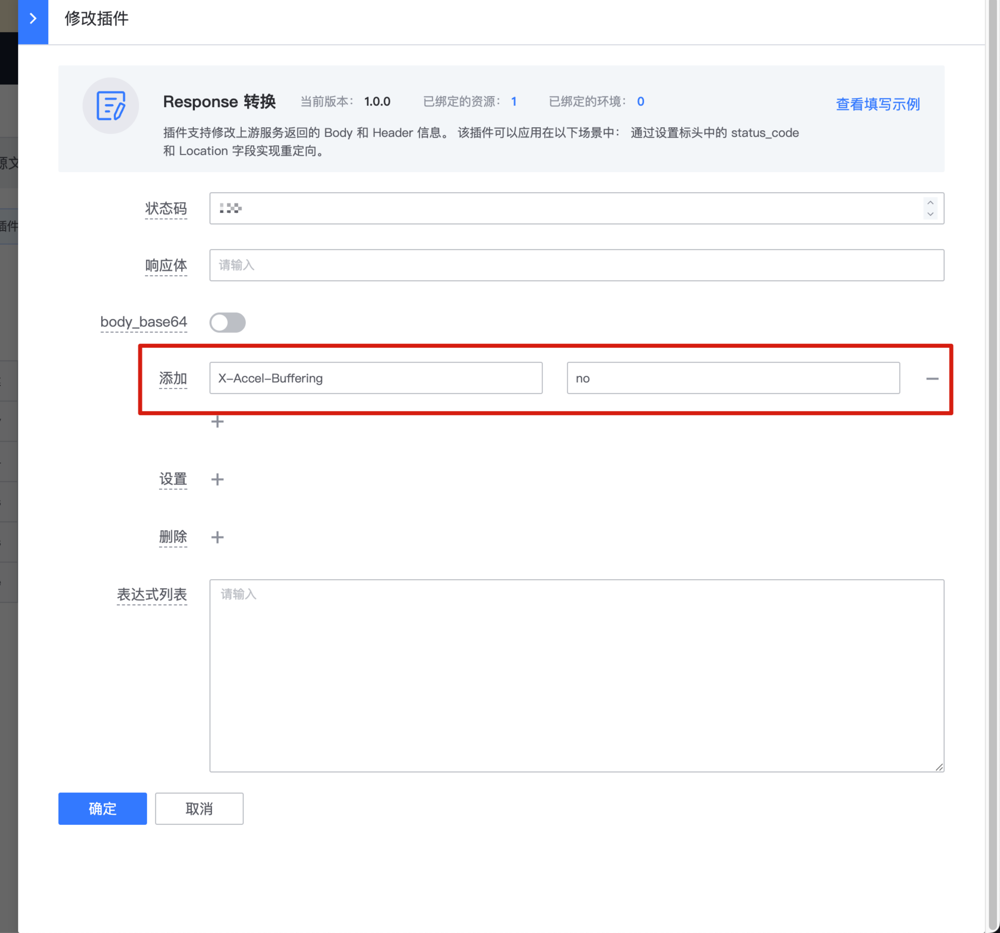

# 响应重写

## 网关版本

bk-apigateway >= 1.16.x

## 背景

某些场景下需要修改响应体。

建议查看 apisix 插件 [plugin: response-rewrite](https://apache-apisix.netlify.app/zh/docs/apisix/3.2/plugins/response-rewrite/) 官方文档了解更多配置说明。（仅开放了部分字段配置）

## 步骤

### 选择资源

在资源上新建 【Response 转换】插件

入口：【资源管理】- 【资源配置】- 找到资源 - 点击插件名称或插件数 - 【添加插件】

### 配置插件

### 效果

## 实践场景

### 1. 使用 response-rewrite 支持流式处理

如果接口需要支持：

- [支持 WebSocket](../Connect/support-websocket.md)

如果被调用的后端服务接口是可以控制的，我们可以通过改造响应头来支持

client <- nginx <- [X-Accel-Buffering:no] apisix <- [X-Accel-Buffering:no] 后端服务

1. 在后端服务对应接口的 response 中增加返回头

   X-Accel-Buffering: no

   Cache-Control: no-store 【可选，建议一并配上】

2. 在蓝鲸 API 网关对应接口增加插件 response-rewrite， 在返回给接入层 nginx 的响应中加入头 X-Accel-Buffering: no 以及 Cache-Control: no-store

相关文档：[nginx: X-Accel-Buffering](https://nginx.org/en/docs/http/ngx_http_proxy_module.html#proxy_ignore_headers)
