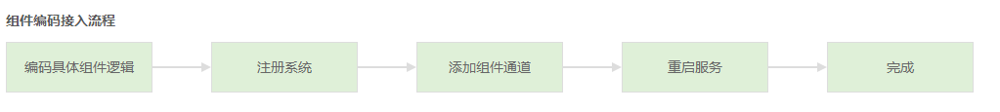

# API 网关 简介

蓝鲸 API 网关（API Gateway）是蓝鲸体系的 API 托管服务。可以帮助开发者创建、发布、维护、和保护 API，以快速、低成本、低风险地开放系统的数据或服务。 API 网关支持组件编码接入和在线自助接入两种接入方式，并提供了统一的 **用户认证、蓝鲸应用鉴权、请求转发、日志记录** 等功能。

## API 网关接入方式简述

### 组件编码接入

编码组件逻辑，并通过注册系统以及组件通道，提供 API 服务。适用于需自定义处理逻辑的场景。

API 网关中，开发者编写组件代码，并通过 **通道管理**，添加组件通道配置，提供 API 服务。

组件通道配置，通过 **组件代号**，与代码中的组件类进行关联。

#### 组件代号

**组件代号**由 API 网关根据组件代码自动生成，规则如下：

- 组件代号由三部分组成：`前缀`.`系统名`.`组件类名`

- 前缀：默认为 `generic`

- 系统名：由组件类的 sys_name 属性指定，并转换为小写格式

- 组件类名：组件类的类名，类名非首字母的大写字母前加下划线，并转换为小写格式，如 GetHostList 转换为 get_host_list

根据上述规则，系统 CMDB 组件类 GetHostList 的组件代号为：`generic.cmdb.get_host_list`

### 在线自助接入

通过在线配置接口信息，提供 API 服务。适用于将 HTTP 协议、无需特殊处理的接口，直接对接的场景。

API 网关中，开发者通过 **自助接入**，在线配置接口信息，提供 API 服务。

自助接入方式，开发者不需要编写代码，仅通过配置，即可将自己的接口接入 API 网关。

## 名词解释

### 系统

系统主要用于对 API 进行分类，在 API 网关中，每一个 API 只能属于一个系统；系统的名称是系统的唯一标识，主要由字母和数字组成。

> 注：系统 CC、JOB、GSE、DATA、AUTH、BK_LOGIN、BK_PAAS 为默认系统，注册系统时，不能使用

### 通道和组件模块

API 通过组合通道和组件模块来为用户提供接口服务：

1) 通道

- 负责用户认证、应用认证、请求日志记录

2) 组件模块

- 负责参数验证、请求转发、响应处理

- 通道与组件模块的对应关系，可以在 **通道管理** 中进行管理。

在通道管理页面，管理员为某个通道设置对应组件模块时，需要填写组件模块的 **组件代号**。

### 自助接入组件

自助接入组件，是用户通过 **自助接入** 功能，注册的组件。

通过自助接入的方式，用户不需要开发组件模块代码，仅通过配置即可将自己的接口接入 API，自助接入的组件，

同样会进行用户认证和 APP 应用认证，以减少接口开发者的负担。

## 类别

| 序号 | 基础用户服务 | 配置管理 | 主机管控 |
|-----| ----- | -----|---|
| 1 | 蓝鲸登录平台 BK_LOGIN| 蓝鲸配置平台 CC | 蓝鲸作业平台 JOB|
| 2 | 蓝鲸消息管理 CMSI| …… |…… |

## 参数说明

| 序号 | 参数名 | 含义 |  类型 | 平台 |
|:-----:| :-----: | :-----:|:-----: | :-----:|
| 1 | bk_app_code | app 的唯一标识码	 | string	| PaaS 平台 |
| 2 | bk_app_secret	 | 应用私密 key，可以通过   蓝鲸 “开发者中心” -> 点击 “应用 ID” ->   “基本信息” 获取	 | string	|  PaaS 平台 |
| 3 | bk_signature	 | 签名	 | string	| PaaS 平台 |
| 4 | bk_timestamp	 | 时间戳	 | int	| PaaS 平台 |
| 5 | bk_access_token | 	登录票据		| string	| PaaS 平台 |
| 6 | bk_token	 | 当前用户登录态，可以通过 Cookie 获取		| string	| PaaS 平台 |
| 7 | bk_biz_id	 | 蓝鲸配置系统中的业务 ID		| int	| 配置平台 |
| 8 | bk_cloud_id	 | 子网 ID	 | int	| 配置平台 |
| 9 | bk_cloud_name | 子网名称 | 	string	| 配置平台 |

## 在线文档

更多官方 API 的含义和使用信息，可前往 APIGateway->网关 API 文档 查阅。

> 说明：更多 API 信息，会持续更新。
