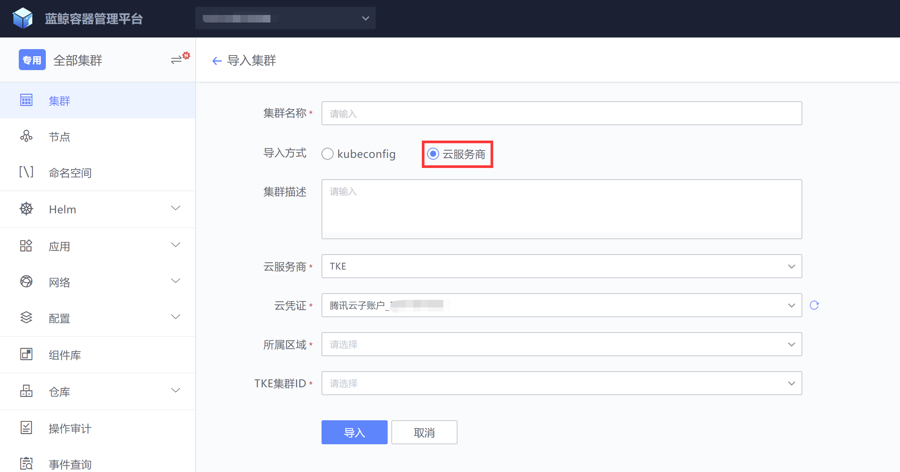
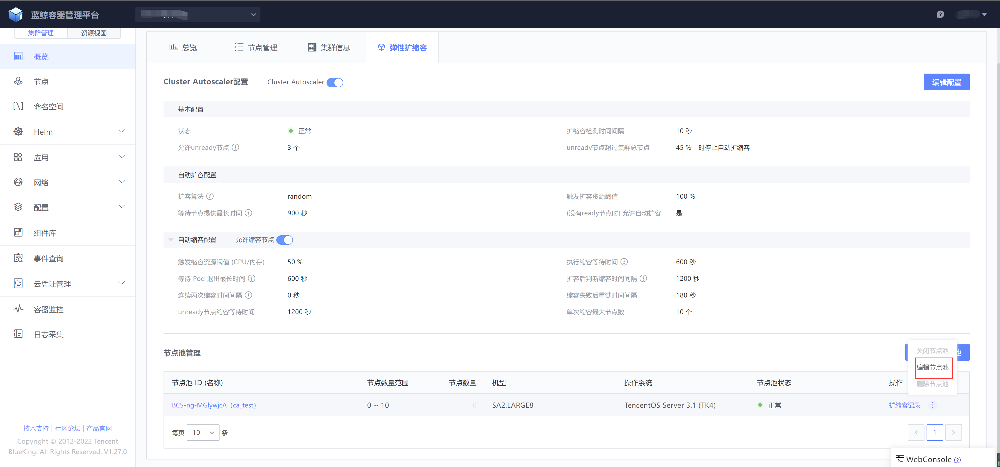
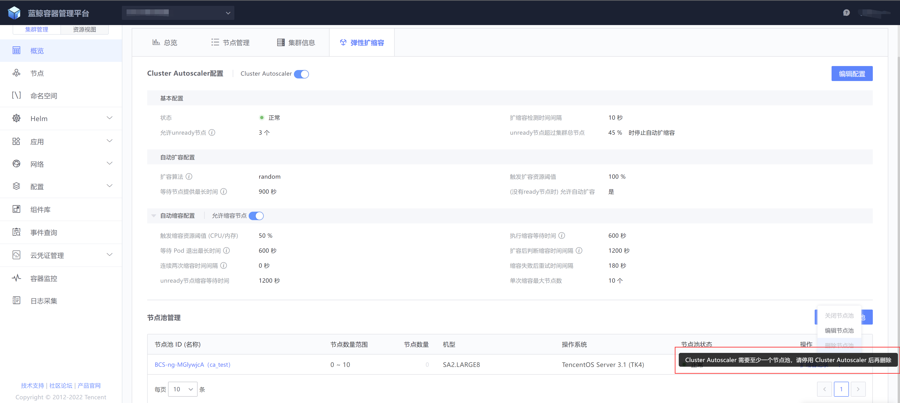

# 节点自动扩缩容

## 节点自动扩缩容功能介绍
节点自动扩缩容功能使用Cluster Autoscaler组件自动调整集群节点数量，当面对以下情况时：
- 集群中存在因资源不足无法运行的 pod；
- 集群某些节点一段时间内资源利用率都处于较低状态，且这些节点上的 pod 可调度到其他现存节点上

## 节点自动扩缩容功能前置条件
- 使用云服务器商导入集群

  

  详情请参考 [集群管理的导入已有集群](cluster_management.md)

- 云凭证必须有以下权限
    ```json
    {
        "version": "2.0",
        "statement": [
            {
                "effect": "allow",
                "action": [
                    "tke:*"
                ],
                "resource": [
                    "*"
                ]
            },
            {
                "effect": "allow",
                "action": [
                    "cvm:DescribeSecurityGroups",
                    "cvm:DescribeImages",
                    "cvm:DescribeInstances"
                ],
                "resource": [
                    "*"
                ]
            },
            {
                "effect": "allow",
                "action": [
                    "vpc:Describe*"
                ],
                "resource": [
                    "*"
                ]
            },
            {
                "effect": "allow",
                "action": [
                    "as:*"
                ],
                "resource": [
                    "*"
                ]
            }
        ]
    }
    ```


##  节点池与Autoscaler组件配置

### 新建节点池


### 开启Cluster Autoscaler组件

开启Cluster Autoscaler组件必须至少有一个状态为“正常”的节点池，否则无法开启


### 快速验证节点自动扩缩容功能

一般节点自动扩缩容是结合K8S集群的HPA功能一起完成，HPA具体功能详情请见 [Pod 水平自动扩缩](https://kubernetes.io/zh-cn/docs/tasks/run-application/horizontal-pod-autoscale/)

这里为了快速验证节点自动扩缩容功能，我们手工触发节点的扩容与缩容

#### 资源计算方式

集群资源使用不是计算真实的节点资源使用率，而是使用workload实例的Request值来计算，具体情况请参考 为 [Pod 和容器管理资源](https://kubernetes.io/zh-cn/docs/concepts/configuration/manage-resources-containers/)

#### 触发扩容

##### 触发扩容条件

- 参数 “触发扩容资源阈值”为100%（默认）， 存在因资源不足不可调度的 Pod，即 Pod 的 Condition 中 PodScheduled 为 False，且通过原生调度算法判断确实不能将该 Pod 调度到现有节点上
- 参数 “触发扩容资源阈值”为非100%，当集群资源使用率大于等于设定阈值触发扩容

##### 模拟触发扩容

根据集群节点资源情况来决定创建测试workload实例数，例如：集群中目前有 1 个节点，这个节点的配置为4核8G，那我创建一个workload，实例数为5，每个实例的Request为1核，就必须会触发一次节点扩容


```yaml
apiVersion: apps/v1
kind: Deployment
metadata:
  name: deployment-test
  namespace: default
  labels:
    app: nginx
spec:
  replicas: 5
  selector:
    matchLabels:
      app: nginx
  template:
    metadata:
      labels:
        app: nginx
    spec:
      containers:
        - name: nginx
          image: 'nginx:latest'
          ports:
            - containerPort: 80
          resources:
            requests:
              cpu: "1"
```


#### 触发缩容

##### 触发缩容条件

- 节点处于空闲状态
- 节点装箱率低于一定阈值（cpu、内存 默认50%），且其上的Pod可以被调度到其余节点
- 以上两种情况之一持续一段时间后将被缩容
- 缩容时也会考虑剩余资源比例，如果缩容一个节点会导致不符合剩余资源比例，则不会缩容该节点
- 扩容后20分钟是缩容冷却期，此时间段内不会执行缩容操作

##### 模拟触发缩容

删除 模拟触发扩容的workload “deployment-test”，等待20分钟之后再看


### 编辑节点池



目前只支持编辑“节点池信息”，由于腾讯云接口限制暂不支持“节点配置”编辑，如需更换节点配置，请新建一个节点池，然后关闭老的节点池即可（如果节点池中有节点不要删除节点池，关闭节点池即可，后续扩容节点不会使用老的节点池；如果节点池中没有节点，也可以删除老的节点池）


### 关闭与删除节点池

如果在Cluster Autoscaler组件开启的情况下，然后又只有1个节点，为了保证Cluster Autoscaler组件的正常运行，是不可以关闭或删除节点池的，需要先关闭Cluster Autoscaler组件




在停用Cluster Autoscaler组件后，如果节点池已存在节点，也是不能删除节点池的，需要先删除


### Cluster Autoscaler组件参数说明

| 参数类型     | 参数名称                        | 对应组件参数                     | 默认值 | 参数说明                                                     |
| ------------ | ------------------------------- | -------------------------------- | ------ | ------------------------------------------------------------ |
| 基本配置     | 状态                            | 无                               | 已停用 | Cluster Autoscaler组件状态，有“正常“与“已停用”两种状态       |
| 基本配置     | 扩缩容检测时间间隔              | scan-interval                    | 10秒   | Cluster Autoscaler多久执行一次循环                           |
| 基本配置     | 允许unready节点                 | ok-total-unready-count           | 3个    | 自动扩缩容保护机制，集群中unready节点大于允许unready节点数量，且unready节点的比例大于设置的比例，会停止Cluster Autoscaler功能，否则Cluster Autoscaler功能正常运行 |
| 基本配置     | unready节点超过集群总节点百分比 | max-total-unready-percentage     | 45%    | 自动扩缩容保护机制，集群中unready节点大于允许unready节点数量，且unready节点的比例大于设置的比例，会停止Cluster Autoscaler功能，否则Cluster Autoscaler功能正常运行 |
| 自动扩容配置 | 扩容算法                        | expander                         | random | random：在有多个节点池时，随机选择节点池<br/>least-waste：在有多个节点池时，以最小浪费原则选择，选择有最少可用资源的节点池<br/>most-pods：在有多个节点池时，选择容量最大（可以创建最多Pod）的节点池 |
| 自动扩容配置 | 触发扩容资源阈值                | buffer-resource-ratio            | 100%   | 集群资源CPU或内存使用率达到多少时触发扩容（Request），100%为workload实例触发Pendding事件后触发扩容 |
| 自动扩容配置 | 等待节点提供最长时间            | max-node-provision-time          | 900秒  | 如果节点池在设置的时间范围内没有提供可用资源，会导致此次自动扩容失败 |
| 自动扩容配置 | 没有ready节点时允许自动扩容     | scale-up-from-zero               | true   | 当没有 ready 节点时允许 CA 扩容                              |
| 自动缩容配置 | 允许缩容节点                    | scale-down-enabled               | true   | 是否允许缩容节点                                             |
| 自动缩容配置 | 触发缩容资源阈值                | scale-down-utilization-threshold | 50%    | 集群资源CPU或内存使用率（Request）低于阈值触发缩容节点流程   |
| 自动缩容配置 | 执行缩容等待时间                | scale-down-unneeded-time         | 600秒  | Cluster Autocaler组件评估集群可以缩容多久后开始执行缩容，防止集群容量在短时间内或高或低于设置的缩容阈值造成频繁扩缩容操作 |
| 自动缩容配置 | 等待Pod退出最长时间             | max-graceful-termination-sec     | 600秒  | 缩容节点时，等待 pod 停止的最长时间（不会遵守 terminationGracefulPeriodSecond，超时强杀） |
| 自动缩容配置 | 扩容后判断缩容时间间隔          | scale-down-delay-after-add       | 1200秒 | 扩容节点后多久才继续缩容判断，如果业务自定义初始化任务所需时间比较长，需要适当上调此值 |
| 自动缩容配置 | 连续两次缩容时间间隔            | scale-down-delay-after-delete    | 0秒    | 缩容节点后多久再继续缩容节点，默认设置为0，代表与扩缩容检测时间间隔设置的值相同 |
| 自动缩容配置 | 缩容失败后重试时间间隔          | scale-down-delay-after-failure   | 180秒  | 缩容节点失败后多久，再继续缩容节点                           |
| 自动缩容配置 | unready节点缩容等待时间         | scale-down-unready-time          | 1200秒 | 节点 unready 状态后多久才被缩容（如果业务自定义初始化任务所需时间比较长，需要修改此参数） |
| 自动缩容配置 | 单次缩容最大节点数              | max-empty-bulk-delete            | 10个   | CA 一次缩容空节点的最大数量                                  |

