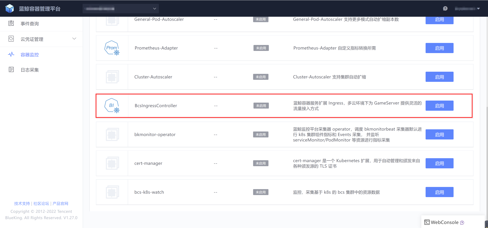
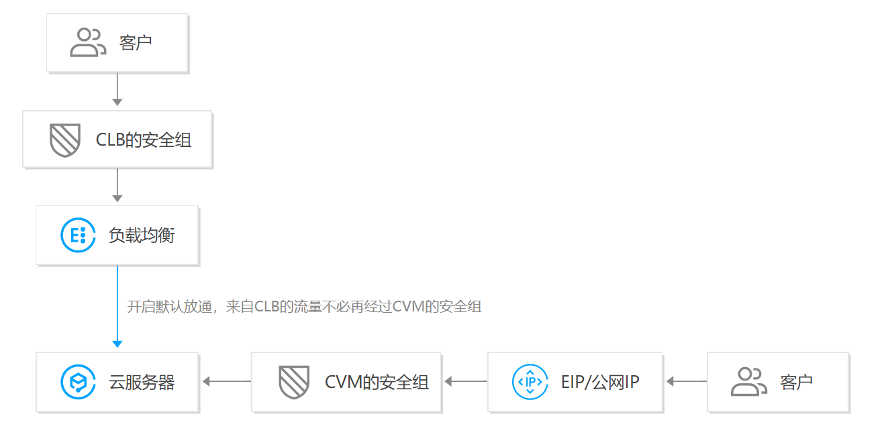
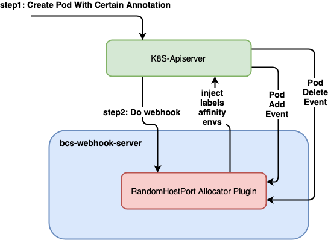

# bcs-ingress-controller TKE使用指南

## bcs-ingress-controller介绍
bcs-ingress-controller是蓝鲸容器服务扩展 Ingress，多云环境下为业务服务提供灵活的流量接入方式，目前支持的云服务商有Tencent TKE、Amazon EKS、Google GKE

## 特性支持
- 支持HTTPS，HTTP，TCP，UDP协议
- 支持腾讯云Clb健康检查等参数配置
- 支持单个ingress同时控制多个clb实例
- 支持转发到NodePort模式和转发到直通Pod模式
- 支持单端口多Service流量转发，以及WRR负载均衡方法下权重配比
- 直通Pod模式下，支持Service内部通过Label选择Pod，以及WRR负载均衡方法下权重配比
- 支持StatefulSet和GameStatefulSet端口段映射
- 云接口的客户端限流与重试
- 为任意Pod动态分配端口
## bcs-ingress-controller组件部署
### 1. 腾讯云账户与权限
部署bcs-ingress-controller组件的SecretID、SecretKey至少需要有如下权限：
["clb:Describe*",
"clb:DescribeTargetHealth",
"clb:DescribeForwardLBListeners",
"clb:DescribeLoadBalancerListeners",
"clb:DescribeForwardLBBackends",
"clb:DescribeExclusiveClusters",
"clb:DescribeBlockIPList",
"clb:DescribeBlockIPTask",
"clb:DescribeClassicalLBByInstanceId",
"clb:DescribeClusterResources",
"clb:DescribeLoadBalancerListByCertId",
"clb:DescribeQuota",
"clb:DescribeSetInnerName",
"clb:DescribeCustomizedConfigList",
"clb:DescribeCustomizedConfigContent",
"clb:AutoRewrite",
"clb:ModifyTargetWeight",
"clb:BatchModifyTargetWeight",
"clb:CreateListener",
"clb:DeleteListener",
"clb:CreateRule",
"clb:DeleteRule",
"clb:ModifyRule",
"clb:ManualRewrite",
"clb:ModifyListener",
"clb:RegisterTargets",
"clb:DeregisterTargets",
"clb:BatchDeregisterTargets",
"clb:ReplaceCertForLoadBalancers",
"clb:DeleteLoadBalancerListeners",
"clb:BatchRegisterTargets",
"clb:BatchDeregisterTargets",
"clb:AssociateTargetGroups",
"clb:DescribeTargetGroupInstances",
"clb:DescribeTargetGroupList",
"clb:DescribeTargetGroups",
"clb:DisassociateTargetGroups",
"cvm:DescribeInstances"]

#### 账户授权
设置单独的权限需要添加自定义策略，参考 https://cloud.tencent.com/document/product/598/37739 ，然后给子账号授权该策略。

为了方便，可以给直接子账号授权预设策略中 CLB 全部权限和 CVM 只读权限，这样可以不用创建自定义策略。如：


#### 生成 Secret ID 和 Secret Key
参考 https://cloud.tencent.com/document/product/598/37140 通过子账号生成 Secret ID 和 Secret Key

### 2. 组件部署

在组件库中找到“BcsIngressController”，点击“启用”按钮


配置TKE集群所在Region、SecretID、SecretKey参数后即可点击“启用”按钮部署bcs-ingress-controller组件，填入SecretID、SecretKey内容记得用base64加密

```bash
echo -n "<SecretID>" | base64
echo -n "<SecretKey>" | base64
```


## bcs-ingress-controller快速入门
### 1. 创建 CLB
参考 https://cloud.tencent.com/document/product/214/6149 创建腾讯云 CLB，地域和 VPC 需要和当前集群一致。实例类型选推荐类型，即【负载均衡（原“应用型负载均衡”）】。网络类型公网和内网都可以，IP 版本选 IPv4，其他默认即可。
创建完成后，进入负载均衡控制台获取 CLB ID。如：
### 2. 准备 workload
为了验证 ingress 绑定 pod ip，需要提前准备好对应的 workload，保存下面内容为ingress-test.yaml
```yaml
apiVersion: v1
kind: Namespace
metadata:
  name: ingress-test
---
apiVersion: apps/v1
kind: Deployment
metadata:
  name: nginx
  namespace: ingress-test
  labels:
    app: nginx
spec:
  replicas: 1
  selector:
    matchLabels:
      app: nginx
  template:
    metadata:
      labels:
        app: nginx
    spec:
      containers:
      - name: nginx
        image: nginx:1.14.2
        ports:
        - containerPort: 80
---
apiVersion: v1
kind: Service
metadata:
  name: nginx
  namespace: ingress-test
spec:
  selector:
    app: nginx
  ports:
    - protocol: TCP
      port: 8080
      targetPort: 80
  type: NodePort
```
把以下内容保存为文件nginx-sts.yaml
```yaml
apiVersion: apps/v1
kind: StatefulSet
metadata:
  name: nginx-sts
  namespace: ingress-test
  labels:
    app: nginx-sts
spec:
  replicas: 3
  serviceName: nginx-sts
  selector:
    matchLabels:
      app: nginx-sts
  template:
    metadata:
      labels:
        app: nginx-sts
    spec:
      containers:
      - name: nginx
        image: nginx:1.14.2
        ports:
        - containerPort: 80
---
apiVersion: v1
kind: Service
metadata:
  name: nginx-sts
  namespace: ingress-test
spec:
  selector:
    app: nginx-sts
  ports:
    - protocol: TCP
      port: 8080
      targetPort: 80
  type: ClusterIP
```

执行如下命令，创建workload
```bash
kubectl apply -f ingress-test.yaml
kubectl apply -f nginx-sts.yaml
```
### 3. 安装组说明
- CVM 安全组：控制 CLB 到 CVM 的流量，如果开启默认放通，则不用特地设置 CVM 安全组，否则需要放通 CLB 到 CVM 后端端口。如果是 Pod 直通，则已 Pod 端口为后端端口设置安全组。
- CLB 安全组：控制客户端到 CLB 的流量，放通指定客户端即可


### 4. 快速体验
#### NodePort转发
networkextension.bkbcs.tencent.com/lbids 替换为自己的 lb，
创建完成后，查看腾讯云 CLB 监听器，看 38080 端口是否被创建，后端 ip port 是否正常，ip 应该为 pod 所在节点的 ip，port 为 service 的 nodeport
```yaml
apiVersion: networkextension.bkbcs.tencent.com/v1
kind: Ingress
metadata:
  name: test1
  namespace: ingress-test
  annotations:
    networkextension.bkbcs.tencent.com/lbids: lb-xxx
spec:
  rules:
  - port: 38080
    protocol: TCP
    services:
    - serviceName: nginx
      serviceNamespace: ingress-test
      servicePort: 8080
```
#### CLB直通Pod
networkextension.bkbcs.tencent.com/lbids 替换为自己的 lb
创建完成后，查看腾讯云 CLB 监听器，看 39090 端口是否被创建，后端 ip port 是否正常，ip 应该为 pod 的 ip，port 为 80
```yaml
apiVersion: networkextension.bkbcs.tencent.com/v1
kind: Ingress
metadata:
  name: test2
  namespace: ingress-test
  annotations:
    networkextension.bkbcs.tencent.com/lbids: lb-xxx
spec:
  rules:
  - port: 39090
    protocol: TCP
    services:
    - serviceName: nginx
      serviceNamespace: ingress-test
      servicePort: 8080
      isDirectConnect: true
```
#### 端口段
networkextension.bkbcs.tencent.com/lbids 替换为自己的 lb
创建完成后，查看腾讯云 CLB 监听器，观察 30000-30001, 30002-30003, 30004-30005 三个端口段是否被创建，因为我们的验证Pod只监听一个80端口，所以只有vport映射的80端口是通的，30001映射的81，30002映射的82，30003映射的83，30004映射的84，30005映射的85都不可访问是正常现象，主要看CLB的规则是否创建正确即可

```yaml
apiVersion: networkextension.bkbcs.tencent.com/v1
kind: Ingress
metadata:
  name: test3
  namespace: ingress-test
  annotations:
    networkextension.bkbcs.tencent.com/lbids: lb-xxx
spec:
  portMappings:
  - startPort: 30000
    protocol: TCP
    startIndex: 0
    endIndex: 3
    segmentLength: 2
    workloadKind: StatefulSet
    workloadName: nginx-sts
    workloadNamespace: ingress-test
    rsStartPort: 80
```

#### 端口池
步骤一：创建端口池
loadBalancerIDs 替换为自己的 lb

```yaml
apiVersion: networkextension.bkbcs.tencent.com/v1
kind: PortPool
metadata:
  name: pool1
  namespace: ingress-test
spec:
  poolItems:
  - itemName: item1
    loadBalancerIDs: ["lb-xxx"]
    startPort: 31000
    endPort: 31010
```
查看 Portpool 是否创建成功，status 为 ready 说明创建成功
```
kubectl describe portpool pool1 -n ingress-test
```
步骤二：声明命名空间使用端口池
给 ingress-test 命名空间打上 label
```bash
kubectl label ns ingress-test bcs-ingress-controller-inject=true
```
步骤三：声明 pod 使用端口池
给之前创建的 nginx deployment 打上 annotation，声明使用端口池。
annotaions 内容：
```
portpools.networkextension.bkbcs.tencent.com: "true"
ports.portpools.networkextension.bkbcs.tencent.com: "{端口池名称} {端口协议名称} {端口号}"
```
例如：
```yaml
apiVersion: apps/v1
kind: Deployment
metadata:
  name: nginx-portpool
  namespace: ingress-test
  labels:
    app: nginx-portpool
spec:
  replicas: 1
  selector:
    matchLabels:
      app: nginx-portpool
  template:
    metadata:
      labels:
        app: nginx-portpool
      annotations:
        portpools.networkextension.bkbcs.tencent.com: "true"
        ports.portpools.networkextension.bkbcs.tencent.com: "pool1 TCP 80"
    spec:
      containers:
      - name: nginx-portpool
        image: nginx:1.14.2
        ports:
        - containerPort: 80
```
创建完成后，查看腾讯云 CLB 监听器，观察 31000 - 31009 端口是否被监听，创建完后31000映射的80端口是正常的，其它端口因为没有在容器中监听，所以没有绑定后端服务

### 常用命令
```bash
# 查看 Ingress
kubectl get ingress.networkextension.bkbcs.tencent.com -n namespace
# 查看监听器
kubectl get listener -n namespace
# 查看端口池
kubectl get portpool -n namespace
# 查看端口池绑定 pod
kubectl get portbinding -n namespace
```


## bcs-ingress-controller全部使用场景

### 1. CLB转到Service NodePort

#### 场景描述

* 命名空间 **default** 下有名为 **test-svc** 的NodePort类型的Service
* service **test-svc** 中有端口号为8080的TCP端口，对应的NodePort为31003
* service **test-svc** 8080端口对应后端pod端口同样为8080
* clb实例的id是**lb-xxxxxxx**
* Overlay集群，从集群外无法访问集群内Pod的IP地址
#### 想要达到的效果
* clb流量无法直接转发到Pod上，需要转到对应Service的NodePort上
* 需要对外暴露TCP 38080端口

```text
clb(38080 port) ------> service对应pod所在的node节点(31003 port) -------> pod(8080)
```

配置示例

```yaml
apiVersion: networkextension.bkbcs.tencent.com/v1
kind: Ingress
metadata:
  name: test1
  annotations:
    networkextension.bkbcs.tencent.com/lbids: lb-xxxxxxx
spec:
  rules:
  - port: 38080
    protocol: TCP
    services:
    - serviceName: test-svc
      serviceNamespace: default
      servicePort: 8080
```
### 2. CLB直通Pod
#### 场景描述
* 命名空间 **default** 下有名为 **test-svc** 的NodePort类型的Service
* service **test-svc** 中有端口号为28080的TCP端口
* service **test-svc** 28080端口对应后端deployment中的pod端口为8080
* Pod拥有underlay IP地址，从集群外可以访问集群内Pod的IP地址（或者Clb实例开通了SnatPro）
* clb实例的id是 **lb-xxxxxxx**
#### 想要达到的效果
* 假设集群是Underlay的，流量需要直通Pod
* 需要对外暴露TCP 38080端口

```text
clb(38080 port) ------> pod(8080)
```

配置示例

```yaml
apiVersion: networkextension.bkbcs.tencent.com/v1
kind: Ingress
metadata:
  name: test2
  annotations:
    networkextension.bkbcs.tencent.com/lbids: lb-xxxxxxx
spec:
  rules:
  - port: 38080
    protocol: TCP
    services:
    - serviceName: test-svc
      serviceNamespace: default
      servicePort: 28080
      isDirectConnect: true
```
注意：service 对应的 workload 需要在 `pod template` 中给容器暴露的端口指定 `containerPort`，如：
```yaml
apiVersion: apps/v1
kind: Deployment
...
spec:
...
  template:
...
    spec:
      containers:
      - name: nginx
        image: nginx:1.14.2
        ports:
        - containerPort: 80 # 对应 service 中的 targetPort
          protocol: TCP
```

### 3. 使用 hostPort
#### 场景描述
* 命名空间 **default** 下有名为 **test-svc** 的Service
* service **test-svc** 中有端口号为28080的TCP端口
* service **test-svc** 28080端口对应后端deployment中的pod端口为8080，pod 8080 对应的 hostPort 为 18080
* clb实例的id是 **lb-xxxxxxx**

#### 想要达到的效果

* 需要对外暴露TCP 38080端口

```text
clb(38080 port) ------> pod hostPort(18080)
```

配置示例

```yaml
apiVersion: networkextension.bkbcs.tencent.com/v1
kind: Ingress
metadata:
  name: test2
  annotations:
    networkextension.bkbcs.tencent.com/lbids: lb-xxxxxxx
spec:
  rules:
  - port: 38080
    protocol: TCP
    services:
    - serviceName: test-svc
      serviceNamespace: default
      servicePort: 28080
      isDirectConnect: true
      hostPort: true
```

### 4. CLB对外暴露HTTPS（单向验证）协议443端口
#### 场景描述

* 命名空间 **default** 下有名为 **test-svc** 的NodePort类型的Service
* service **test-svc** 中有端口号为8080的TCP端口，对应的NodePort为31003
* service **test-svc** 8080端口对应后端pod端口同样为8080
* Overlay集群，从集群外无法访问集群内Pod的IP地址
* 腾讯云上HTTPS证书ID为**xxx**，单向验证
* clb示例的id是**lb-xxxxxxx**

#### 想要达到的效果

* clb流量无法直接转发到Pod上，需要转到对应Service的NodePort上
* 需要对外暴露TCP 443端口

```text
clb(443 port)(www.qq.com)(/path1) ------> service对应pod所在的node节点(31003 port) -------> pod(8080)
```

配置示例

```yaml
apiVersion: networkextension.bkbcs.tencent.com/v1
kind: Ingress
metadata:
  name: test3
  annotations:
    networkextension.bkbcs.tencent.com/lbids: lb-xxxxxxx
spec:
  rules:
  - port: 443
    protocol: HTTPS
    certificate:
      mode: UNIDIRECTIONAL
      certID: xxx
    layer7Routes:
    - domain: www.qq.com
      path: /path1
      services:
      - serviceName: test-tcp
        serviceNamespace: default
        servicePort: 8080
```

### 5. StatefulSet/GameStatefulSet端口段映射

#### 场景描述

* 命名空间 **game** 下有名为 **gameserver** StatefulSet，有6个Pod
* **gameserver** 的每个Pod都需要单独直接对外提供UDP服务
* **gameserver** 每个Pod的端口号与Pod需要有一定对应关系
* **gameserver** clb直通到每个Pod，underlay网络和host网络不需要额外设置
* VPC路由方案（overlay）参考[在 TKE 上使用负载均衡直通 Pod](https://cloud.tencent.com/document/product/457/48793)
* clb实例的id是**lb-xxxxxxx**

#### 想要达到的效果

* 端口映射
  * gameserver-0对应30000~30004端口
  * gameserver-1对应30005~30009端口
  * .....
  * gameserver-5对应30020~30024端口

配置示例

```yaml
apiVersion: networkextension.bkbcs.tencent.com/v1
kind: Ingress
metadata:
  name: test4
  annotations:
    networkextension.bkbcs.tencent.com/lbids: lb-xxxxxxx
spec:
  portMappings:
  - startPort: 30000
    protocol: UDP
    # [startIndex, endIndex)，左闭右开区间
    startIndex: 0
    endIndex: 6
    segmentLength: 5
    # 目前支持StatefulSet和GameStatefulSet
    workloadKind: StatefulSet
    workloadName: gameserver
    workloadNamespace: game
    # rsStartPort: 3000 # 设置后端pod的起始端口
    # isRsPortFixed: false # 设置所有后端Pod端口是否一样
    # hostPort: false # 是否使用 hostPort
```

注意：
* 端口段映射依赖公网clb端口段映射接口，该接口只支持公网clb的TCP和UDP协议。
* 当ignoreSegment为false时，默认使用端口段接口，即一个端口段对应一个规则；而当ignoreSegment为true时，使用普通接口，一个端口对应一个规则；
* 使用端口段接口可以使得一个clb实例注册更多端口
* 使用 hostPort 需要开启 `isRsPortFixed` 和 `ignoreSegment`，同时需要定义端口段中所有端口的 `containerPort` 和 `hostPort`，如果使用随机 HostPort方案，则可不手动指定 hostPort。

### 6. 随机 HostPort方案
#### 场景描述
Kubernetes技术已经成为潮流，但是Kubernetes的集群流量导入方案并不能够完美适应各种场景：

一般情况下，从集群外部进入集群内的流量，必定经过一层service或者Ingress的转发，存在一层性能损失；而且k8s service对tcp长连接的负载均衡不太理想（连接数较少的情况下，比如30个连接），会导致业务中长连接服务的负载不均衡，进而导致资源浪费以及故障时影响面可能较大。
很多云提供商借助云网络，能够实现负载均衡器直联Pod，但是Pod需要消耗VPC内underlay的IP资源。如果在裸金属机器上，则就不能实现Pod的直接访问。
在无云基础设施的情况下，Pod之间无法进行跨集群的服务发现。
有状态服务之间需要互访、同时供外部访问。
如果能够利用Kubernetes hostport特性，实现hostport的随机分配，在无云网络特别支持的情况下，也能够提供Pod之间的跨集群访问，同时避免service层转发带来的性能开销。将pod的监听端口映射到其所在node的某个随机可用的端口，从而集群内外都可以通过node上的这个端口来访问这个pod

具体流程如下：

pod启动的时候，把pod想要监听的端口随机映射到该pod所在node上的某个随机可用的端口
通过环境变量，在pod内进程启动之前，把node的ip和port告诉pod里的业务进程
pod内的业务进程启动时，可以把该node的ip和port通过服务发现等机制告诉k8s集群内部或外部的其他业务进程
k8s集群内部或外部的其他业务进程访问该node的ip和port，node会把流量转发给pod，从而达到了与pod通信的目的

#### 使用方法
* 针对带有特定annotation的Pod进行Hook

```shell
randhostport.webhook.bkbcs.tencent.com: "true"
ports.randhostport.webhook.bkbcs.tencent.com: "8080,metric"
```

* 被注入Pod内容变化过程

注入前的Deployment

```yaml
apiVersion: apps/v1
kind: Deployment
metadata:
  name: nginx-deployment
  labels:
    app: nginx
spec:
  replicas: 3
  selector:
    matchLabels:
      app: nginx
  template:
    metadata:
      labels:
        app: nginx
      annotations:
        randhostport.webhook.bkbcs.tencent.com: "true"
        # 可以是端口名字或者端口号
        ports.randhostport.webhook.bkbcs.tencent.com: "8080,metric"
    spec:
      containers:
      - name: nginx
        image: nginx:1.14.2
        ports:
        - containerPort: 8080
        - name: metric
          containerPort: 8081
```

注入后的Pod

用户最终可以通过以下环境变量获取到注入信息
BCS_RANDHOSTPORT_FOR_CONTAINER_PORT_
BCS_RANDHOSTPORT_HOSTIP
BCS_RANDHOSTPORT_POD_NAME
BCS_RANDHOSTPORT_POD_NAMESPACE

```yaml
apiVersion: v1
kind: Pod
metadata:
  name: nginx-deployment-xxxx-xxxxx
  metadata:
    labels:
      app: nginx
      # 注入随机hostport相关的label，用于pod亲和性调度，防止调度失败
      29001.randhostport.webhook.bkbcs.tencent.com: "29001"
      29323.randhostport.webhook.bkbcs.tencent.com: "29323"
    annotations:
      randhostport.webhook.bkbcs.tencent.com: "true"
      ports.randhostport.webhook.bkbcs.tencent.com: "8080,metric"
spec:
  containers:
  - name: nginx
    image: nginx:1.14.2
    ports:
    - containerPort: 8080
      hostPort: 29001
    - name: metric
      containerPort: 8081
      hostPort: 29323
    env:
    - name: BCS_RANDHOSTPORT_FOR_CONTAINER_PORT_8080
      value: "29001"
    - name: BCS_RANDHOSTPORT_FOR_CONTAINER_PORT_8081
      value: "29323"
    - name: BCS_RANDHOSTPORT_HOSTIP
      valueFrom:
        fieldRef:
          apiVersion: v1
          fieldPath: status.hostIP
    - name: BCS_RANDHOSTPORT_POD_NAME
      valueFrom:
        fieldRef:
          apiVersion: v1
          fieldPath: metadata.name
    - name: BCS_RANDHOSTPORT_POD_NAMESPACE
      valueFrom:
        fieldRef:
          apiVersion: v1
          fieldPath: metadata.namespace
  # 注入pod亲和性
  affinity:
    podAntiAffinity:
      requiredDuringSchedulingIgnoredDuringExecution:
        - labelSelector:
            matchLabels:
              29001.randhostport.webhook.bkbcs.tencent.com: "29001"
          topologyKey: kubernetes.io/hostname
        - labelSelector:
            matchLabels:
              29323.randhostport.webhook.bkbcs.tencent.com: "29323"
          topologyKey: kubernetes.io/hostname
```
#### 详细设计

##### 整体架构



* randhostport作为bcs-webhook-server的插件存在，减少了部署的复杂性和对kube-apiserver压力
* randhostport拦截特定Pod的创建，监听Pod的变化
* randhostport维护一个端口资源池

##### 随机端口分配策略


* 维护一个针对（端口号，已分配的Pod的数量）映射关系的优先级队列，以已分配的Pod数量为优先级，总是挑选已分配Pod最少的端口号作为本次随机的hostport端口号。
* 每次都Pod增加或者删除时，更新优先级队列中对应端口号的Quantity值。

### 7. NodePort模式下，不同Service之间进行权重配比

#### 场景描述

* 命名空间 **test** 下有名为 **svc1** 和 **svc2**的两个Service
* service **svc1** 和 **svc2** 中都有端口号为8080的TCP端口，**svc1** 对应的NodePort为31003， **svc2** 对应的NodePort为31004
* 80%的流量转给svc1，20%的流量转给svc2
* clb实例的id是**lb-xxxxxxx**

#### 想要达到的效果

```text
clb(38080 port) -----80%---> service svc1 对应pod所在的node节点(31003 port) -----> svc1 pods(8080)
                  |--20%---> service svc2 对应pod所在的node节点(31004 port) -----> svc2 pod(8080)
```

配置示例

```yaml
apiVersion: networkextension.bkbcs.tencent.com/v1
kind: Ingress
metadata:
  name: test1
  annotations:
    networkextension.bkbcs.tencent.com/lbids: lb-xxxxxxx
spec:
  rules:
  - port: 38080
    protocol: TCP
    services:
    - serviceName: svc1
      serviceNamespace: default
      servicePort: 8080
      # 注意：这里的权重只是clb控制台上RS的权重，最终的流量比例，需要考虑后端实例的数量
      weight:
        value: 80
    - serviceName: svc2
      serviceNamespace: default
      servicePort: 8080
      weight:
        value: 20
```

### 8. 直通模式下，同Service不同Deployment Pod之间权重配比
#### 场景描述

* 存在名为nginx-svc2的service，同时关联nginx-v2-1和nginx-v2-2不同的两个deployment
* nginx-v2-1和nginx-v2-2对应的pod template labels不同

#### 想要达到的效果

* nginx-v2-1的pods在clb上对应的rs ip权重为10
* nginx-v2-2的pods在clb上对应的rs ip权重为20

配置示例

```yaml
apiVersion: networkextension.bkbcs.tencent.com/v1
kind: Ingress
metadata:
  name: test-tcp
  namespace: ingress-test
  annotations:
    networkextension.bkbcs.tencent.com/lbids: lb-7hxxxxx
spec:
  rules:
  - port: 8080
    protocol: TCP
    services:
    - serviceName: nginx-v2
      serviceNamespace: ingress-test
      servicePort: 8080
      isDirectConnect: true
      subsets:
      - labelSelector:
          version: v2-1
        weight:
          value: 10
      - labelSelector:
          version: v2-2
        weight:
          value: 20
```

### 9. StatefulSet端口HTTP协议一一映射
#### 场景描述

* 命名空间 **game** 下有名为 **gameserver** StatefulSet，有6个Pod
* **gameserver** 的每个Pod都需要单独直接对外提供HTTPS服务
* **gameserver** 每个Pod的端口号与Pod需要有一定对应关系
* **gameserver** 拥有underlay IP地址或者是Host模式，或者clb开通了Global Router直通模式
* clb实例的id是**lb-xxxxxxx**

#### 想要达到的效果

* 端口映射
  gameserver-0对应30000端口
  gameserver-1对应30001端口
  .....
  gameserver-5对应30005端口

* 配置示例
    ```yaml
    - startPort: 30000
        protocol: HTTPS
        startIndex: 0
        endIndex: 6
        workloadKind: StatefulSet
        workloadName: gameserver
        workloadNamespace: game
        certificate:
          mode: UNIDIRECTIONAL
          certID: xxxxxxx
        routes:
        - domain: www.qq.com
          path: /path2
    ```

### 10. 为Pod动态分配云负载均衡器端口资源

#### 场景描述
在某些业务场景下，某些服务为了减少延迟，通常直接对客户端对外提供公网IP和端口，然而，服务器直接配置公网IP地址会存在一定安全风险，同时也面临公网IP消耗量大，无法保证高可用等问题。所以各大云厂商都提供了高可用的云负载均衡器，通过介入云负载均衡器能实现防护网络攻击，收敛IP地址，消除单点故障的效果。  
在云原生架构下，各大云厂商的都提供了Kuberentes原生LoadBalancer和Ingress对接云负载均衡器的实现，但是并没有提供为单个服务实例暴露公网端口的能力。基于BCS提供的bcs-ingress-controller，用户可以实现为单个Pod分配一个或者一段端口，但是需要提前设计映射规则，在多环境多版本场景下，管理不够便捷直观。期望有一种更加直观的方案，在不需要提前设定映射规则的情况下，使得单个pod能够绑定云负载均衡器端口资源。该方案需要具有以下功能：

* 维护云负载均衡器端口资源池，能够动态地向资源池中增加和删除云负载均衡器
* Pod通过简单的annotation进行端口资源绑定
* Pod中程序需要读取到绑定的负载均衡器信息和端口信息，需要某种机制通知Pod绑定过程是否已完成
* 能够为Pod的同一端口分配多个云负载均衡器，实现多运营商接入
* 为端口分配增加时间窗口，使得同名Pod在重新调度之后能够复用原来的VIP和端口
* 为集群中可用端口资源提供可观测手段
#### 操作指引
#####  创建端口池

假设我们已经拥有了一个id为lb-00001的clb实例，我们就可以创建一个端口池资源

```yaml
apiVersion: networkextension.bkbcs.tencent.com/v1
kind: PortPool
metadata:
  name: test-pool1
  namespace: test
spec:
  poolItems:
  # 定义了一个包含31000-31099总共100个端口的端口池Item
  - itemName: item1 # 端口池item名称，每个item不能重名
    loadBalancerIDs: ["lb-00001"]
    protocol: "TCP" # 端口池的协议，不填则默认为 "TCP,UDP"
    startPort: 31000
    endPort: 31100
```

当我们创建完PortPool之后，PortPool会进行初始化，并完成负载均衡监听器的提前创建，我们需要等待PortPool中item的状态变成Ready之后，才能绑定端口资源。

```yaml
apiVersion: networkextension.bkbcs.tencent.com/v1
kind: PortPool
metadata:
  annotations:
  finalizers:
  - ingresscontroller.bkbcs.tencent.com
  name: test-pool1
  namespace: test
spec:
  poolItems:
  - endPort: 31100
    itemName: item1
    loadBalancerIDs:
    - lb-00001
    startPort: 31000
status:
  poolItems:
  - itemName: item1
    loadBalancerIDs:
    - lb-00001
    message: Ready
    poolItemLoadBalancers:
    - ips:
      - 1.1.1.1
      loadbalancerID: lb-00001
      loadbalancerName: test-nj-loadtest-public1
      region: ap-nanjing
      type: OPEN
    segmentLength: 0
    startPort: 31000
    endPort: 31100
    # 此时表示端口池Item已初始化成功
    status: Ready
```

##### 给需要注入端口的Pod所在Namespace打上端口注入标签

```shell
kubectl label ns test bcs-ingress-controller-inject=true
```

##### 给Pod Template增加端口池注解

用户只需要为Pod Template增加两条annotations即可给Pod注入端口池中的端口：

* portpools.networkextension.bkbcs.tencent.com: "true"
* ports.portpools.networkextension.bkbcs.tencent.com: "{端口池名称} {端口协议名称} {端口号}"

```yaml
---
apiVersion: apps/v1
kind: Deployment
metadata:
  name: nginx
  namespace: test
  labels:
    app: nginx
spec:
  replicas: 1
  selector:
    matchLabels:
      app: nginx
  template:
    metadata:
      labels:
        app: nginx
      annotations:
        # 此注解表示Pod需要注入端口池
        portpools.networkextension.bkbcs.tencent.com: "true"
        # 此注解表示Pod需要关联通命名空间下的端口池test-pool1，暴露端口containerPort 80，且为TCP协议
        ports.portpools.networkextension.bkbcs.tencent.com: "test-pool1 TCP 80"
    spec:
      containers:
      - name: nginx
        image: nginx:latest
        ports:
        - containerPort: 80
        # 挂载annotation到文件目录/etc/podinfo，此路径用户可以自行定义
        volumeMounts:
        - mountPath: /etc/podinfo
          name: podinfo
      volumes:
      - name: podinfo
        downwardAPI:
          defaultMode: 420
          items:
          - fieldRef:
              apiVersion: v1
              fieldPath: metadata.annotations
            path: annotations
```

##### 读取端口信息和端口绑定状态

当Pod成功创建之后，bcs-ingress-controller会自动给Pod注入端口信息，并根据实际端口绑定过程，动态修改Pod的annotation来通知Pod

* poolbindings.portpool.networkextension.bkbcs.tencent.com： 此注解为Pod动态注入的详细端口信息
* status.portpools.networkextension.bkbcs.tencent.com：此注解为Pod绑定端口的状态，当绑定成功时，会从NotReady变成Ready

```yaml
apiVersion: v1
kind: Pod
metadata:
  annotations:
    # 注入的端口端口
    poolbindings.portpool.networkextension.bkbcs.tencent.com: '[
    	{
        	"poolName":"test-pool1",
        	"poolNamespace":"test",
        	"loadBalancerIDs":[
         	   "lb-00001"
        	],
       	 	"poolItemLoadBalancers":[
       	     {
        	        "loadbalancerName":"test-nj-loadtest-public1",
        	        "loadbalancerID":"lb-00001",
       	        	"region":"ap-nanjing",
        	        "type":"OPEN",
                	"ips":[
                  		"1.1.1.1"
                	]
            }
        	],
        	"poolItemName":"item1",
        	"protocol":"TCP",
        	"startPort":31000,
        	"endPort":0,
        	"rsStartPort":80
    	}
    ]'
    portpools.networkextension.bkbcs.tencent.com: "true"
    ports.portpools.networkextension.bkbcs.tencent.com: test-pool1 TCP 80
    status.portpools.networkextension.bkbcs.tencent.com: Ready
  labels:
    app: nginx
  name: nginx-5c56b6f598-f64l7
  namespace: test
spec:
  containers:
  - env:
    - name: BCS_PORTPOOL_PORT_VIPLIST_TCP_80
      value: 1.1.1.1:31000
    image: nginx:1.15
    imagePullPolicy: IfNotPresent
    name: nginx
    ports:
    - containerPort: 80
      protocol: TCP
    volumeMounts:
    - mountPath: /etc/podinfo
      name: podinfo
  volumes:
  - downwardAPI:
      defaultMode: 420
      items:
      - fieldRef:
          apiVersion: v1
          fieldPath: metadata.annotations
        path: annotations
    name: podinfo
```

由于我们通过downwardAPI将Pod的annotation挂载成了一个文件，用户应用程序可以通过监听文件的内容来监听pod端口绑定状态的变化

进入容器之后，我们可以看到文件内容如下

```shell
kubectl exec -it nginx-d47f57c99-6wrzn -n test -- /bin/sh
# cat /etc/podinfo/annotations
kubernetes.io/config.seen="2021-07-27T10:15:00.995308727+08:00"
kubernetes.io/config.source="api"
poolbindings.portpool.networkextension.bkbcs.tencent.com="[{\"poolName\":\"test-pool1\",\"poolNamespace\":\"test\",\"loadBalancerIDs\":[\"lb-00001\"],\"poolItemLoadBalancers\":[{\"loadbalancerName\":\"test-nj-loadtest-public1\",\"loadbalancerID\":\"lb-00001\",\"region\":\"ap-nanjing\",\"type\":\"OPEN\",\"ips\":[\"1.1.1.1\"]}],\"poolItemName\":\"item1\",\"protocol\":\"TCP\",\"startPort\":31001,\"endPort\":0,\"rsStartPort\":80}]"
portpools.networkextension.bkbcs.tencent.com="true"
ports.portpools.networkextension.bkbcs.tencent.com="test-pool1 TCP 80"
status.portpools.networkextension.bkbcs.tencent.com="Ready"
```

##### 删除端口池

对于已分配端口的端口池，不能直接删除 PortPool。需要先清理掉已使用该端口池的 Workload，等清理完成 Workload 后，再删除 PortPool。

查看已使用端口池的 Pod 命令：

```
kubectl get portbinding --all-namespaces
```

portbinding 名称和命名空间就是使用端口池的 Pod 名称和命名空间。

##### 端口池详细配置

注意事项：

* PortPool中可以动态增加和删除item
* item中的loadBalancerIDs一旦定义好不能修改，只能通过删除和新建item来修改
* item中的端口如果已经被使用，则不能被删除，当端口被释放掉之后可以删除
* item中的startPort不能修改；endPort可以变大，但是不能变小
* aws 中不支持一个端口同时监听多种协议，因此需要在 item 中 `protocol`字段指定协议，且只能是`TCP`或`UDP`。腾讯云可以同时监听两种协议，如果需要创建两种协议的端口池，则不需要填此参数

```yaml
apiVersion: networkextension.bkbcs.tencent.com/v1
kind: PortPool
metadata:
  name: portpool-example1
  namespace: default
spec:
  poolItems:
  - itemName: item1
    loadBalancerIDs: ["lb-test1", "lb-test2"]
    protocol: TCP
    startPort: 30000
    endPort: 31000
  - itemName: item2
    loadBalancerID: ["lb-test3", "lb-test4"]
    startPort: 30000
    endPort: 31000
```

* 端口段形式的端口池声明

```yaml
apiVersion: networkextension.bkbcs.tencent.com/v1
kind: PortPool
metadata:
  name: portpool-example1
  namespace: default
spec:
  poolItems:
  - itemName: item1
    loadBalancerIDs: ["lb-test1", "lb-test2"]
    # 此处声明了1000个端口，每5个端口一个段，总共可以供200个Pod使用
    startPort: 30000
    endPort: 31000
    segmentLength: 5
```

##### 更多Pod注解形式

```yaml
# 如果只指定端口池的名字，则默认查找pod所在命名空间的端口池
# 可用协议[TCP, UDP, TCP_UDP]
ports.portpools.networkextension.bkbcs.tencent.com: |-
  portpool-sample TCP 8000

# 同时暴露TCP和UDP端口
# 实际会为Pod分配端口号相同的TCP和UDP两个端口
ports.portpools.networkextension.bkbcs.tencent.com: |-
  portpool-sample TCP_UDP 8000

# 可以指定端口池的命名空间
ports.portpools.networkextension.bkbcs.tencent.com: |-
  portpool1.ns1 TCP 8000

# 可以绑定 Pod hostPort，如 8000 为 containerPort，绑定 lb 时则使用 containerPort 对应的 hostPort
ports.portpools.networkextension.bkbcs.tencent.com: |-
  portpool1.ns1 TCP 8000/hostport

# 可以使用端口名称来索引
ports.portpools.networkextension.bkbcs.tencent.com: |-
  portpool1.ns1 TCP httpport

# 不指定协议，则默认以container的协议分配端口
ports.portpools.networkextension.bkbcs.tencent.com: |-
  portpool1.ns1 httpport

# 多个端口
ports.portpools.networkextension.bkbcs.tencent.com: |-
  portpool1.ns1 TCP 8000
  portpool1.ns1 UDP 8000
  portpool2.ns1 TCP 8080

# 多个端口
ports.portpools.networkextension.bkbcs.tencent.com: "portpool1.ns1 TCP 8000;portpool1.ns1 UDP 8000;portpool2.ns1 TCP 8080"
```

##### 为Pod端口设置保留时间

在某些情况下，Pod名字是固定的，用户希望固定名字的Pod在重建之后依然使用原来的VIP和端口；此时可以通过下面的Annotation来设置VIP和端口保留时间

* "keepduration.portbinding.bkbcs.tencent.com": "5m"

时间字符串是一个十进制数序列，例如“5m”、或“2h45m”。 有效时间单位为“ns”、“us”（或“µs”）、“ms”、“s”、“m”、“h”。

##### 为Pod增加readinessGate

如果在clb端口绑定好之前，需要Pod处于NotReady状态，则需要为Pod增加readinessGate相关的annotations

* "readinessgate.portpools.networkextension.bkbcs.tencent.com": "true"
* 存在此annotations，则会为Pod增加readinessGate

##### 为每个Pod增加端口段

如果需要为一个pod暴露一整个端口段，则需要在端口池crd中定义段的长度。注：部署在 AWS 中不支持端口段。

```yaml
apiVersion: networkextension.bkbcs.tencent.com/v1
kind: PortPool
metadata:
  name: test-pool1
  namespace: test
spec:
  poolItems:
  # 定义了一个包含31000-31099总共100个端口的端口池Item
  - itemName: item1 # 端口池item名称，每个item不能重名
    loadBalancerIDs: ["lb-00001"]
    startPort: 31000
    endPort: 31100
    # 此处定义为每个Pod
    segmentLength: 5
```

容器中注入的端口是

```yaml
apiVersion: v1
kind: Pod
metadata:
  annotations:
  # 注入的端口端口
    poolbindings.portpool.networkextension.bkbcs.tencent.com: '[
    	{
        	"poolName":"test-pool1",
        	"poolNamespace":"test",
        	"loadBalancerIDs":[
         	   "lb-00001"
        	],
       	 	"poolItemLoadBalancers":[
       	     {
        	        "loadbalancerName":"test-nj-loadtest-public1",
        	        "loadbalancerID":"lb-00001",
       	        	"region":"ap-nanjing",
        	        "type":"OPEN",
                	"ips":[
                  		"1.1.1.1"
                	]
            }
        	],
        	"poolItemName":"item1",
        	"protocol":"TCP",
        	"startPort":31000,
        	"endPort":31004,
        	"rsStartPort":80
    	}
    ]'
    portpools.networkextension.bkbcs.tencent.com: "true"
    ports.portpools.networkextension.bkbcs.tencent.com: test-pool1 TCP 80
    status.portpools.networkextension.bkbcs.tencent.com: Ready
    ......
```

##### 为Pod注入自定义字段

在创建端口池时，可以为每个poolItem指定自定义字段（external）
```yaml
apiVersion: networkextension.bkbcs.tencent.com/v1
kind: PortPool
metadata:
  name: test-pool1
  namespace: test
spec:
  poolItems:
  # 定义了一个包含31000-31099总共100个端口的端口池Item
  - itemName: item1 # 端口池item名称，每个item不能重名
    loadBalancerIDs: ["lb-00001"]
    protocol: "TCP" # 端口池的协议，不填则默认为 "TCP,UDP"
    startPort: 31000
    endPort: 31100
    external: "test" #自定义字段
```
自定义字段会被透传到绑定的pod上，用户可以通过监听文件来使用这个字段（见2.5）。
```yaml
apiVersion: v1
kind: Pod
metadata:
  annotations:
    # 注入的端口
    poolbindings.portpool.networkextension.bkbcs.tencent.com: '[
    	{
        	"poolName":"test-pool1",
        	"poolNamespace":"test",
        	"loadBalancerIDs":[
         	   "lb-00001"
        	],
       	 	"poolItemLoadBalancers":[
       	     {
        	        "loadbalancerName":"test-nj-loadtest-public1",
        	        "loadbalancerID":"lb-00001",
       	        	"region":"ap-nanjing",
        	        "type":"OPEN",
                	"ips":[
                  		"1.1.1.1"
                	]
            }
        	],
        	"poolItemName":"item1",
        	"protocol":"TCP",
        	"startPort":31000,
        	"endPort":0,
        	"rsStartPort":80,
			"external":"test" # 透传字段
    	}
    ]'
    portpools.networkextension.bkbcs.tencent.com: "true"
    ports.portpools.networkextension.bkbcs.tencent.com: test-pool1 TCP 80
    status.portpools.networkextension.bkbcs.tencent.com: Ready
  labels:
    app: nginx
  name: nginx-5c56b6f598-f64l7
  namespace: test
spec:
  containers:
  - env:
    - name: BCS_PORTPOOL_PORT_VIPLIST_TCP_80
      value: 1.1.1.1:31000
    image: nginx:1.15
    imagePullPolicy: IfNotPresent
    name: nginx
    ports:
    - containerPort: 80
      protocol: TCP
    volumeMounts:
    - mountPath: /etc/podinfo
      name: podinfo
  volumes:
  - downwardAPI:
      defaultMode: 420
      items:
      - fieldRef:
          apiVersion: v1
          fieldPath: metadata.annotations
        path: annotations
    name: podinfo
```
自定义字段需要更新时，可以直接修改PortPool.Spec中对应poolItem的external，ingress会将更新应用到所有相关的pod上。

##### 配置grafana监控

详细metric指标

| 指标类型 | 指标 | 自定义 Label | 单位 | 具体含义 |
| :-- | --- | --- | --- | --- |
| counter | bcs_network_ingress_controller_cloud_request_total | errcode(错误码), rpc（函数调用哦） | 次 | controller请求云API的接口次数 |
| summary | bcs_network_ingress_controller_cloud_response_time_sum,<br />bcs_network_ingress_controller_cloud_response_time_count | rpc（函数调用）| sum（秒）,count（次）| controller请求云API的接口返回时延概况 |
| histogram | bkbcs_ingressctrl_lib_request_latency_seconds_bucket | handler（接口handler名字），method（接口方法），status（状态码），system（外部系统名称） | 秒 | controller请求外部接口时延|
| counter | bkbcs_ingressctrl_lib_request_total| handler（接口handler名字），method（接口方法），status（状态码），system（外部系统名称） | 次 | controller请求外部接口次数|
| histogram | bkbcs_ingressctrl_api_request_latency_seconds_bucket | handler（接口handler名字），method（接口方法），status（状态码） | 秒 | controller自身接口响应时延|
| counter | bkbcs_ingressctrl_api_request_total| handler（接口handler名字），method（接口方法），status（状态码） | 次 | controller自身接口被请求次数|
| gauge | cloudloadbalance_backendhealth_backend_status| host（http域名）,lbid（clb ID）,listenerid（监听器ID）,path（http路径）,port（端口号）,protocol（协议类型）,rsip（绑定的后段IP）,rsport（后端端口） | 0代表不健康1代表健康2 代表未知 | 云负载均衡监听器后端健康状态|
| counter | bkbcs_ingressctrl_cache_poolitem_portitem_total| itemname（端口池item名称）,poolkey（端口池key）,protocol（端口池协议） | 个 | 端口池端口数量|
| counter | bkbcs_ingressctrl_cache_poolitem_portitem_used | itemname（端口池item名称）,poolkey（端口池key）,protocol（端口池协议） | 个 | 端口池已使用端口数量 |

### 11. 跨域绑定

#### 场景描述
满足 P2P 等游戏业务中，多地同服的场景。客户后端服务集群在广州，客户希望在上海、北京等多地创建 CLB，绑定相同的广州后端服务集群。起到游戏加速、流量收敛的作用，有效保证数据传输质量，降低时延。

#### 前置条件
* 为自己申请的clb实例开启snat pro2.0（即跨域绑定2.0）功能，参考 开启 [snat pro2.0](https://cloud.tencent.com/document/product/214/48180)
* 配置Snat IP（选择一个当前CLB所在VPC的子网中的IP），参考 开启 [snat pro2.0](https://cloud.tencent.com/document/product/214/48180)
* （非跨域直连没有此需求）如果在跨域情况下需要使用直连模式，确保用户的Pod使用的underlay网络（vpc-cni）

#### ingress 示例
```yaml
apiVersion: networkextension.bkbcs.tencent.com/v1
kind: Ingress
metadata:
  name: test-cross
  namespace: ingress
  annotations:
    # 跨域绑定需要给跨域的 lb 加上地域，如：ap-chongqing:lb-xxxxxxxx
    networkextension.bkbcs.tencent.com/lbids: "ap-chongqing:lb-xxxxxxxx,ap-shanghai:lb-xxxxxxxx"
spec:
  rules:
  - port: 38080
    protocol: TCP
    services:
    - serviceName: nginx-host
      serviceNamespace: ingress
      servicePort: 8080
```

#### 端口池 PortPool 示例

```yaml
apiVersion: networkextension.bkbcs.tencent.com/v1
kind: PortPool
metadata:
  name: test-pool1
  namespace: ingress
spec:
  poolItems:
  - itemName: item1
    loadBalancerIDs: ["ap-chongqing:lb-xxxxxxxx", "ap-shanghai:lb-xxxxxxxx"]
    startPort: 31000
    endPort: 31100
```

#### 使用限制

* **SNAT IP的数量限制：10**
	* 配置多个SNAT IP的场景原理
	* 数量单个CLB的单个规则（四层监听器、七层location），单个 SNAT IP 后单个后端之间的连接数最大是5.5万个，若增加 SNAT IP 或增加后端服务时，连接数等比增加
	* 若某 CLB 只有1个 SNAT IP，CLB 只绑定了1个 IP的一个端口，此时该后端服务最多支持5.5w个连接
	* 若某 CLB 有2个 SNAT IP，CLB后端绑定了10个端口，此时该CLB总的连接数是：2 x 10 x 5.5w = 110w个
* **SNAT IP在删除时，该 IP 上的所有连接会全部断开，请谨慎操作。**


## 更多参数解释
```yaml
apiVersion: networkextension.bkbcs.tencent.com/v1
kind: Ingress
metadata:
  # ingress的名字
  name: bcs-ingress1
  # ingress的命名空间
  namespace: test
  annotations:
    # 可以通过id和name来关联clb实例，优先匹配id，以下annotation二选一
    # 通过此annotation来关联多个clb实例，value的形式为"lb1-xxxxx,lb2-xxxxx,ap-xxxx:lb3-xxxxx"
    networkextension.bkbcs.tencent.com/lbids: lb-xxxxxx
    # 通过此annotation来关联多个clb实例，value的形式为"name1,name2,ap-xxx:name3"
    networkextension.bkbcs.tencent.com/lbnames: name1
spec:
  # rules是一个数组，每个数组元素定义单个端口到一个或者多个Service的映射
  rules:
    # rule定义的端口号，rule之间的端口号不能冲突
  - port: 1111
    # rule定义的端口协议，可选有[HTTP, HTTPS, TCP, UDP]
    protocol: TCP
    # TCP或者UDP监听器转发属性
    # 详情参考链接 https://cloud.tencent.com/document/product/214/30693
    listenerAttribute:
      # 会话保持时间，单位：秒。可选值：30~3600，默认 0，表示不开启。
      sessionTime: 100
      # 负载均衡策略：可选值：WRR, LEAST_CONN
      lbPolicy: WRR
      # 健康检查策略
      healthCheck:
        # 是否开启健康检查，如果不设置该选项，默认开启，采用腾讯云默认值
        enabled: true
        # 健康检查的响应超时时间（仅适用于四层监听器），可选值：2~60，默认值：2，单位：秒。响应超时时间要小于检查间隔时间。
        timeout: 2
        # 健康检查探测间隔时间，默认值：5，可选值：5~300，单位：秒。
        intervalTime: 15
        # 健康阈值，默认值：3，表示当连续探测三次健康则表示该转发正常，可选值：2~10，单位：次。
        healthNum: 3
        # 不健康阈值，默认值：3，表示当连续探测三次不健康则表示该转发异常，可选值：2~10，单位：次。
        unHealthNum: 3
    # TCP端口或者UDP端口映射的Service的数组
    services:
      # service的名字
    - serviceName: test-tcp
      # service的命名空间的名字
      serviceNamespace: default
      # service定义的service port的名字
      servicePort: 1111
      # 是否直通Pod，默认为false
      isDirectConnect: true
      # 是否使用 hostPort，默认为false
      hostPort: true
      # 属于该service的监听器后端的权重（只有负载均衡为WRR时才生效）
      weight:
        value: 10
    # HTTP端口的映射规则
  - port: 2222
    protocol: HTTP
    # 只对HTTP或者HTTPS端口生效，7层协议端口映射规则数组（port+domain+path确定唯一的规则）
    layer7Routes:
      # 7层规则的域名
    - domain: www.qq.com
      # 7层规则的url
      path: /test1
      # 7层规则的转发详细属性
      # 详情参考链接 https://cloud.tencent.com/document/product/214/30691
      listenerAttribute:
        # 会话保持时间，单位：秒。可选值：30~3600，默认 0，表示不开启。
        sessionTime: 100
        # 负载均衡策略：可选值：WRR, LEAST_CONN, IP_HASH
        lbPolicy: LEAST_CONN
        # 健康检查策略, 如果不设置该选项，默认开启，采用腾讯云默认值
        healthCheck:
          # 是否开启健康检查
          enabled: true
          # 健康检查的响应超时时间（仅适用于四层监听器），可选值：2~60，默认值：2，单位：秒。响应超时时间要小于检查间隔时间。
          timeout: 2
          intervalTime: 15
          healthNum: 3
          unHealthNum: 3
          # 健康检查状态码（仅适用于HTTP/HTTPS转发规则、TCP监听器的HTTP健康检查方式）。可选值：1~31，默认 31。1 表示探测后返回值 1xx 代表健康，2 表示返回 2xx 代表健康，4 表示返回 3xx 代表健康，8 表示返回 4xx 代表健康，16 表示返回 5xx 代表健康。若希望多种返回码都可代表健康，则将相应的值相加。注意：TCP监听器的HTTP健康检查方式，只支持指定一种健康检查状态码。
          httpCode: 31
          # 健康检查路径（仅适用于HTTP/HTTPS转发规则、TCP监听器的HTTP健康检查方式）。
          httpCheckPath: /
          # 健康检查方法（仅适用于HTTP/HTTPS转发规则、TCP监听器的HTTP健康检查方式），默认值：HEAD，可选值HEAD或GET。
          httpCheckMethod: HEAD
      # HTTP或者HTTPS规则映射的后端数组
      services:
      - serviceName: test2
        serviceNamespace: default
        servicePort: 2222
        # 属于该service的监听器后端的权重（只有负载均衡为WRR时才生效）
        weight:
          value: 10
```

## 常见问题
如果遇到组件无法正常工作的情况下，通过如下方法来排查问题
1. 查看gameingress-controller组件的状态
    ```bash
    # 查看组件运行状态是否异常
    kubectl get pod -n bcs-system|grep 'gameingress-controller'
    kubectl describe pod gameingress-controller-xxx -n bcs-system
    ```

2. 查看gameingress-controller组件日志，常见问题如下：

    ```bash
    # 确认是否存在错误日志
    kubectl logs gameingress-controller-xxx -n bcs-system
    ```

- 日志显示 is not add to global route
  通常为 CLB 和集群不在一个 vpc，使用和集群相同 vpc 的 CLB 即可。

  

- 日志显示 has no permission
  表示部署 bcs-ingress-controller 使用的 secret id/ secret key 账号没有相关权限，可以参考 Ingress-controller 替换secret id & secret key 流程 查看需要的权限。通常给 secret id 分配权限后，不需要重启 bcs-ingress-controller 和 ingress 实例，等同步完就可以了。

  

- bcs-ingress-controller 启动失败
  describe controller的pod显示错误如下：
  Message: OCI runtime create failed: container_linux.go:380: starting container process caused: process_linux.go:545: container init caused: setenv: invalid argument: unknown
  原因：secretid和secretkey没有进行base64，参考 Ingress-controller 替换secret id & secret key 流程 替换

  

- 腾讯云公有云端口段创建失败问题
  CreateListener failed, err [TencentCloudSDKError] Code=FailedOperation, Message=uin not allow to create port range listener.需要给腾讯云账户添加端口段白名单，请联系腾讯云助手添加

  

- 腾讯云公有云直通 Pod 绑定失败
  BatchRegisterTargets failed, err [TencentCloudSDKError] Code=InvalidParameterValue, Message=Account {0} is not network shift up, do not support to register other ip
  需要账户为带宽上移用户，请联系腾讯云助手确认

  

- 后端 ip 已经绑定到 clb 上，但是用 clb vip 不能访问

  - 检查 pod 是否正常访问，使用 pod ip 能否正常访问
  
  - 检查 cvm 安全组策略，是否放通 clb → cvm，参考 https://cloud.tencent.com/document/product/214/14733 设置
  
    


- 健康检查正常，但 clb vip 不能访问后端服务

  - 检查 clb 安全组，查看是否放通客户端 ip

  - 检查 cvm 安全组策略，是否放通 clb → cvm，参考 https://cloud.tencent.com/document/product/214/14733 设置

    

- 镜像拉取失败
查看组件库 values.yaml 镜像相关参数是否填写正确，镜像版本参考 bcs-ingress-controller Changelog
chart 在 v1.26.0-alpha.1 以上需要在 values.yaml 中填写 registry。


- 日志显示 invalid header field value "TC3-HMAC-SHA256 Credential......"
  原因：腾讯云 secret id& secret key 没配置正确，按照 Ingress-controller 替换secret id & secret key 流程 更改即可。


- 重新安装后，有些 crd 没创建
  原因：可能是卸载和安装间隔太快，还没卸载干净
  解决方法：可以再尝试重装一下


- 日志显示 loadbalancer not found
  原因：部署 bcs-ingress-controller 时 values 填的 lb 地域和当前 lb 地域不一致
  解决方法：
  方法一：修改 values 中 tencentcloudRegion 字段为 lb 的地域，地域列表，修改完更新组件库即可
  方法二：修改 ingress 或 portpool 中声明的 lb id，格式改为 ap-xxx:lb-xxx


- Not support to register other ip ['xxx.xxx.xxx.xxx'] before enable SnatPro

  原因：clb 和集群不在一个地域

  解决方法：1. 需要使用与集群相同的 VPC 和相同的地域的 lb，或者开启 SnatPro 开启跨域绑定 2.0，参考 BCS Ingress Controller 跨地域绑定指引

  

- pod 创建等待时间很长，webhook 超时

  原因：在 webhook 请求前，有端口池正在创建中，持有了整个端口池的锁，需要等待端口池创建完成，释放了锁，webhook 才能继续执行。

  

- workload 声明了端口池，但 pod 没有分配 clb 端口
  原因可能有两个：

  - namespace 没有打 label，需要打上 bcs-ingress-controller label

    ```kubectl label ns {namespace} bcs-ingress-controller-inject=true```

  - portpool 端口声明 annotation 位置有问题，需要放在 worload template 里面，如：

    ```
    apiVersion: apps/v1
    kind: Deployment
    metadata:
      name: nginx
      namespace: mars
      labels:
        app: nginx
    spec:
      replicas: 1
      selector:
        matchLabels:
          app: nginx
      template:
        metadata:
          annotations:
            # 此注解表示Pod需要注入端口池
            portpools.networkextension.bkbcs.tencent.com: "true"
            # 此注解表示Pod需要关联通命名空间下的端口池test-pool1，暴露端口containerPort 80，且为TCP协议
            ports.portpools.networkextension.bkbcs.tencent.com: "test-pool1 TCP 80"
    ```