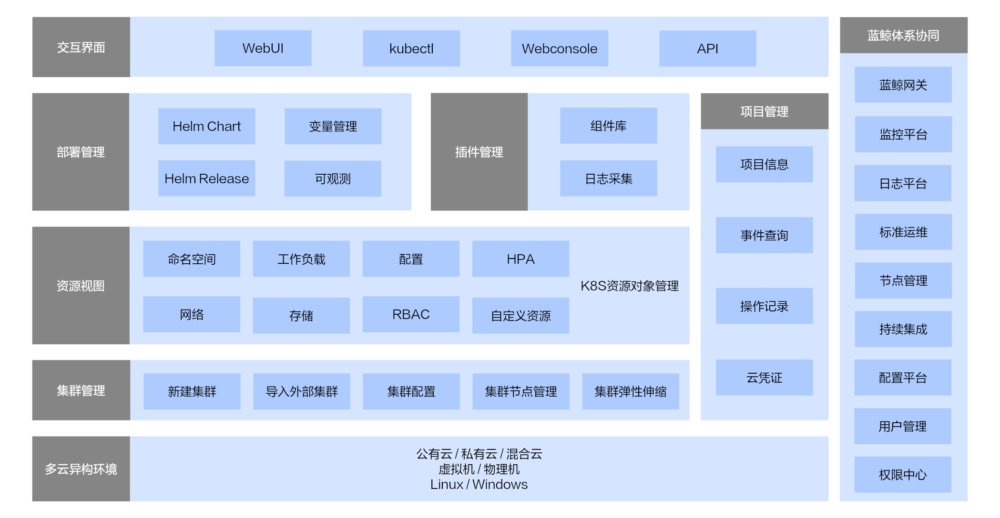

# 产品架构

- 资源视图(K8S对象管理)
    - 命名空间
    - 工作负载
    - 网络
    - 配置
    - 存储
    - RBAC
    - HPA
    - 自定义资源
- 集群管理
    - 新建集群
    - 导入外部集群
    - 集群节点管理
    - 集群弹性伸缩
- 部署管理
    - Helm Chart
    - Helm Release
    - 变量管理
- 项目管理
    - 项目信息
    - 集群配置
    - 事件查询
    - 操作记录
    - 云凭证
- 插件管理
    - 组件库
    - 日志采集
    - 容器监控（跳转）