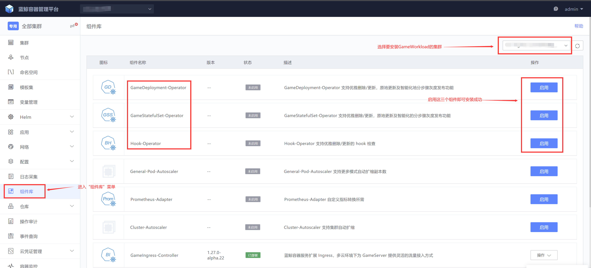
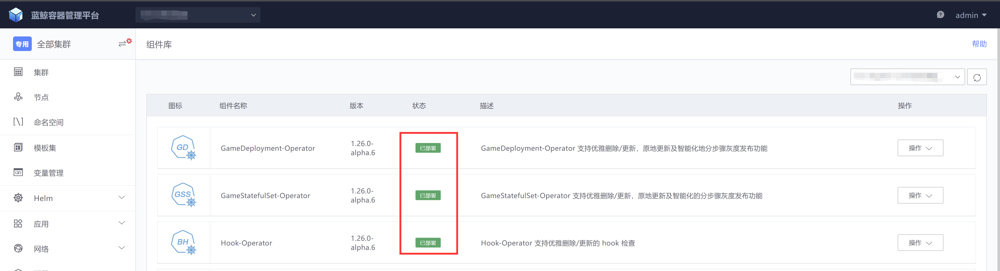

# Game workload 使用指南
## 功能介绍

GameDeployment 是针对游戏场景定制的面向无状态服务的增强版 Deployment

GameStatefulSet 是针对游戏场景定制的面向有状态服务的增强版 StatefulSet

### GameDeployment
- 支持Operator高可用部署
- 支持滚动更新 / 原地更新
- 优雅删除和更新
- 支持设置 partition 灰度发布
- 支持分步骤自动化灰度发布
- 支持 HPA
- 指定 pod 删除
- 支持 pod 注入唯一序号
- 支持防误删功能
- 支持 readinessgate 可选功能
### GameStatefulSet

- 支持 Operator 高可用部署
- 支持 Node 失联时，Pod 的自动漂移
- 支持优雅删除和更新
- 支持滚动更新/原地更新
- 支持分步骤自动化灰度发布
- 支持并行更新
- 支持 maxSurge / maxUnavailable 字段
- 支持 HPA
- 支持防误删功能

## 组件安装



## 快速体验
### GameDeployment

#### 创建实例

将以下保存为 gamedeployment-inplaceupdate.yaml，使用 `kubectl apply -f gamedeployment-inplaceupdate.yaml`
```yaml
apiVersion: tkex.tencent.com/v1alpha1
kind: HookTemplate
metadata:
  name: test-hooktemplate
  labels:
      io.tencent.bcs.dev/deletion-allow: Always
spec:
  metrics:
  - name: webtest
    count: 10
    interval: 5s
    successfulLimit: 1
    successCondition: "asInt(result) == 1"
    provider:
      web:
        url: http://{{ args.PodIP }}:8080/hook
        jsonPath: "{$.result}"
        timeoutSeconds: 60  
  - name: webtest2
    count: 10
    interval: 2s
    successfulLimit: 1
    successCondition: "asInt(result) == 1"
    provider:
      web:
        url: http://{{ args.PodIP }}:8080/hook
        jsonPath: "{$.result}"
        timeoutSeconds: 60

---
apiVersion: tkex.tencent.com/v1alpha1
kind: HookTemplate
metadata:
  name: test-post
  labels:
      io.tencent.bcs.dev/deletion-allow: Always
spec:
  metrics:
  - name: patch-test
    provider:
      kubernetes:
        function: patch
        fields:
          - path: metadata.annotations.io.tencent.bcs.dev/game-pod-deleting
            value: "false"
    successfulLimit: 1
    interval: 10s
  - name: get-test
    provider:
      kubernetes:
        function: get
        fields:
          - path: metadata.annotations.io.tencent.bcs.dev/game-pod-deleting
            value: "false"
    successfulLimit: 1
    interval: 10s

---
apiVersion: tkex.tencent.com/v1alpha1
kind: GameDeployment
metadata:
  name: test-gamedeploy
  labels:
    app: test-gamedeploy
    io.tencent.bcs.dev/deletion-allow: Always
  annotations:
    tkex.bkbcs.tencent.com/gamedeployment-index-on: "true"
    tkex.bkbcs.tencent.com/gamedeployment-index-range: '{"podStartIndex": 100, "podEndIndex": 110}'
spec:
  updateStrategy:
    type: InplaceUpdate
    maxSurge: 0
    maxUnavailable: 25%
    partition: 0
  replicas: 2
  selector:
    matchLabels:
      app: test-gamedeploy
  preDeleteUpdateStrategy:
    hook:
      templateName: test-hooktemplate
  preInplaceUpdateStrategy:
    hook:
      templateName: test-hooktemplate
  postInplaceUpdateStrategy:
    hook:
      templateName: test-post
  template:
    metadata:
      labels: 
        app: test-gamedeploy
      annotations:
        io.tencent.bcs.dev/pod-cost-metrics-name: cpu;memory
        io.tencent.bcs.dev/pod-cost-metrics-weight: 2;0.001
        io.tencent.bcs.dev/pod-deletion-cost-sort-method: ascend
    spec:
      containers:
      - name: web
        image: hub.bktencent.com/blueking/game-demo:0.0.1
        imagePullPolicy: IfNotPresent
```
创建完后预期结果如下：
```bash
# kubectl get gamedeployments.tkex.tencent.com  
NAME              DESIRED   UPDATED   UPDATED_READY   READY   TOTAL   AGE
test-gamedeploy   2         2         2               2       2       3m27s

# kubectl get hooktemplates.tkex.tencent.com 
NAME                AGE
test-hooktemplate   12m
test-post           12m
```
#### 原地更新
将 gamedeployment-inplaceupdate.yaml中，gamedeplyoment 的 image 改为：image: hub.bktencent.com/blueking/game-demo:0.0.2， 再执行` kubectl apply -f gamedeployment-inplaceupdate.yaml`

预期结果如下：
```bash
# kubectl get hookrun  
NAME                                                           PHASE     AGE
preinplace-test-gamedeploy-75c467595-wt9g5-test-hooktemplate   Running   7s
```
等一段时间后，preinplace hookrun 运行完成，开始运行 post inplace hookrun（hookrun 跑完会自动被删除，所以有可能来不及看到 hookrun 的存在，重点看 Pod 有没有被更新）

```bash
# kubectl get hookrun 
NAME                                                     PHASE     AGE
postinplace-test-gamedeploy-5ccfb5c6c4-b5w28-test-post   Running   3s
```

更新完成后，对应 pod 的 RESTAR 数加一
```bash
# kubectl get pod      
NAME                    READY   STATUS    RESTARTS   AGE
test-gamedeploy-b5w28   1/1     Running   1          102s
test-gamedeploy-wt9g5   1/1     Running   1          102s
```

#### 滚动更新
把以下内容保存在文件 gamedeployment-rollingupdate.yaml 中：

```yaml
apiVersion: tkex.tencent.com/v1alpha1
kind: GameDeployment
metadata:
  name: test-gamedeploy
  labels:
    app: test-gamedeploy
    io.tencent.bcs.dev/deletion-allow: Always
  annotations:
    tkex.bkbcs.tencent.com/gamedeployment-index-on: "true"
    tkex.bkbcs.tencent.com/gamedeployment-index-range: '{"podStartIndex": 100, "podEndIndex": 110}'
spec:
  updateStrategy:
    type: RollingUpdate
  replicas: 2
  selector:
    matchLabels:
      app: test-gamedeploy
  preDeleteUpdateStrategy:
    hook:
      templateName: test-hooktemplate
  preInplaceUpdateStrategy:
    hook:
      templateName: test-hooktemplate
  postInplaceUpdateStrategy:
    hook:
      templateName: test-post
  template:
    metadata:
      labels: 
        app: test-gamedeploy
      annotations:
        io.tencent.bcs.dev/pod-cost-metrics-name: cpu;memory
        io.tencent.bcs.dev/pod-cost-metrics-weight: 2;0.001
        io.tencent.bcs.dev/pod-deletion-cost-sort-method: ascend
    spec:
      containers:
      - name: web
        image: hub.bktencent.com/blueking/game-demo:0.0.1
        imagePullPolicy: IfNotPresent
```
执行 `kubectl apply -f gamedeployment-rollingupdate.yaml` ，预期结果如下：
pre delete hookrun 正在运行

```bash
# kubectl get hookrun
NAME                                                           PHASE     AGE
predelete-test-gamedeploy-5ccfb5c6c4-b5w28-test-hooktemplate   Running   6s
```
等一段时间后，pod 更新为新的版本
```bash
# kubectl get po
NAME                    READY   STATUS    RESTARTS   AGE
test-gamedeploy-ckfkr   1/1     Running   0          38s
test-gamedeploy-rw74v   1/1     Running   0          56s
```

#### 删除实例
执行 `kubectl delete -f gamedeployment-inplaceupdate.yaml` 删除实例
```bash
# kubectl delete -f gamedeployment-inplaceupdate.yaml 
hooktemplate.tkex.tencent.com "test-hooktemplate" deleted
hooktemplate.tkex.tencent.com "test-post" deleted
gamedeployment.tkex.tencent.com "test-gamedeploy" deleted
```

### GameStatefulSet
#### 创建实例
将以下保存为 gamestatefulset-inplaceupdate.yaml，使用 `kubectl apply -f gamestatefulset-inplaceupdate.yaml` 创建

```yaml
apiVersion: tkex.tencent.com/v1alpha1
kind: HookTemplate
metadata:
  name: test-hooktemplate
  labels:
    io.tencent.bcs.dev/deletion-allow: Always
spec:
  metrics:
  - name: webtest
    count: 10
    interval: 5s
    successfulLimit: 1
    successCondition: "asInt(result) == 1"
    provider:
      web:
        url: http://{{ args.PodIP }}:8080/hook
        jsonPath: "{$.result}"
        timeoutSeconds: 60  
  - name: webtest2
    count: 10
    interval: 2s
    successfulLimit: 1
    successCondition: "asInt(result) == 1"
    provider:
      web:
        url: http://{{ args.PodIP }}:8080/hook
        jsonPath: "{$.result}"
        timeoutSeconds: 60

---
apiVersion: tkex.tencent.com/v1alpha1
kind: HookTemplate
metadata:
  name: test-post
  labels:
    io.tencent.bcs.dev/deletion-allow: Always
spec:
  metrics:
  - name: patch-test
    provider:
      kubernetes:
        function: patch
        fields:
          - path: metadata.annotations.io.tencent.bcs.dev/game-pod-deleting
            value: "false"
    successfulLimit: 1
    interval: 10s
  - name: get-test
    provider:
      kubernetes:
        function: get
        fields:
          - path: metadata.annotations.io.tencent.bcs.dev/game-pod-deleting
            value: "false"
    successfulLimit: 1
    interval: 10s

---
apiVersion: tkex.tencent.com/v1alpha1
kind: GameStatefulSet
metadata:
  name: test-gameset
  labels:
    app: test-gameset
    io.tencent.bcs.dev/deletion-allow: Always
spec:
  serviceName: test-svc
  updateStrategy:
    type: InplaceUpdate
  replicas: 2
  selector:
    matchLabels:
      app: test-gameset
  preDeleteUpdateStrategy:
    hook:
      templateName: test-hooktemplate
  preInplaceUpdateStrategy:
    hook:
      templateName: test-hooktemplate
  postInplaceUpdateStrategy:
    hook:
      templateName: test-post
  template:
    metadata:
      labels: 
        app: test-gameset
    spec:
      containers:
      - name: web
        image: hub.bktencent.com/blueking/game-demo:0.0.1
        imagePullPolicy: IfNotPresent
```
预期结果如下：

```bash
# kubectl get gamestatefulsets.tkex.tencent.com
NAME               REPLICAS   READY_REPLICAS   CURRENT_REPLICAS   UPDATED_REPLICAS   UPDATED_READY_REPLICAS   AGE
test-gameset       2          2                2                  2                  2                        61s

# kubectl get hooktemplates.tkex.tencent.com 
NAME                AGE
test-hooktemplate   109s
test-post           109s
```

#### 原地更新
将 gamestatefulset-inplaceupdate.yaml 中，gamestatefulset 的 image 改为：image: hub.bktencent.com/blueking/game-demo:0.0.2， 再执行`kubectl apply -f gamestatefulset-inplaceupdate.yaml`

预期结果如下：
preinplace hookrun 正在运行

```
kubectl get hookrun
NAME                                                    PHASE     AGE
preinplace-test-gameset-777f889cc-1-test-hooktemplate   Running   3s
```

更新完成后，对应 pod 的 RESTARS 数加一

```
# kubectl get pod 
NAME                 READY   STATUS    RESTARTS   AGE
test-gameset-0       1/1     Running   1          3m58s
test-gameset-1       1/1     Running   1          3m55s
```

#### 滚动更新
将以下内容保存到文件gamestatefulset-rollingupdate.yaml中：

```yaml
apiVersion: tkex.tencent.com/v1alpha1
kind: GameStatefulSet
metadata:
  name: test-gameset
  labels:
    app: test-gameset
    io.tencent.bcs.dev/deletion-allow: Always
spec:
  serviceName: test-svc
  updateStrategy:
    type: RollingUpdate
  replicas: 2
  selector:
    matchLabels:
      app: test-gameset
  preDeleteUpdateStrategy:
    hook:
      templateName: test-hooktemplate
  preInplaceUpdateStrategy:
    hook:
      templateName: test-hooktemplate
  postInplaceUpdateStrategy:
    hook:
      templateName: test-post
  template:
    metadata:
      labels:
        app: test-gameset
    spec:
      containers:
      - name: web
        image: hub.bktencent.com/blueking/game-demo:0.0.1
```
执行 `kubetl apply -f gamestatefulset-rollingupdate.yaml`

预期结果:

predelete hookrun 正在运行

```bash
# kubectl get hookrun
NAME                                                   PHASE     AGE
predelete-test-gameset-c594b9cb8-1-test-hooktemplate   Running   3s
```
一段时间后，更新完成，对应 pod 被重建为新版本 pod

```bash
#$ kubectl get pod
NAME                 READY   STATUS              RESTARTS   AGE
test-gameset-0       0/1     ContainerCreating   0          2s
test-gameset-1       1/1     Running             0          27s
```

#### 删除实例
```bash
kubectl delete -f gamestatefulset-inplaceupdate.yaml

hooktemplate.tkex.tencent.com "test-hooktemplate" deleted
hooktemplate.tkex.tencent.com "test-post" deleted
gamestatefulset.tkex.tencent.com "test-gameset" deleted
```

## Game workload Hook
### 概述
多数复杂类应用在发布更新过程中有许多外部依赖或应用本身的数据指标依赖，如实例扩缩容或更新前需要进行数据搬迁；缩容一个实例前需要先完成路由变更；实例缩容或更新前需要等待游戏对局结束此外，在灰度发布时，有时我们需要从 prometheus 监控数据中查看指标是否符合预期，以决定是否继续灰度更多的实例

这其实可以看作为应用发布过程中的各种 hook 勾子，通过 hook 的结果来判断是否可以继续下一步的发布流程无论是面向无状态应用的 GameDeployment 还是面向有状态应用的 GameStatefulSet，都有这种发布需求

bk-bcs 在 kubernetes 层面抽象出了一个通用的 operator: bcs-hook-operatorbcs-hook-operator 主要职责是根据 hook 模板执行 hook 操作并记录 hook 的状态，GameDeployment 或 GameStatefulSet watch hook 的最终状态，根据 hook 结果来决定下一步执行何种操作

GameDeployment/GameStatefulSet 与 bcs-hook-operator 在应用发布过程中使用 hook 时的交互架构图：


### hooktemplate
HookTemplate 用来定义一个 hook 的模板在一个 HookTemplate 中可以定义多个 metric，每个 metric 都是需要执行的一个 hook在 metric 中可以定义 hook 的次数、两次之间的间隔、成功的条件、provider等等多个参数provider 定义的是 hook 的类型，目前支持三种类型的 hook：webhook、prometheus和K8S 类型

#### Web 类型

```yaml
apiVersion: tkex.tencent.com/v1alpha1
kind: HookTemplate
metadata:
  name: test-hooktemplate
  namespace: test
spec:
  args:
    - name: abc
      value: "123"
  metrics:
  - name: webtest
    count: 10
    interval: 3s
    successfulLimit: 1
    successCondition: "asInt(result) == 1"
    provider:
      web:
        url: http://{{ args.PodIP }}:8080/hook?podnamespace={{ args.PodNamespace }}&podname={{ args.PodName }}&podcontainer={{ args.PodContainer[0] }}&podip={{ args.PodIP }}&abc={{ args.abc }}
        jsonPath: "{$.result}"
        timeoutSeconds: 60    
```

#### Prometheus 类型
成功/失败条件的设置需要注意查询语句返回的类型asInt 函数只适用于类型为 string 的变量，以下为返回类型是 string 的示例
```yaml
apiVersion: tkex.tencent.com/v1alpha1
kind: HookTemplate
metadata:
  namespace: test
  name: test-hooktemplate
spec:    
  metrics:
  - name: promtest
    count: 10
    interval: 1s
    consecutiveErrorLimit: 10
    failureCondition: "asInt(result) == 0"
    provider:
      prometheus:
        query: prometheus_operator_watch_operations_failed_total{controller="alertmanager"}
        address: http://po-prometheus-operator-prometheus.thanos.svc.cluster.local:9090
```
如果查询语句返回类型是 vector，则不能使用 "==" 等判断，而要用下标进行取值，并且如果 vector 中的数值类型不是 string，则不能使用 asInt 函数，否则会报错；以下为返回类型是 vector，且 vector 内数值类型为 float64 的示例

`successCondition: "result[0] == 0"`

如果查询语句返回类型是 vector，且 vector 中元素为数值，若只需判断某个数值是否在数组内，则可以如下设置成功/失败条件

`successCondition: "0 in result"`

如果返回类型是 scalar，则不能使用 asInt 等类型转换，可以直接进行比较

`successCondition: "result == 0"`

查询语句的返回值类型一方面可以从暴露指标的代码中确定，另一方面也可以通过查询语句的函数进行转换，如在查询语句中加上  `vector()` 或 `scalar()` 函数可以将返回值转换成 vector 或 scalar 类型，具体见：https://prometheus.io/docs/prometheus/latest/querying/functions/


#### K8S 类型
1. 功能：支持对特定资源对象特定字段的 get 和  patch 操作；

2. 资源对象：
      * 可在 hooktemplate 的 args 字段中增加 Group, Version, Kind 变量，指定特定资源对象，默认为 Pod 对象；
      * 资源对象指定 GVK 只支持 GameDeployment 和 GameStatefulSet 两种，如需支持更多对象种类，需要给 hook-operator 的 RBAC 增加权限，请联系相关同学操作；
      * 资源对象名称和命名空间强制为 hookrun 的 args 字段中的默认 PodName 和 PodNamespace（防止操作其他人资源）；

3. 特定字段 fields：
      * 支持多个字段，每个字段含 path 和 value 两个值
      * path 只支持 "metadata.annotations.xxx" 形式，即只能对 annotations 字段进行操作；
      * value 在 patch 操作时指的是写到资源对象对应字段的值，在 get 操作时指的是想要得到的预期值；
      * 将要操作的对象需已存在 annotions 字段，因为 patch 操作不支持递归创建；

4. 操作 function：
      * 只支持 get 和 patch；
      * get 操作对比实际拿到的值和预期值 value，不一致则失败，存在多个字段时有一个不一致就会失败；
      * patch 操作将 value 写到对象对应的 path 处，操作过程中出错则失败，多个字段时有一个失败则整体失败；
      * k8s metric 无需指定 successfulCondition，需要指定 successfulLimit

```yaml
apiVersion: tkex.tencent.com/v1alpha1
kind: HookTemplate
metadata:
  name: test-hooktemplate
  namespace: test
spec:
  metrics:
  - name: patch-test
    provider:
      kubernetes:
        function: patch
        fields:
          - path: metadata.annotations.io.tencent.bcs.dev/game-pod-deleting
            value: "false"
    successfulLimit: 1
    interval: 10s
  - name: get-test
    provider:
      kubernetes:
        function: get
        fields:
          - path: metadata.annotations.io.tencent.bcs.dev/game-pod-deleting
            value: "false"
    successfulLimit: 1
    interval: 10s
```

k8s 类型的 hook 也可用于原地更新前后切断和恢复 CLB 流量如在更新前执行如下 preinplace hook，将 clb-weight 置为 0，clb-weight-ready 置为 false，然后等 bcs-ingress-controller 进行相关操作，等切断 CLB 流量后， bcs-ingress-controller 将 clb-weight-ready 置为 true，此时 hook 成功，可以开始进行原地更新操作（preinplace hook 在 GameWorkload 的 spec.preInplaceUpdateStrategy 字段设置）

```yaml
apiVersion: tkex.tencent.com/v1alpha1
kind: HookTemplate
metadata:
  name: test
  namespace: default
spec:
  metrics:
  - name: patch-test
    provider:
      kubernetes:
        function: patch
        fields:
          - path: metadata.annotations.networkextension.bkbcs.tencent.com/clb-weight
            value: "0"
          - path: metadata.annotations.networkextension.bkbcs.tencent.com/clb-weight-ready
            value: "false"
    successfulLimit: 1
    interval: 10s
  - name: get-test
    provider:
      kubernetes:
        function: get
        fields:
          - path: metadata.annotations.networkextension.bkbcs.tencent.com/clb-weight 
            value: "0"
          - path: metadata.annotations.networkextension.bkbcs.tencent.com/clb-weight-ready
            value: "true"
    successfulLimit: 1
    interval: 10s
```

在更新成功之后，执行如下 postinplace hook，将 clb-weight 置为 1，clb-weight-ready 置为 false，然后等 bcs-ingress-controller 进行相关操作，等恢复 CLB 流量后， bcs-ingress-controller 将 clb-weight-ready 置为 true，此时 hook 成功，pod 开始接受流量（postinplace hook 在 GameWorkload 的 spec.postInplaceUpdateStrategy 字段设置）

```yaml
apiVersion: tkex.tencent.com/v1alpha1
kind: HookTemplate
metadata:
  name: test
  namespace: default
spec:
  metrics:
  - name: patch-test
    provider:
      kubernetes:
        function: patch
        fields:
          - path: metadata.annotations.networkextension.bkbcs.tencent.com/clb-weight
            value: "1"
          - path: metadata.annotations.networkextension.bkbcs.tencent.com/clb-weight-ready
            value: "false"
    successfulLimit: 1
    interval: 10s
  - name: get-test
    provider:
      kubernetes:
        function: get
        fields:
          - path: metadata.annotations.networkextension.bkbcs.tencent.com/clb-weight 
            value: "1"
          - path: metadata.annotations.networkextension.bkbcs.tencent.com/clb-weight-ready
            value: "true"
    successfulLimit: 1
    interval: 10s
```

#### 参数解读
1. args

    配置 hook 需要的参数bcs 默认提供了以上4种参数，可只配置 key， value 则由创建 HookRun 时自动传入，preDeleteUpdateStrategy/preInplaceUpdateStrategy 情况下，默认支持以上四种参数

    

    PodContainer 参数按 spec 中定义的容器顺序，以 PodContainer[0], PodContainer[1], ... 形式存储每个容器的名字信息
      如果是 preInplace hookrun，还会有默认参数 ModifiedContainer，以 ModifiedContainer[0], ModifiedContainer[1], ... 的形式存储触发原地更新的容器名字（也即镜像发生改变的容器名字）

    

    args中预填的PodIP、PodName、PodNamespace、PodContainer 因为和Pod状态相关，所以只适用于 preDeleteUpdateStrategy/preInplaceUpdateStrategy/postInplaceUpdateStrategy 的Hook而 canary 中的 hook 面对的是整个应用，所以 args 字段 不适用于 canary.hook

2. metrics

   在模板的 metrics 中可以定义多个 metric，每个 metric 可以配置一个 hook 调用，metric 中的 provider 定义了该 hook 的类型

3. count

   count 表示该 metric 需要完成的 hook 调用的次数如果 count 和 interval 都没配置，将只进行一次 hook 调用；如果只配置了 interval, 将会无限制 地一直进行 hook 调用，直到成功或者失败条件满足即退出；如果配置 count 且大于 1，必须配置 interval

4. interval

   interval 表示两次 hook 调用间的时间间隔，如果没有定义，将只会进行一次 hook 调用

5. successCondition

   successCondition 表示 hook 的成功条件

6. failureCondition

   failureCondition 表示 hook 的失败条件

7. failureLimit

   failureLimit 定义了标识metric失败的次数，只要执行metrics失败次数 > n，那这个 metric 就是失败的
   如果配置了count，且 failureLimit的值 小于 count，执行该 metrics 错误次数为 failureLimit 时，此 metrics 标记为失败；
   如果配置了count，执行该 metric count 次后仍失败，则约定检测该 metrics 达到阈值 仍失败，标记此 metric 成功，即可强制删除

8. consecutiveErrorLimit

   consecutiveErrorLimit 定义了允许的 hook 连续产生 error 的次数，如设置为 4，则只要有连续4次检测失败，那这个 metric 就是失败的

9. successfulLimit

   successfulLimit 定义了标识metric成功的次数，即只要有n次返回是成功的，那这个 metric 就是成功的

10. consecutiveSuccessfulLimit

    consecutiveSuccessfulLimit 定义了达到metrics连续执行成功的次数时，标识此metric状态是成功的

11. provider

     hook 的类型，目前仅支持 webhook, prometheus 和 k8s

     以 webhook 类型为例，url 定义了 webhook 调用的地址，jsonPath 表示提取返回 json 中的某个字段，timeoutSeconds 指定超时时间（默认为 10s）

     url 中可以通过模板的形式配置，比如 http://{{ args.PodIP }}:9091，hookrun-controller 在进行 hook 调用时会通过 args 渲染出真实值

     **注意 args.PodIP 等参数与双括号之间有空格**
     当前 webhook 类型只支持 GET 方式
     注： 如果使用集群内prometheus作为provider，address填写为 [http://po-prometheus-operator-prometheus.thanos.svc.cluster.local:9090](http://po-prometheus-operator-prometheus.thanos.svc.cluster.local:9090/) 即可

#### 其它参数
1. 防误删功能
    在 K8S 机制中，如果删除 CRD，会导致所有 CR 一起被级联删除，因此如果手误删除了 HookTemplate 的 CRD（比如误卸载组件），会导致集群中所有 HookTemplate 实例一起被删除，造成严重影响，为了防止误操作造成的影响，我们加了一个 Admission Webhook，对 HookTemplate 的 CRD 和 CR 的删除操作做验证，根据 CRD 和 CR 的 label 中对应标签值的不同，进行相应操作
    在 HookTemplate 的 CRD 中标签效果如下（默认为空，也即是不允许删除）

      | **key**                           | **value**    | **效果**                                                     |
      | --------------------------------- | ------------ | ------------------------------------------------------------ |
      | io.tencent.bcs.dev/deletion-allow | Always       | 总是允许删除                                                 |
      | io.tencent.bcs.dev/deletion-allow | Cascading    | 如果有级联资源则不允许删除，如删除 HookTemplate 的 CRD 时有 HookTemplate 实例存在 |
      | 不添加labels                      | 不添加labels | 不允许删除                                                   |

2. 执行策略

   同一 HookTemplate 内不同 metric 的执行顺序可以通过 Policy 字段指定，当前支持两种策略，默认为 Parallel 策略

   - Parallel：在执行时会并行执行所有 metrics

   - Ordered: 执行时顺序执行所有 metrics，只有上一 metric 执行结束后才会继续执行下一 metric

    ```yaml
    apiVersion: tkex.tencent.com/v1alpha1
    kind: HookTemplate
    metadata:
      ...
    spec:
      policy: Parallel
    ```

### HookRun
HookRun 是根据模板 HookTemplate 创建的一个实际运行的 hook CRD，bcs-hook-operator 监测并控制 HookRun 的运行状态和生命周期，根据其 metrics 中的定义来执行 hook 操作，并实时记录 hook 调用的结果

#### HookRun示例
```yaml
apiVersion: tkex.tencent.com/v1alpha1
kind: HookRun
metadata:
  name: test-gamedeployment-67864c6f65-4-test
  namespace: default
spec:
  metrics:
  - name: webtest
    provider:
      web:
        jsonPath: '{$.age}'
        url: http://1.1.1.1:9091
    successCondition: asInt(result) < 30
  terminate: true
status:
  metricResults:
  - count: 1
    failed: 1
    measurements:
    - finishedAt: "2020-11-09T10:08:49Z"
      phase: Failed
      startedAt: "2020-11-09T10:08:49Z"
      value: "32"
    name: webtest
    phase: Failed
  phase: Failed
  startedAt: "2020-11-09T10:08:49Z"
```
#### HookRun 参数解读
一般用户无需设置 HookRun 相关参数，由控制器根据 HookTemplate 自动生成对应的 HookRun
但有一种情况是需要手动设置 hookrun 参数的：当 hookrun 正在执行，但此时想要中断 hookrun 执行，不能直接手动删除 hookrun，因为控制器会自动重建，此时应该手动修改 hookrun 的 spec.terminate 字段，将其设置为 true，则 hookrun 会中断执行

```yaml
apiVersion: tkex.tencent.com/v1alpha1
kind: HookRun
metadata:
  ...
spec:
  terminate: true
```

## GameDeployment特性说明

### CRD定义样例
GameDeployment 是 kubernetes 原生 Deployment 的增强实现，一个典型的 GameDeployment 定义如下：
```yaml
apiVersion: tkex.tencent.com/v1alpha1
kind: GameDeployment
metadata:
  name: test-gamedeployment
  namespace: test
  labels:
    app: test-gamedeployment
spec:
  replicas: 5
  selector:
    matchLabels:
      app: test-gamedeployment
  scaleStrategy:
    podsToDelete:
    - test-gamedeployment-ghrwg
  minReadySeconds: 5
  updateStrategy:
    type: InplaceUpdate
    partition: 0
    maxUnavailable: 1
    maxSurge: 0
    paused: false
    inPlaceUpdateStrategy:
      gracePeriodSeconds: 30
  preDeleteUpdateStrategy:
    hook:
      templateName: test
  preInplaceUpdateStrategy:
    hook:
      templateName: test-inplace
  template:
    metadata:
      labels:
        app: test-gamedeployment
    spec:
      containers:
      - name: nginx
        image: nginx:1.7.9
        imagePullPolicy: IfNotPresent
        resources:
          requests:
            cpu: 20m
          limits:
            cpu: 20m
```
### CR 字段说明
GameDeployment 详细字段定义及其意义，请查阅 API 文档：
http://htmlpreview.github.io/?https://github.com/Tencent/bk-bcs/blob/master/docs/features/bcs-gamedeployment-operator/API_Reference.html


### 滚动更新 / 原地更新
涉及字段：updateStrategy
updateStrategy.type 支持 RollingUpdate, InplaceUpdate 2种更新方式，相比原生 Deployment, 新增 InplaceUpdate 更新模式
滚动更新，为 k8s 原生支持更新策略，更新时删除旧版本 Pod，建立新版本 Pod由于建立 Pod 需要进行调度流程，因此开销较大，速度较慢，另外共享内存等信息会丢失
原地更新，指更新时只重启 Pod 中的容器，其他保持不变由于无需进行调度过程，速度较快，并且共享内存等信息会被保持下来

注意：InplaceUpdate，只支持以原地重启容器的方式更新 image 字段，以及以不重启不重建的方式更新 labels/annotations 字段更改除此之外的其它字段，则此次原地更新不会生效

每个模式后，有相应的策略供配置，比如 inPlaceUpdateStrategy.gracePeriodSeconds 决定原地更新时优雅更新时间、rollingUpdate.partition 来决定滚动更新时发布比例

spec.updateStrategy.inPlaceUpdateStrategy.gracePeriodSeconds 原理及用法：
gracePeriodSeconds 用来实现原地升级当中的流量服务的平滑切换原地升级的更新策略下，可以配置 spec/updateStrategy/inPlaceUpdateStrategy/gracePeriodSeconds 参数，假设配置为 30 秒，那么 GameDeployment 在原地更新一个 pod 前，会通过 ReadinessGate 先把这个 pod 设置为 unready 状态，30 秒过后才会真正去原地重启 pod 中的容器这样，在这 30 秒的时间内因为 pod 变为 unready 状态，k8s 会把该 pod 实例从 service 的 endpoints 中剔除等原地升级成功后，GameDeployment 再把该 pod 设为 ready 状态，之后 k8s 才会重新把该 pod 实例加入到 service 的 endpoints 当中通过这样的逻辑，在整个原地升级过程中，能保证服务流量的无损gracePeriodSeconds 的默认值为 0 ，当为 0 时，GameStatefulSet/GameDeployment 会立刻原地升级 pod 中的容器，可能会导致服务流量的丢失

GameDeployment参考配置

```yaml
updateStrategy:
    type: InplaceUpdate
    inPlaceUpdateStrategy:
      gracePeriodSeconds: 30
    paused: false
    partition: 0
    maxUnavailable: 1
    maxSurge: 0
```


### 原地更新-策略指定

涉及字段：updateStrategy.inplaceUpdateStrategy.policy
可选值：DisOrdered（默认）, OrderedReady, OrderedUpdated
在之前的原地更新中，容器更新顺序是不确定的，并且只有当一个容器更新完后，才会去更新下一个容器，这种方式对有容器依赖关系的 Pod 影响较大
现支持指定策略去原地更新容器，分别有以下策略可指定：

- DisOrdered：默认策略，不保证容器原地更新顺序；
- OrderedReady：按容器定义顺序进行更新，当上一个容器更新并 Ready 之后，才去更新下一个容器；
- OrderedUpdated: 按容器定义顺序进行更新，当上一个容器更新后，就去更新下一个容器

```yaml
updateStrategy:
    type: InplaceUpdate
    inPlaceUpdateStrategy:
      policy: DisOrdered
```


### 优雅删除/更新

涉及字段：preDeleteUpdateStrategy preInplaceUpdateStrategy PostInplaceUpdateStrategy

```yaml
spec:
  preDeleteUpdateStrategy:
    hook:
      templateName: test-delete
  preInplaceUpdateStrategy:
    hook:
      templateName: test-inplace
  postInplaceUpdateStrategy:
    hook:
      templateName: test-post 
```

此字段表示在删除/更新应用实例前 调用定义的 Hook 以确认能否进行删除/更新操作，以及在原地更新之后，调用定义的 Hook 进行一些操作该功能与HookTemplate及HookRun资源共同使用，在使用前，请确保bcs-hook-operator已部署、对应HookTemplate已定义；

在删除 Pod 时，会首先触发 preDeleteUpdateStrategy.hook.templateName 对应的 HookRun 对象创建，Hook-Operator 执行 metric 验证逻辑，以决定能否进行 Pod 的删除；
在更新 Pod 时，会首先触发 preInplaceUpdateStrategy.hook.templateName 对应的 HookRun 对象创建，Hook-Operator 执行 metric 验证逻辑，以决定能否进行Pod的原地更新；
（若只定义了 preDeleteUpdateStrategy，在更新策略是原地更新(InplaceUpdate)时会触发 preDeleteUpdateStrategy.hook.templateName 对应的规则，来确定能否进行 Pod 原地更新，建议2种场景定义各自的策略）
在原地更新 Pod 之后，触发 postInplaceUpdateStrategy.hook.templateName 对应的 HookRun 对象创建，Hook-Operator 执行 metric，进行原地更新后的一些操作

**注意**：**只支持控制器控制下的Pod删除/更新操作（缩容、滚动更新、原地更新），若用户手工删除Pod，则不会触发这些策略；**


### 设置 partition 灰度发布

涉及字段：GameDeployment中的updateStrategy.partition，用于实现灰度发布
Partition 的语义是 保留旧版本 Pod 的数量或百分比，默认为 0，用来控制灰度发布的个数这里的 partition 不表示任何 order 序号为了兼容，InplaceUpdate 的灰度发布个数也由这个参数配置
如果在发布过程中设置了 partition:

- 如果是数字，控制器会将 (replicas - partition) 数量的 Pod 更新到最新版本
- 如果是百分比，控制器会将 (replicas * (100% - partition)) 数量的 Pod 更新到最新版本


### 滚动更新时最大不可用pod数

涉及字段：updateStrategy.maxUnavailable
指在更新过程中每批执行更新的实例数量，在更新过程中这批实例是不可用的比如一共有 8 个实例，maxUnavailable 设置为 2 ，那么每批滚动或原地重启 2 个实例，等这 2 个实例更新完成后，再进行下一批更新可设置为整数值或百分比，默认值为 25%


### 滚动更新前最多新建旧版本pod数量

涉及字段：updateStrategy.maxSurge
在滚动更新过程中，如果每批都是先删除 maxUnavailable 数量的旧版本 pod 数，再新建新版本的 pod 数，那么在整个更新过程中，总共只有 replicas - maxUnavailable 数量的实例数能够提供服务在总实例数 replicas 数量比较小的情况下，会影响应用的服务能力设置 maxSurge 后，会在滚动更新前先多创建 maxSurge 数量的 pod， 然后再逐批进行更新，更新完成后，最后再删掉 maxSurge 数量的 pod ，这样就能保证整个更新过程中可服务的总实例数量 maxSurge 默认值为 25%


### 交互式灰度发布

涉及字段：updateStrategy.canary

```yaml
canary:
      steps:
      - partition: 3
      - pause: {}
      - partition: 2
```

在这个配置中，假设期望实例数为 4，使用原地重启的更新策略，配置了 5 个灰度发布的步骤：

- 步骤 0：partition 为 3，一共灰度 1 个实例；
- 步骤 1：暂停灰度发布，等待用户介入，用户需要手动将 updateStrategy.paused 的值改为 false，才能继续发布；
- 步骤 2：partition 为 2，一共灰度 2 个实例；
- 步骤 3：暂停灰度发布 60 秒，60 秒过后继续后续步骤；
- 步骤 4：使用名为 test 的 HookTemplate 进行 hook 调用，如果返回的结果满足预期，则继续执行后续步骤，如果返回结果不满足预期，则暂停灰度，等待用户手动介入来决定是继续灰度发布还是进行回滚操作
  如果不需要分步骤灰度发布，那么无需配置 spec.updateStrategy.canary


### 发布暂停

涉及字段： updateStrategy.paused
用户可以通过设置 paused 为 true 暂停发布不过此字段只会影响更新过程，不会影响扩缩过程，也即如果 replicas 发生变动，pod 数量还是会发生相应变化


### 支持 HPA

可以通过 HPA 对 Gamedeployment 进行自动伸缩


### 指定 Pod 缩容

涉及字段：scaleStrategy.podsToDelete
在Gamedeployment中使用，选填如果 podsToDelete 列表里写了一些 Pod 名字，控制器会优先删除这些 Pod 对于已经被删除的 Pod，控制器会自动从 podsToDelete 列表中清理掉
注意：

- 若只把 Pod 名字加到 podsToDelete，但没有修改 replicas 数量，那么控制器会先把指定的 Pod 删掉，然后再扩一个新的 Pod;
- 若不指定 podsToDelete，控制器按照默认顺序来选择 Pod 删除：not-ready < ready, unscheduled < scheduled, and pending < running若存在 PodDeletionCost，则还会再按 cost 值排序，然后选择 Pod 删除


### Pod注入唯一序号

该特性需要在 gamedeployment 的 yaml 文件注入以下 annotation，添加 annotation 开关 以及序号 range 配置

```yaml
apiVersion: tkex.tencent.com/v1alpha1
kind: GameDeployment
metadata:
  annotations:
    tkex.bkbcs.tencent.com/gamedeployment-index-on:  "true"
    tkex.bkbcs.tencent.com/gamedeployment-index-range:  '{"podStartIndex": 100, "podEndIndex": 110}'
```

注入的唯一 ID 通过环境变量暴露给用户，通过读取 pod 环境变量 'POD_INDEX' 可获取该pod注入的唯一序号


### 防误删功能

在 K8S 机制中，如果删除 CRD，会导致所有 CR 一起被级联删除，因此如果手误删除了 GameStatefulset 的 CRD（比如误卸载组件），会导致集群中所有 GameDeployment 实例一起被删除，造成严重影响同样的，如果手误删除一个 GameDeployment 实例，也会导致其所有对应的 Pod 一起被删除
为了防止误操作造成的影响，我们加了一个 Admission Webhook，对 GameDeployment 的 CRD 和 CR 的删除操作做验证，根据 CRD 和 CR 的 label 中对应标签值的不同，进行相应操作
在 GameDeployment 的 CR 和 CRD 中，标签效果如下（默认为空，也即是不允许删除）

| **key**                           | **value**    | **效果**                                                     |
| --------------------------------- | ------------ | ------------------------------------------------------------ |
| io.tencent.bcs.dev/deletion-allow | Always       | 总是允许删除                                                 |
| io.tencent.bcs.dev/deletion-allow | Cascading    | 如果有级联资源则不允许删除，如删除 HookTemplate 的 CRD 时有 HookTemplate 实例存在 |
| 不添加labels                      | 不添加labels | 不允许删除                                                   |

推荐删除 GameDeployment 时，设置 io.tencent.bcs.dev/deletion-allow=Cascading，然后缩容副本数为0，再删除对应 GameDeployment.
如果确认要删除，则设置 io.tencent.bcs.dev/deletion-allow=Always，然后方可删除，如下所示

```yaml
apiVersion: tkex.tencent.com/v1alpha1
kind: GameDeployment
metadata:
  name: test-gamedeployment
  namespace: test
  labels:
    app: test-gamedeployment
    io.tencent.bcs.dev/deletion-allow: Always
```


### readinessgate 可选功能

在之前的版本中，gamedeployment 所管理的 pod 一定会强制加上一个 readinessgate 如下

```yaml
readinessGates:
  - conditionType: InPlaceUpdateReady
```

在 1.27.0 及以上版本中，此 readinessgate 改为可选项，可通过设置 spec.disableReadinessGate 值来控制是否加上此 readinessgate若值为 false，则表示要给 pod 加上 readinessgate，若值为 true，则表示不要给 pod 加上 readinessgate

```yaml
spec:
  disableReadinessGate: false
```

注意：此字段值不能在原地更新策略下进行更改，因为涉及对 Pod 的 ReadinessGate 字段的修改，因此原地更新会失败，需要以重建或者滚动更新的方式，重建 Pod 之后，再改为原地更新策略，然后才会生效


## GameStatefulset特性说明

### CRD定义样例

GameStatefulSet 是 kubernetes 原生 StatefulSet 的增强实现，一个典型的 GameStatefulSet 定义如下

```yaml
apiVersion: tkex.tencent.com/v1alpha1
kind: GameStatefulSet
metadata:
  name: test-gamestatefulset
  namespace: test
  labels:
    app: test-gamestatefulset
spec:
  serviceName: "test"
  replicas: 5
  selector:
    matchLabels:
      app: test-gamestatefulset
  podManagementPolicy: OrderedReady
  updateStrategy:
    type: InplaceUpdate
    rollingUpdate:
      partition: 0
    paused: false
    inPlaceUpdateStrategy:
      gracePeriodSeconds: 30
    canary:
      steps:
      - hook:
          templateName: test
      - partition: 3
      - pause: {}
      - partition: 2
      - pause:
          duration: 60
  preDeleteUpdateStrategy:
    hook:
      templateName: test
  preInplaceUpdateStrategy:
    hook:
      templateName: test-inplace
  template:
    metadata:
      labels:
        app: test-gamestatefulset
    spec:
      containers:
      - name: nginx
        image: nginx:1.7.9
        imagePullPolicy: IfNotPresent
        resources:
          requests:
            cpu: 20m
          limits:
            cpu: 20m
```


### CR 字段说明

GameStatefulSet 详细字段定义及其意义，请查阅 API 文档：http://htmlpreview.github.io/?https://github.com/Tencent/bk-bcs/blob/master/docs/features/bcs-gamestatefulset-operator/API_Reference.html


### 优雅删除/更新

涉及字段：preDeleteUpdateStrategy/preInplaceUpdateStrategy

```yaml
spec:
  preDeleteUpdateStrategy:
    hook:
      templateName: test-delete
  preInplaceUpdateStrategy:
    hook:
      templateName: test-inplace
  postInplaceUpdateStrategy:
    hook:
      templateName: test-post
```

此字段表示在删除/更新应用实例前 调用定义的 Hook 以确认能否进行删除/更新操作，以及在原地更新之后，调用定义的 Hook 进行一些操作该功能与 HookTemplate 及 HookRun 资源共同使用，在使用前，请确保 bcs-hook-operator 已部署、对应 HookTemplate 已定义

在删除 Pod 时，会首先触发 preDeleteUpdateStrategy.hook.templateName 对应的 HookRun 对象创建，Hook-Operator 执行 metric 验证逻辑，以决定能否进行 Pod 的删除；
在更新 Pod 时，会首先触发 preInplaceUpdateStrategy.hook.templateName 对应的 HookRun 对象创建，Hook-Operator 执行 metric 验证逻辑，以决定能否进行 Pod 的原地更新；
（若只定义了 preDeleteUpdateStrategy，在更新策略是原地更新(InplaceUpdate)时会触发 preDeleteUpdateStrategy.hook.templateName 对应的规则，来确定能否进行 Pod 原地更新，建议2种场景定义各自的策略）
在原地更新 Pod 之后，触发 postInplaceUpdateStrategy.hook.templateName 对应的 HookRun 对象创建，Hook-Operator 执行 metric，进行原地更新后的一些操作
注意：只支持控制器控制下的Pod删除/更新操作（缩容、滚动更新、原地更新），若用户手工删除Pod，则不会触发这些策略；


### 更新策略

涉及字段：updateStrategy
updateStrategy.type 支持 RollingUpdate, OnDelete, InplaceUpdate 三种更新方式，相比原生StatefulSet, 新增 InplaceUpdate 更新模式

每个模式后，有相应的策略供配置，比如 inPlaceUpdateStrategy.gracePeriodSeconds决定原地更新时优雅更新时间、rollingUpdate.partition来决定滚动更新时发布比例

spec/updateStrategy/inPlaceUpdateStrategy/gracePeriodSeconds 原理及用法：
gracePeriodSeconds 用来实现原地升级当中的流量服务的平滑切换原地升级的更新策略下，可以配置 spec/updateStrategy/inPlaceUpdateStrategy/gracePeriodSeconds 参数，假设配置为 30 秒，那么 GameStatefulSet/GameDeployment 在原地更新一个 pod 前，会通过 ReadinessGate 先把这个 pod 设置为 unready 状态，30 秒过后才会真正去原地重启 pod 中的容器这样，在这 30 秒的时间内因为 pod 变为 unready 状态，k8s 会把该 pod 实例从 service 的 endpoints 中剔除等原地升级成功后，GameStatefulSet/GameDeployment 再把该 pod 设为 ready 状态，之后 k8s 才会重新把该 pod 实例加入到 service 的 endpoints 当中通过这样的逻辑，在整个原地升级过程中，能保证服务流量的无损gracePeriodSeconds 的默认值为 0 ，当为 0 时，GameStatefulSet/GameDeployment 会立刻原地升级 pod 中的容器，可能会导致服务流量的丢失 

注意：InplaceUpdate，只支持以原地重启容器的方式更新 image 字段，以及以不重启不重建的方式更新 labels/annotations 字段更改除此之外的其它字段，则此次原地更新会卡住！

下面是GameStatefulSet的workload类型参考配置

```yaml
updateStrategy:
    type: InplaceUpdate
    inPlaceUpdateStrategy:
      gracePeriodSeconds: 30
    paused: false
    rollingUpdate:
      partition: 0
```


### 原地更新-策略指定

涉及字段：updateStrategy.inplaceUpdateStrategy.policy
可选值：DisOrdered（默认）, OrderedReady, OrderedUpdated
在之前的原地更新中，容器更新顺序是不确定的，并且只有当一个容器更新完后，才会去更新下一个容器，这种方式对有容器依赖关系的 Pod 影响较大
现支持指定策略去原地更新容器，分别有以下策略可指定：

- DisOrdered：默认策略，不保证容器原地更新顺序；
- OrderedReady：按容器定义顺序进行更新，当上一个容器更新并 Ready 之后，才去更新下一个容器；
- OrderedUpdated: 按容器定义顺序进行更新，当上一个容器更新后，就去更新下一个容器

```yaml
updateStrategy:
    type: InplaceUpdate
    inPlaceUpdateStrategy:
      policy: DisOrdered
```


### 交互式灰度发布

涉及字段：updateStrategy.canary

```yaml
canary:
      steps:
      - partition: 3
      - pause: {}
      - partition: 2
      - pause: {duration: 60}
```

在这个配置中，假设期望实例数为 4，使用原地重启的更新策略，配置了 5 个灰度发布的步骤：

- 步骤 0：partition 为 3，灰度 1 个实例；
- 步骤 1：暂停灰度发布，等待用户介入，用户需要手动将 updateStrategy.paused 的值改为 false，才能继续发布；
- 步骤 2：partition 为 2，灰度 2 个实例；
- 步骤 3：暂停灰度发布 60 秒，60 秒过后继续后续步骤；
- 步骤 4：使用名为 test 的 HookTemplate 进行 hook 调用，如果返回的结果满足预期，则继续执行后续步骤，如果返回结果不满足预期，则暂停灰度，等待
  用户手动介入来决定是继续灰度发布还是进行回滚操作
  如果不需要分步骤灰度发布，那么无需配置 spec.updateStrategy.canary


### 发布暂停

涉及字段： updateStrategy.paused
用户可以通过设置 paused 为 true 暂停发布不过此字段只会影响更新过程，不会影响扩缩过程，也即如果 replicas 发生变动，pod 数量还是会发生相应变化


### 滚动/原地更新时灰度个数

涉及字段：GamestatefulSet中的updateStrategy.rollingUpdate.partition
Partition 的语义是 保留旧版本 Pod 的数量或百分比，默认为 0，用来控制灰度发布的个数这里的 partition 不表示任何 order 序号为了兼容，InplaceUpdate 的灰度发布个数也由这个参数配置


### 并行更新/删除

涉及字段：podManagementPolicy

```yaml
podManagementPolicy: Parallel
```

在GameStatefulSet中使用 支持 "OrderedReady" 和 "Parallel" 两种方式，定义和 StatefulSet 一致，默认为 OrderedReady与 StatefulSet 不同的是，如果配置为 Parallel， 那么不仅删除和创建 pod 实例是并行的，实例更新也是并行的，即自动并行更新并行更新时会综合考虑 maxUnavailable 和 maxSurge 字段


### 支持 maxUnavailable/maxSurge

1. 滚动/原地更新时支持最大不可用pod数（maxUnavailable）
   涉及字段：GamestatefulSet中 的 updateStrategy.rollingUpdate.maxUnavailable
   指在更新过程中每批执行更新的实例数量，在更新过程中这批实例是不可用的比如一共有 8 个实例，maxUnavailable 设置为 2 ，那么每批滚动或原地重启 2 个实例，等这 2 个实例更新完成后，再进行下一批更新可设置为整数值或百分比，默认值为 25% 
   **只有在 podManagementPolicy 为 Parallel 时才会生效，并且只有更新时才会生效**

   

2. 滚动/原地更新前支持最多新建新版本pod数量（maxSurge）
   涉及字段：GamestatefulSet中的updateStrategy.rollingUpdate.maxSurge
   设置 maxSurge 后，会先多创建 maxSurge 数量的新版本 pod， 然后再逐批进行更新，更新完成后，最后再删掉 maxSurge 数量的 pod ，这样就能保证整个更新过程中可服务的总实例数量比如一共有 8 个实例，maxSurge 设置为 2，那么在更新前会新建两个新版本的实例，然后再去处理旧版本实例，更新完成后再删除多出来的两个实例 maxSurge 默认值为 0 
   **只有在 podManagementPolicy 为 Parallel 时才会生效，并且只有更新时才会生效**


### 支持 HPA

可以通过 HPA 对 GameStatefulset进行自动伸缩


### 服务名称

涉及字段：serviceName
在GameStatefulSet中使用，必填这个参数指的是控制此GamestatefulSet的service name此service必须在Gamestatefulset创建前创建，负责对应pod的网络ID命名如果你的 pod 之间是完全独立的（不需要服务发现），你可以随意指定一个 service（不需要提前创建，实际上就是为 pod 增加了一个 subdomin）但是大多数应用都需要服务发现，这时创建 headless service 就显得非常必要，之后你可以通过 my-headless-service.my-namespace.svc.cluster.local 解析到所有 pod 的 ip，也可以通过 my-pod.my-headless-service.my-namespace.svc.cluster.local 解析到某个 pod 的 ip


### 防误删功能

在 K8S 机制中，如果删除 CRD，会导致所有 CR 一起被级联删除，因此如果手误删除了 GameStatefulset 的 CRD（比如误卸载组件），会导致集群中所有 GameStatefulset 实例一起被删除，造成严重影响同样的，如果手误删除一个 GameStatefulset 实例，也会导致其所有对应的 Pod 一起被删除
为了防止误操作造成的影响，我们加了一个 Admission Webhook，对 GameStatefulset 的 CRD 和 CR 的删除操作做验证，根据 CRD 和 CR 的 label 中对应标签值的不同，进行相应操作
在 GameStatefulset 的 CR 和 CRD 中标签效果如下（默认为空，也即是不允许删除）

| **key**                           | **value**    | **效果**                                                     |
| --------------------------------- | ------------ | ------------------------------------------------------------ |
| io.tencent.bcs.dev/deletion-allow | Always       | 总是允许删除                                                 |
| io.tencent.bcs.dev/deletion-allow | Cascading    | 如果有级联资源则不允许删除，如删除 HookTemplate 的 CRD 时有 HookTemplate 实例存在 |
| 不添加labels                      | 不添加labels | 不允许删除                                                   |

推荐删除 GameStatefulset 时，设置 io.tencent.bcs.dev/deletion-allow=Cascading，然后缩容副本数为0，再删除对应 GameStatefulset.
如果确认要删除，则设置 io.tencent.bcs.dev/deletion-allow=Always，然后方可删除，如下所示

```yaml
apiVersion: tkex.tencent.com/v1alpha1
kind: GameStatefulSet
metadata:
  name: test-gamestatefulset
  namespace: test
  labels:
    app: test-gamestatefulset
    io.tencent.bcs.dev/deletion-allow: Always
```


### readinessgate 可选功能

在之前的版本中，gamedeployment 所管理的 pod 一定会强制加上一个 readinessgate 如下

```yaml
readinessGates:
  - conditionType: InPlaceUpdateReady
```

在 1.27.0 及以上版本中，此 readinessgate 改为可选项，可通过设置 spec.disableReadinessGate 值来控制是否加上此 readinessgate若值为 false，则表示要给 pod 加上 readinessgate，若值为 true，则表示不要给 pod 加上 readinessgate

```yaml
spec:
  disableReadinessGate: false
```

注意：此字段值不能在原地更新策略下进行更改，因为涉及对 Pod 的 ReadinessGate 字段的修改，因此原地更新会失败，需要以重建或者滚动更新的方式，重建 Pod 之后，再改为原地更新策略，然后才会生效


### Hook 发布控制

可以在应用发布过程中配置 hook 勾子，通过 hook 结果判断是否可以继续下一步发布流程


### 自动扩缩容

支持与原生HPA相结合进行服务的自动扩缩容并且，可以配置相应的 Hook 发布控制，来保证优雅缩容避免在线业务被强杀
以下是针对GameDeployment的HPA配置示例：

```yaml
apiVersion: autoscaling/v2beta2
kind: HorizontalPodAutoscaler
metadata:
  name: goserver-hpa
spec:
  scaleTargetRef:
    apiVersion: tkex.tencent.com/v1alpha1
    kind: GameDeployment
    name: test-gamedeployment
  minReplicas: 1
  maxReplicas: 10
  metrics:
  - type: Resource
    resource:
      name: cpu
      target:
        type: Utilization
        averageUtilization: 80
```

