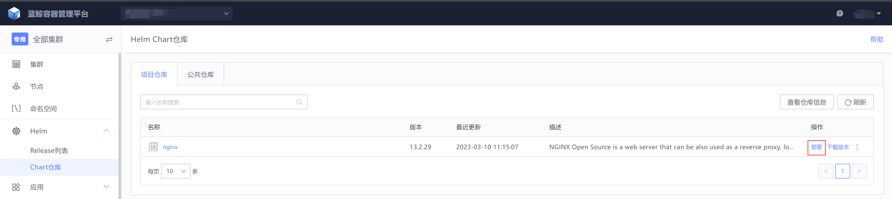
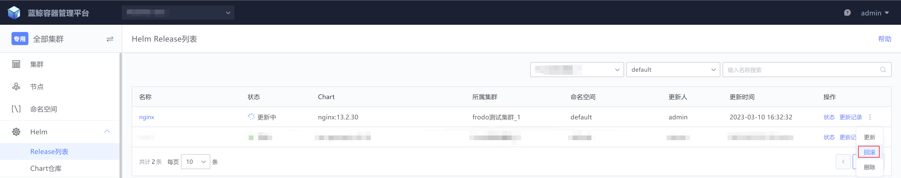

# 使用 Helm 发布应用

## 使用容器服务部署helm chart
进入到“Chart仓库”菜单，点击“部署”

Chart部署配置项填写

+ 名称：只能输入字母, 数字或者 `-`
+ 版本：选择部署的Chart目标版本
+ 所属集群：选择部署的目标集群
+ 命名空间：选择部署的目标集群下的命名空间
+ Chart部署选项：选择部署时所需的values文件，用户可以根据不同场景修改values文件的key / value
+ Helm部署参数：相当于helm命令行部署时的常用参数

Chart部署预览，在真正创建 helm release 之前，可以通过【预览】功能查看，将要生成的 K8S 资源配置是否符合预期。

点击“部署”按钮后会跳转到Release列表菜单，显示正在部署中的Chart，直到部署状态为“正常”或“失败”

## 使用容器服务更新helm release

helm release更新，蓝鲸容器服务提供了对比的功能，可以确认变更内容之后，再执行更新

helm release回滚，如果更新的chart版本有问题，可以使用回滚功能恢复故障

检查helm release部署或更新状态

