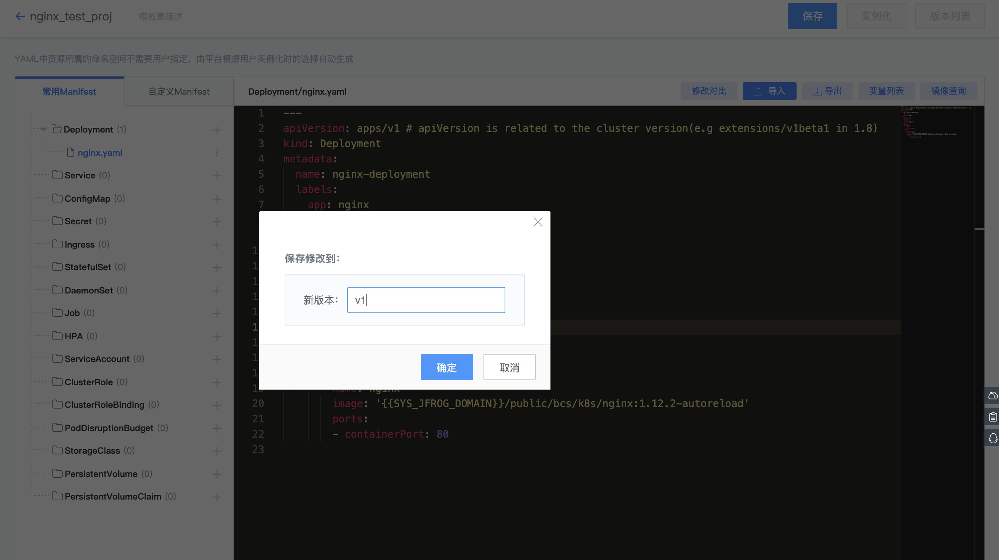
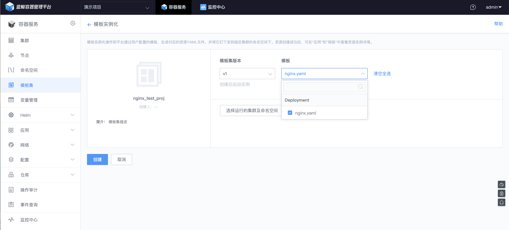

# 模板集使用介绍
在容器服务中，模板集是 K8S 配置文件模板的集合。用户可以通过将多个应用 (如 Deployment) 的配置模板构成一个模板集，来简化服务管理的复杂度；同时也可以将模板里面需要频繁修改的数据设置成变量，以方便维护。

容器服务提供了两种类型的模板集：一种是 YAML 模式，另一种是表单模式。对于熟悉 K8S manifest 的用户，YAML 模式更加灵活。

## YAML 模板集
### 创建模板集
在【模板集】菜单中，点击【添加模板集】，选择【YAML 模式】。用户进入创建模板集页面后，可以在模板集定义 Deployment、Service 等资源。

在使用模板集的时候，可能会用到[变量管理](variable_management.md)。对于模板集中的镜像信息，用户可以通过【镜像】按钮进行查询，复制并替换 image 的值。

模板集提供了版本管理的功能，在实际保存时，可以填入版本信息。

### 实例化模板集
点击【实例化】按钮，选择模板集的版本以及需要实例化的 YAML 文件

选择要下发到的集群和命名空间，页面会出现待下发的 YAML 文件的预览，点击【创建】按钮完成配置下发。

## 表单模板集
表单模板集主要是将 K8S 的资源以表单的方式展示出来，相比 YAML 模式，它有填写提示，关联提示等辅助功能，方便用户使用。在字段说明上，它基本对应 K8S 的资源 spec。

### 创建模板集
在【模板集】菜单中，点击【添加模板集】，选择【表单模式】。进入创建模板集页面后，可以在模板集定义 Deployment 等资源。

表单模板集在“保存”和“实例化”时，页面交互和 YAML 模式类似，用户可以直接参考 YAML 模板集的使用方法。

## 应用资源查看
实例化成功后，用户可以通过左侧菜单【应用】、【网络】以及【配置】来查看实际下发到集群中的资源，例如上面的例子中，实例化了一个 nginx 的 Deployment。

点开具体的应用，可以看到更详细的内容，如 Pod 的性能指标，Pod 的状态等。

