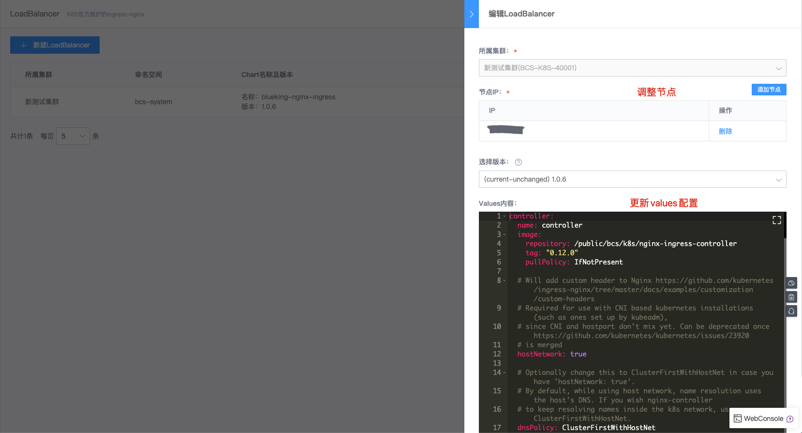

# LoadBalancer

容器服务 LoadBalancer 采用 K8S 官方维护的 nginx ingress controller 方案，通过 Helm Chart 的方式进行部署管理。LoadBalancer 主要包含两部分: nginx 和 nginx controller，其中，nginx controller 主要负责监听 Ingress 规则，最终转换成 nginx 配置。

如下图所示，用户通过 LoadBalancer 管理的 ingress 配置，访问对应的服务。

## 部署 LoadBalancer

选择集群，【添加节点】，调整 Values 中 `replicaCount` 的值和节点数量相同，部署 LoadBalancer。

## LoadBalancer 列表

展示集群、命名空间(默认为 bcs-system )及对应的 chart 和版本

## 更新 LoadBalancer

调整部署节点及 Values 配置，更新集群 LoadBalancer。

