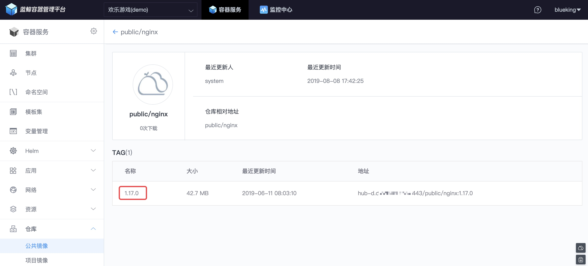

# 应用的滚动升级
## 情景

传统的应用更新方式是停服更新，用户在更新期间**无法使用服务**。

接下来，将以 Nginx 从`1.12.2`升级`1.17.0`为例，看 BCS 中的**滚动更新能力**是如何实现**不停机更新**，**用户无感知**。

## 前提条件

- [K8S 基本概念](https://kubernetes.io/zh/docs/concepts/)，包含 [Deployment](https://kubernetes.io/zh/docs/concepts/workloads/controllers/deployment/)、[Services](https://kubernetes.io/docs/concepts/services-networking/service/)。

- [完成 BCS 部署]

## 操作步骤

1. 滚动更新逻辑介绍

2. BCS 滚动更新操作指引

## 滚动更新逻辑介绍

滚动更新的逻辑如下图，创建一个新版本的实例（ POD），销毁一个旧版本实例（POD），如此滚动，直至线上都是新版本，旧版本已全部销毁。

滚动更新对用户无感知。


## BCS 滚动更新操作指引

### 推送 Nginx:1.17.0 至镜像仓库

参照 [Harbor 仓库使用指南](../Function/image_repo.md)，将镜像 Nginx:1.17.0 推送至 BCS 公共镜像仓库。

### 注册镜像仓库账号

在 [部署 BCS](../../../../DeploymentGuides/7.1/install-bcs.md) 的中控机上获取镜像仓库的访问地址。

```bash
# source /data/install/utils.fc && echo ${HARBOR_SERVER_FQDN}:${HARBOR_SERVER_HTTPS_PORT}
hub-d.o.******.com:443
```

登录仓库地址，注册镜像仓库账号。


注册完，登录后可以访问公共仓库。


### 推送 Nginx:1.17.0 至镜像仓库

使用`docker pull` 从`hub.docker.com`拉取镜像`nginx:1.17.0`。

```bash
# docker pull nginx:1.17.0
1.17.0: Pulling from library/nginx
fc7181108d40: Pull complete
c4277fc40ec2: Pull complete
780053e98559: Pull complete
Digest: sha256:bdbf36b7f1f77ffe7bd2a32e59235dff6ecf131e3b6b5b96061c652f30685f3a
Status: Downloaded newer image for nginx:1.17.0
```

规范镜像`tag`为仓库要求的格式。

```bash
# docker tag nginx:1.17.0 hub-d.******.com/public/nginx:1.17.0

# docker images
REPOSITORY                                                                TAG                  IMAGE ID            CREATED             SIZE
nginx                                                                     1.17.0               719cd2e3ed04        8 weeks ago         109MB
hub-d.******.com/public/nginx                                           1.17.0               719cd2e3ed04        8 weeks ago         109MB
```

推动镜像至 BCS 镜像仓库。

```bash
# docker push hub-d.******.com/public/nginx:1.17.0
The push refers to repository [hub-d.******.com/public/nginx]
d7acf794921f: Pushed
d9569ca04881: Pushed
cf5b3c6798f7: Pushed
1.17.0: digest: sha256:079aa93463d2566b7a81cbdf856afc6d4d2a6f9100ca3bcbecf24ade92c9a7fe size: 948
```

在镜像仓库中，可以找到刚推送的`Nginx:1.17.0`镜像。


在 BCS 的`[仓库菜单]`中也可以找到。



### 滚动升级 Nginx ：从 1.12.2 到 1.17.0

确认当前版本号为`nginx/1.12.2`

```bash
[root@ip-10-0-5-94-n-bcs-k8s-40015 ~]# curl 10.0.5.94:30008 -I
HTTP/1.1 200 OK
Server: nginx/1.12.2
Date: Thu, 08 Aug 2019 09:11:42 GMT
```

在【模板集】的【Deployment】页面中，修改【镜像及版本】，将版本从`1.12.2`修改为在 *推送 Nginx:1.17.0* 至镜像仓库 中上传的 Nginx 新镜像 `1.17.0`。


点击【更多设置】，了解默认滚动升级的更新策略。


> - `maxUnavailable`：滚动升级期间，考虑应用容量，不可用 Pod 的数量上限
> - `maxSurge`：滚动升级期间，考虑集群资源，超出期望 Pod 的数量上限
> - `minReadySeconds`：滚动升级期间，考虑可用性，探测 Pod 正常后转为可用的时间

修改完镜像的版本后，接下来【保存】模板集，填写【新版本】的版本号。


接着，开始滚动升级。点击菜单【应用】 -> 【Deployment】，找到`web-nginx`应用，点击【滚动升级】。


可以看到，差异点是`images`从`nginx:1.12.2`调整为`nginx:1.17.0`


点击【确定】滚动升级后，正在更新。


通过 右下角的 【Web console】 可以通过命令行的方式获取实例(POD)的基础信息。


以下是更新前后的对比

```bash
root:~$ kubectl get pods -n dev -o wide
NAME                         READY   STATUS    RESTARTS   AGE    IP            NODE                           NOMINATED NODE
web-nginx-678bb9c4fb-m8cf4   1/1     Running   0          134m   172.32.1.18   ip-10-0-5-94-n-bcs-k8s-40015   <none>
web-nginx-678bb9c4fb-nxwf4   1/1     Running   0          134m   172.32.1.17   ip-10-0-5-94-n-bcs-k8s-40015   <none>

root:~$ kubectl get pods -n dev -o wide
NAME                        READY   STATUS    RESTARTS   AGE   IP            NODE                           NOMINATED NODE
web-nginx-f95ffc78d-cxhrq   1/1     Running   0          21s   172.32.1.20   ip-10-0-5-94-n-bcs-k8s-40015   <none>
web-nginx-f95ffc78d-pqtcj   1/1     Running   0          14s   172.32.1.21   ip-10-0-5-94-n-bcs-k8s-40015   <none>
```

可以看到`Nginx`版本已经从`1.12.2`更新为`1.17.0`

```bash
[root@ip-10-0-5-94-n-bcs-k8s-40015 ~]# curl 10.0.5.94:30008 -I
HTTP/1.1 200 OK
Server: nginx/1.17.0
```
