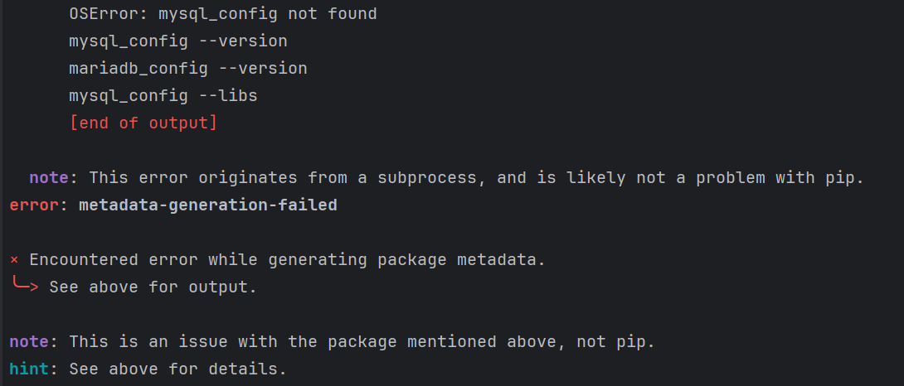

# 开发环境配置

## Q：本地开发报错日志没法显示

A：可以尝试配置以下 `local_settings.py`，这个文件会覆盖默认的 Django settings

```python
from blueapps.conf.log import get_logging_config_dict

LOG_DIR_PREFIX = "./logs"
LOGGING = get_logging_config_dict(locals())
LOGGING["loggers"]["root"]["handlers"] = ["root", "console"]
```

## Q：3.2 mysql_config not found



A：安装 mysql-devel 和 gcc

```bash
yum install mysql-devel gcc
```

## Q：如何查看我的 Agent 执行日志

A：可以在任意位置添加以下配置项，打开 Agent 的执行日志

```python
from langchain.globals import set_debug, set_verbose

set_verbose(True)
set_debug(True)
```
