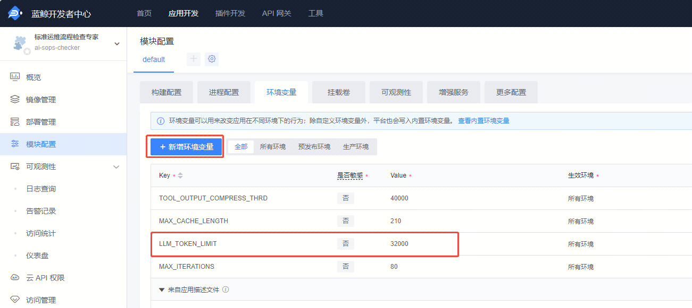
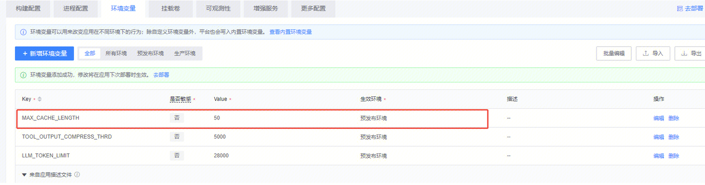
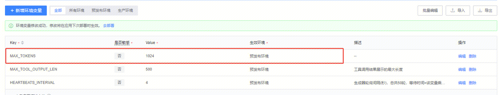

# 环境变量配置

)

## 智能体相关环境变量概览

| 变量名 | 默认值 | 描述 | 适用场景 |
|:---|:---:|:---:|---:|
| LLM_TOKEN_LIMIT | 36000 | LLM 最大 Token 限制，调大不容易 token 超限，不容易触发知识库压缩和工具压缩，最大值需要根据模型支持的上下文长度决定。 | 智能体提示超过最大上下文限制，可根据模型支持的最大上下文调大该环境变量，注意修改完环境变量需要重新进行部署。 |
| TOOL_OUTPUT_COMPRESS_THRD | 5000 | 工具调用结果压缩阈值，调大该环境变量不容易触发工具压缩，最大值可参考模型的最大上下文长度。 | 出现"工具调用结果过长，尝试压缩工具调用结果以减少 token 使用"的提示，且压缩结果为无效或者不准确，希望不进行工具压缩。 |
| MAX_TOOL_OUTPUT_LEN | 500 | 工具调用结果前端的展示长度，超过该长度的结果会被截断，但后端的结果不会被截断。 | 工具调用结果有（内容过长，已截断）的提示，但用户希望看到更多工具结果，可调大该环境变量显示更多结果。 |
| HEARTBEATS_INTERVAL | 4 | 生成器轮询间隔（秒），总共轮询 50 轮，生成器最大等待时间=该变量乘以 50，默认是 4×50=200 秒，等待生成内容超过这个时间则会有"生成器超时"的报错。 | 使用智能体出现"生成器超时"的异常提示，可调大该环境变量以增加生成器等待时间。 |
| MAX_CACHE_LENGTH | 80 | 流式输出缓存最大长度，新版的 deepseek-v3、hunyuan 等非思考模型在工具调用之前会输出一些文字说明，如果工具调用之前模型会输出很多文字，需要把这个缓存调大。 | 使用 deepseek-v3 出现多个思考的异常格式问题，可调大该环境变量（可先尝试调到 100 左右），调的太大可能会影响首 token 输出的时间。 |
| MAX_TOKENS | 1024 | 该环境变量决定 LLM 最大回复的长度，默认为 1024。 | 需要控制模型最大回复长度的场景。 |

## Q：最大上下文长度如何修改

A：最大上下文长度：`LLM_TOKEN_LIMIT`（默认：36000）

LLM 最大 Token 限制，调大不容易 token 超限，不容易触发知识库压缩和工具压缩，最大值需要根据模型支持的上下文长度决定。

**适用场景：** 智能体提示超过最大上下文限制，可根据模型支持的最大上下文调大该环境变量，注意修改完环境变量需要重新进行部署

## Q：工具输出压缩阈值如何修改

A：工具输出压缩阈值：`TOOL_OUTPUT_COMPRESS_THRD`（默认：5000）

工具调用结果压缩阈值，调大该环境变量不容易触发工具压缩，最大值可参考模型的最大上下文长度。

**适用场景：** 出现"工具调用结果过长，尝试压缩工具调用结果以减少 token 使用"的提示，且压缩结果为无效或者不准确，希望不进行工具压缩

## Q：工具调用结果展示的最大长度如何修改

A：工具调用结果展示的最大长度：`MAX_TOOL_OUTPUT_LEN`（默认：500）

工具调用结果前端的展示长度，超过该长度的结果会被截断，但后端的结果不会被截断。

**适用场景：** 工具调用结果有（内容过长，已截断）的提示，但用户希望看到更多工具结果，可调大该环境变量显示更多结果

## Q：生成器轮询间隔时间如何修改

A：生成器轮询间隔时间（秒）：`HEARTBEATS_INTERVAL`（默认：4）

生成器轮询间隔（秒），总共轮询 50 轮，生成器最大等待时间=该变量乘以 50，默认是 4×50=200 秒，等待生成内容超过这个时间则会有"生成器超时"的报错。

**适用场景：** 使用智能体出现"生成器超时"的异常提示，可调大该环境变量以增加生成器等待时间

## Q：流式输出缓存最大长度如何修改

A：流式输出缓存最大长度：`MAX_CACHE_LENGTH`（默认：80）

新版的 deepseek-v3、hunyuan 等非思考模型在工具调用之前会输出一些文字说明，目前是以思考内容的形式呈现。

但如果工具调用之前模型会输出很多文字，需要把这个缓存调大，以保证调用工具前的输出都放在思考内容里，否则可能会有格式问题。

**适用场景：** 使用 deepseek-v3 出现多个思考的异常格式问题，可调大该环境变量（可先尝试调到 100 左右），调的太大可能会影响首 token 输出的时间

## Q：模型最大回复长度如何修改

A：模型最大回复长度：`MAX_TOKENS`（默认：1024）

该环境变量决定 LLM 最大回复的长度，默认为 1024。

**适用场景：** 需要控制模型最大回复长度的场景
