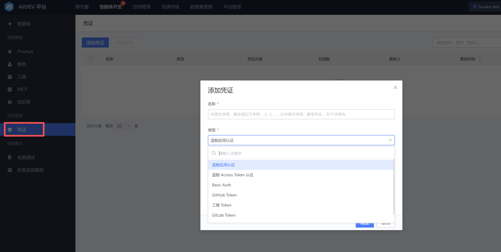
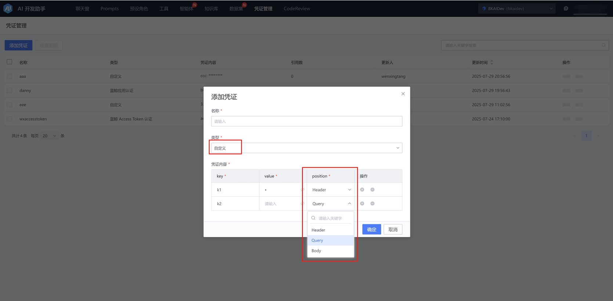
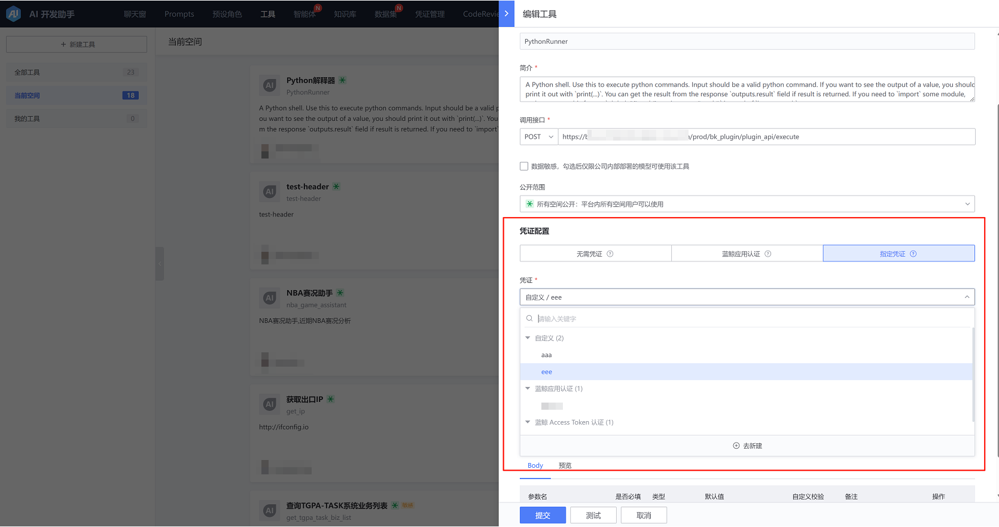

# 凭证管理

## 添加凭证

在 创建工具、添加/更新知识、提交CodeReview 场景都有使用凭证的需求，可以提前在【凭证管理】添加自己的凭证，支持下列类型：

如果使用场景涉及多个凭证值，或者需要回填至请求的不同位置，请选择 自定义 类型凭证，并分别指定凭证内容。

## 使用凭证

以 工具 场景为例：

- 蓝鲸应用认证：智能体在绑定此工具时需要获取此工具的接口权限，并提供智能体的bk_app_code、bk_app_secret作为认证信息使用该工具。

- 使用自己在凭证管理中添加的凭证：

