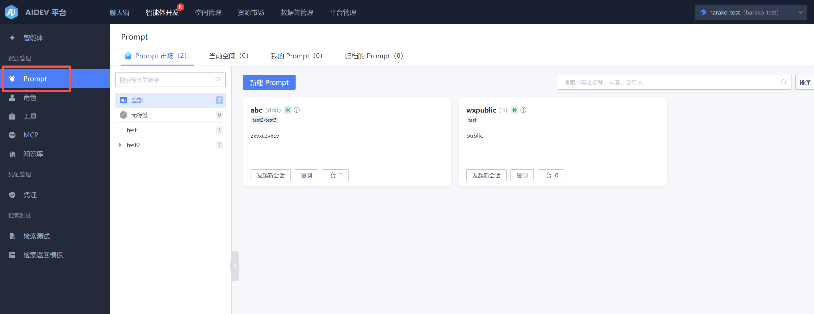
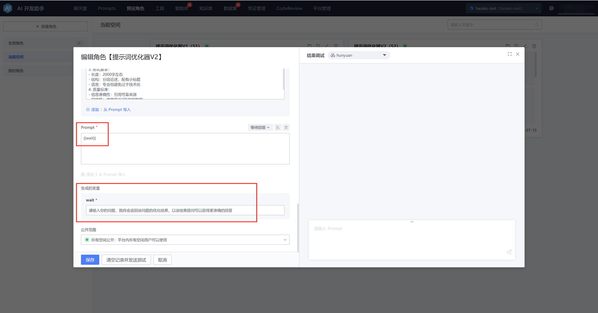
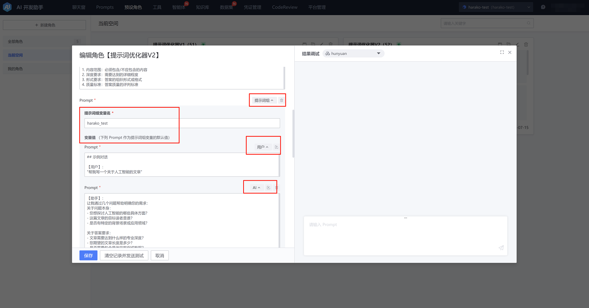
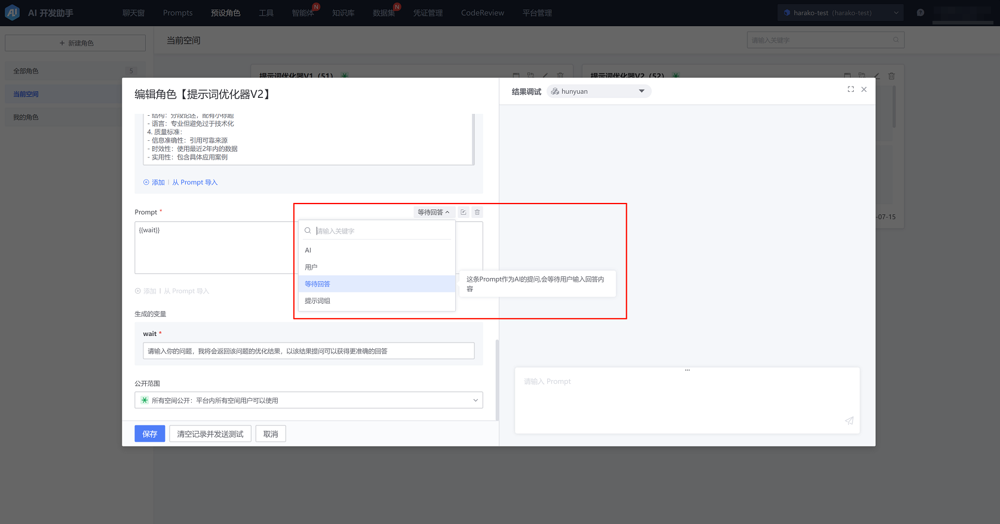
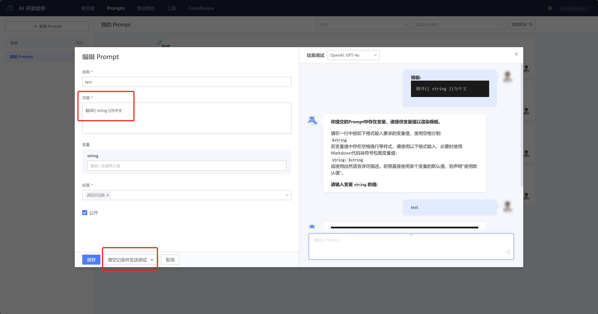
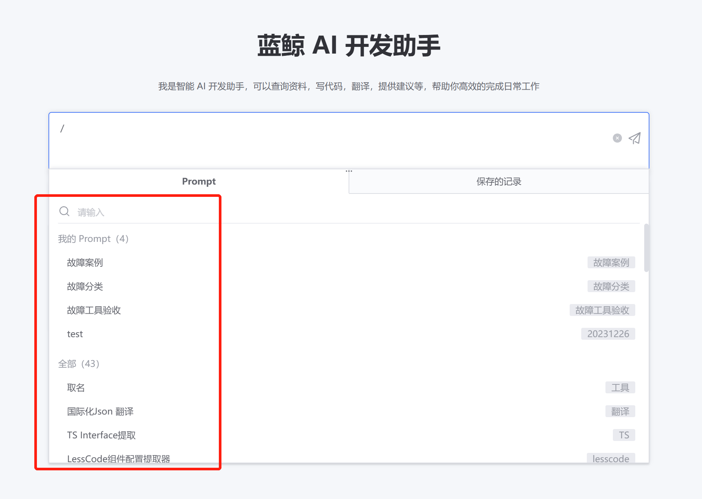

# 提示词管理

【智能体开发】-》【Prompt】tab下可以查看 “全部/当前空间/我的 Prompt”，所有 Prompt 均可以快捷发起会话。

创建/编辑 Prompt，支持以 {{ Var }} 的形式使用变量。

如需预先编辑一段会话用于one shot或few shot，可以使用【用户】【AI】tag，如果需要在SDK调用时替换这些会话内容，请选择【提示词组】tag，以变量值的形式编辑和使用这些提示词。

如需等待用户回答用于引导AI，请选择【等待回答】tag。

可以在 Prompt 编辑页右侧查看当前 Prompt 的测试结果，以便即时修改 Prompt。

Prompt 提交后，即可在会话中使用。

