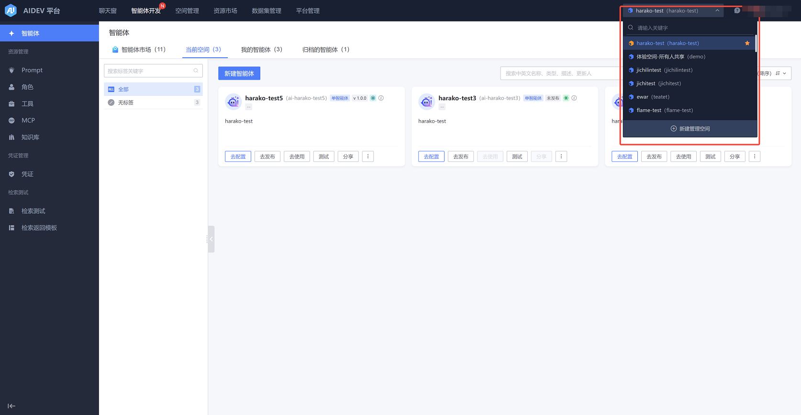
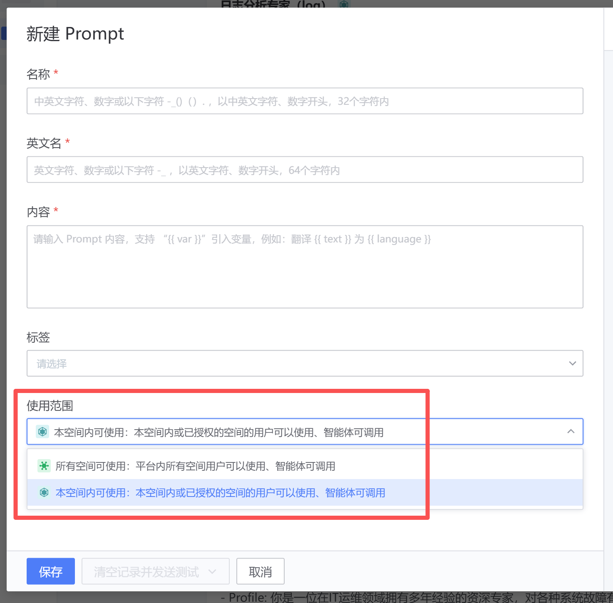
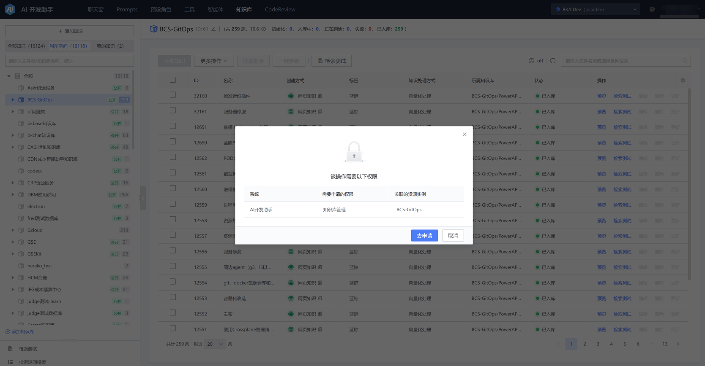
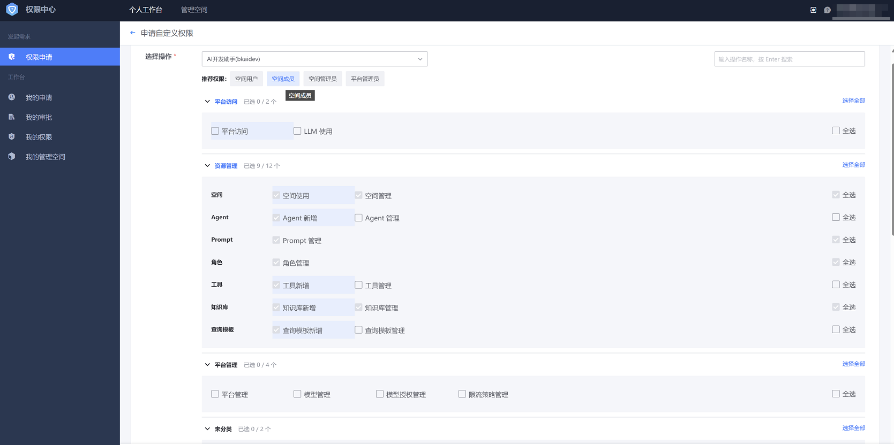
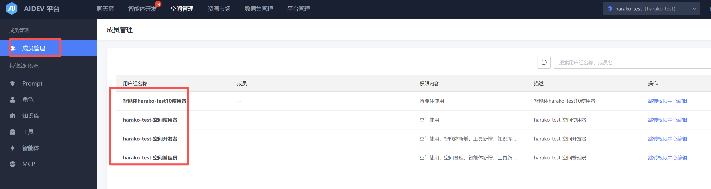
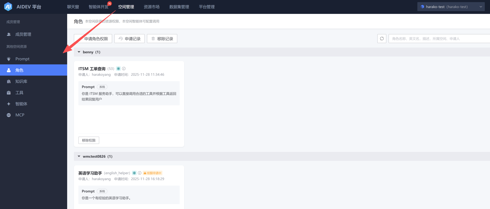
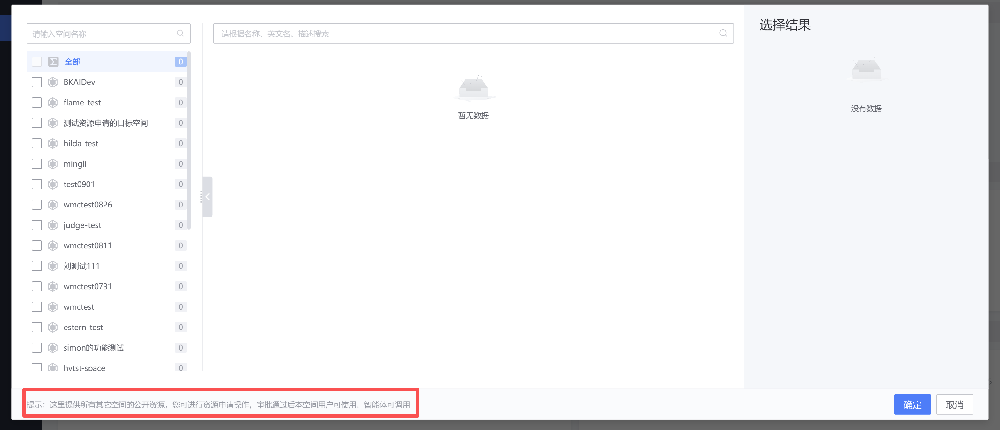
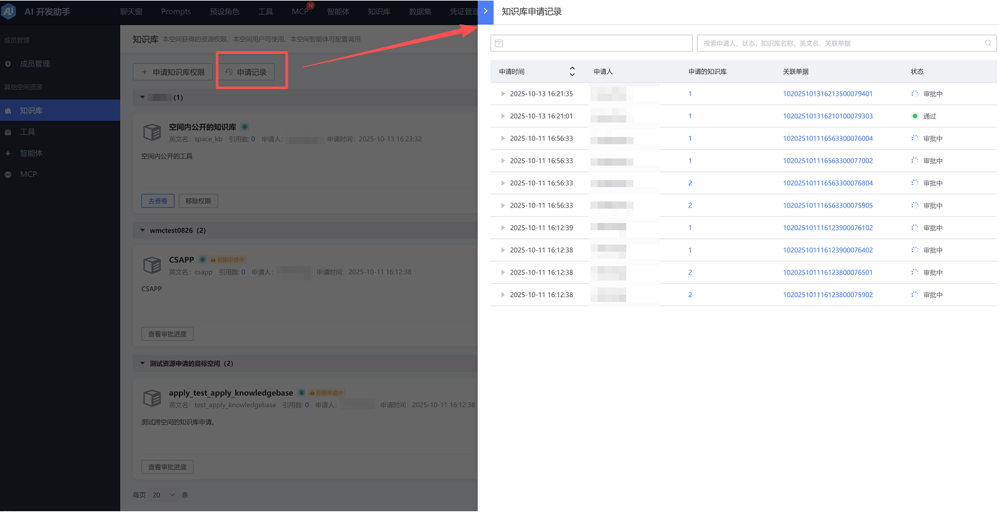

# 空间管理

## 空间内资源管理

AIDev 平台内的资源（知识、提示词、角色、工具/MCP、智能体）按照空间维度隔离，可以在右上角切换空间并管理空间内的资源。

- 使用权限

所有资源在创建时均可选择对应的使用范围（以提示词为例）：

- 编辑权限

如需编辑本空间内其他成员创建的资源，会跳转至权限中心申请

不同用户组对应的权限如下

## 空间内成员管理

在【空间管理】→【成员管理】页面，可以查看和编辑当前空间内不同角色（用户组）的成员和对应权限

## 其他空间资源管理

在【空间管理】页面，可以申请其他空间的公开资源，申请通过后该资源可用于 智能体、聊天窗

支持查看历史申请记录

