# AIDEV知识库索引设置最佳实践

对于结构化数据，在录入知识的时候，AIDEV平台提供用户自定义向量索引和标量索引的功能。

- 向量索引
  
  - 介绍：向量索引是指会使用平台的向量模型计算后存入向量库的索引（其通常是字符串，如工单投诉内容、提问内容）。用户如果不自定义向量索引，平台默认会将每一行数据及对应表头信息合并成 1 个字典，以文本的形式进行向量计算后入库。
  
  - 设置原则：建议遵循最少列原则，即尽量只选取与用户可能的 query 内容相关的那些列作为向量索引，其他与用户 query 内容无关的列，尽量不要选取进来，以免由于噪声内容过多、整体内容过长导致向量相似度计算准确度受影响，进而使检索效果下降。在有多个不同的列都跟用户可能的 query 内容有关的情况下：如果这些列之间有联系、用户某次 query 需要同时跨多个列，则可以将这些列合并成 1 个向量索引；如果这些列之间没有关系，用户某次 query 只跟其中某个列的信息有关，则可以将这些列分别设置成独立的向量索引（不超过 10 个）。
  
  - 实践案例：

    假设有一份某平台商品用户投诉单的结构化数据，内容如下：

    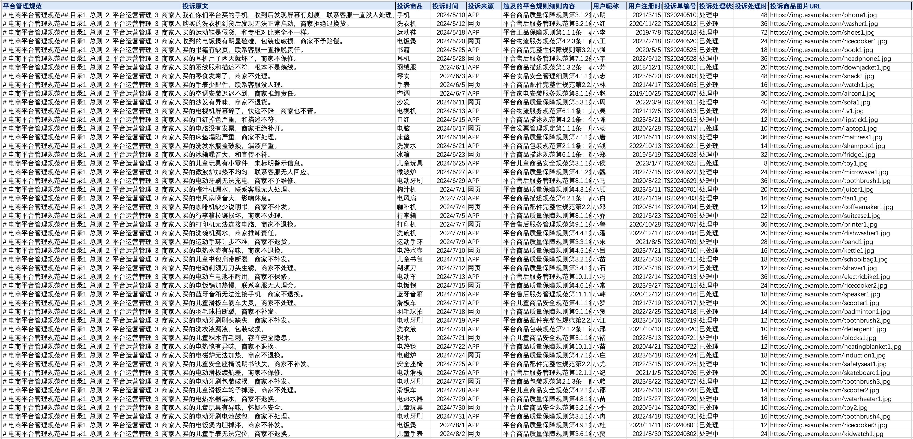
    
    假设业务场景是需要根据用户新的投诉内容（作为 query），在上述结构化知识中查询类似的商品历史投诉单。根据该业务使用场景和该结构化数据的特点，不难看出其中的“平台管理规范”“投诉时间”等诸多列的信息与用户可能的 query 一定没有关系，只有“投诉原文”这一列的内容与用户可能的 query 强相关，因此可以在上传至知识库时，添加一个向量索引，且只选择“投诉原文”这一列，如下图所示：

    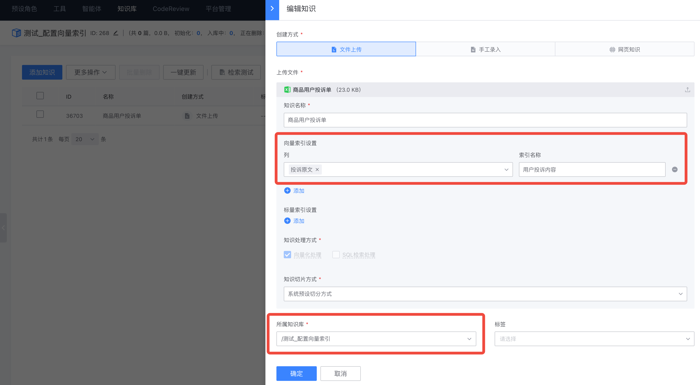
    
    为了对比建立和不建立上述向量索引的检索效果差异，这里上传了一份跟上述结构化数据内容完全一致的数据，通过平台的检索测试功能进行效果对比：

    
    
    检索效果对比如下：

    对比测试1

    不配置向量索引：

    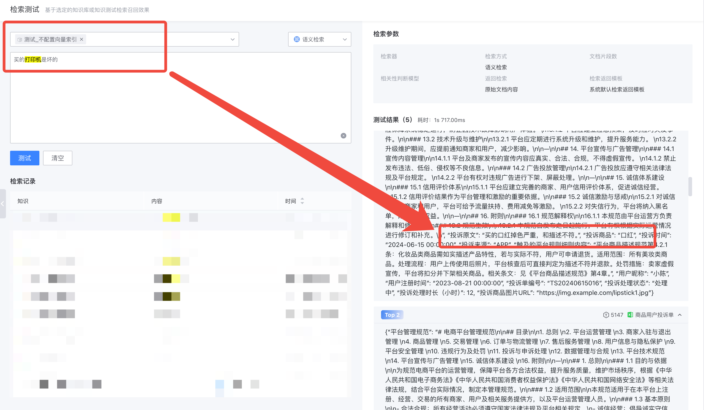
    
    配置向量索引：

    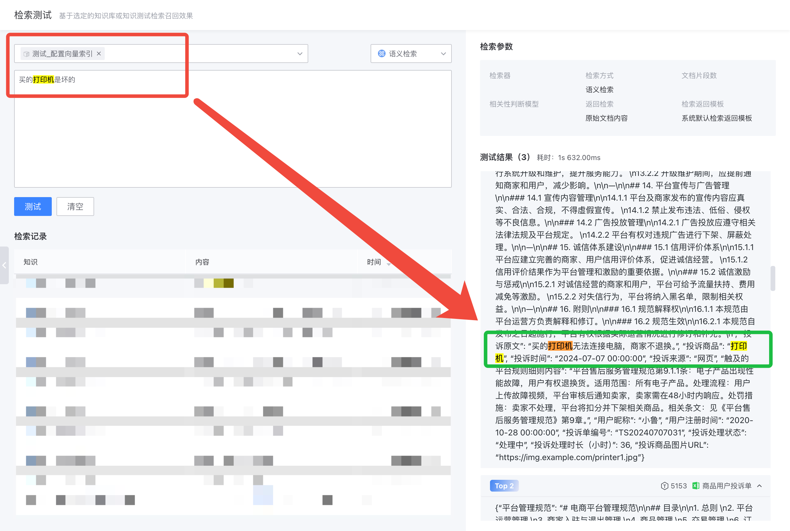
    
    对比测试2

    不配置向量索引：

    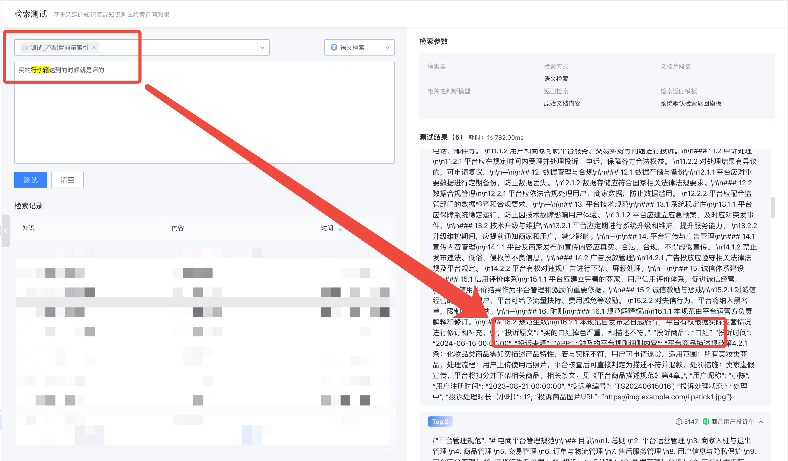
    
    配置向量索引：

    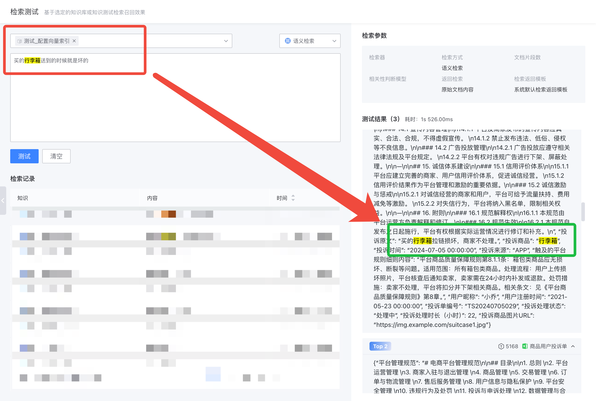
    
    从以上对比效果（检索结果中绿框代表正确，红框代表错误）可以看出，在不新建向量索引的情况下，由于其他列内容带来的噪声影响，检索到的top1内容是错的，跟用户的 query 完全不相关；而根据业务使用场景为新建了“投诉原文”这一列新建了向量索引后，检索到的 top1 内容与用户的 query 相关性很高，符合检索的预期。

- 标量索引
  
  - 介绍：标量索引是指适合进行逻辑操作运算的索引（其通常是整数、浮点数、字符串等，如商品价格、用户籍贯）。用户如果不自定义标量索引，平台默认不提供标量索引。
  
  - 设置原则：建议为用户可能会进行逻辑查询的标量数据新建标量索引。否则，仅靠向量索引较难进行准确的逻辑判断，筛选出严格符合用户条件的数据。注意在使用的时候需使用“混合检索”。
  
  - 实践案例：

    假设有一份某平台商品介绍和用户评论的结构化数据，内容如下：

    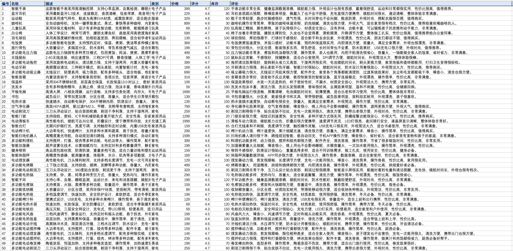
    
    假设业务场景中用户的 query 可能会涉及诸如“价格低于200元的商品有哪些”“评分高于4.5分的家电有哪些”“库存在50以上的商品有哪些”这样的问法，则建议为对应的“类别”“价格”“评分””“库存”新建标量索引，如下图所示：

    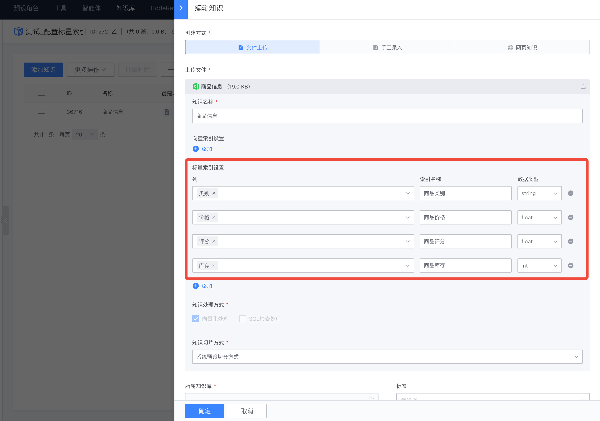
    
    为了对比建立和不建立上述标量索引的检索效果差异，这里上传了一份跟上述结构化数据内容完全一致的数据，通过平台的检索测试功能进行效果对比：

    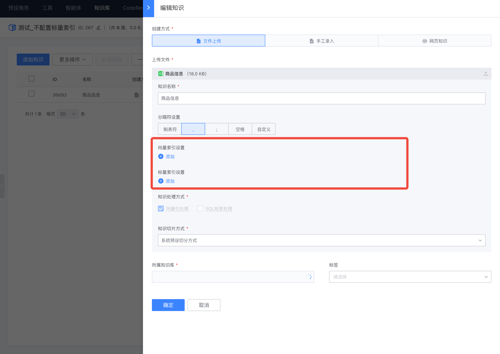
    
    检索效果对比如下：

    对比测试1:

    不配置标量索引：

    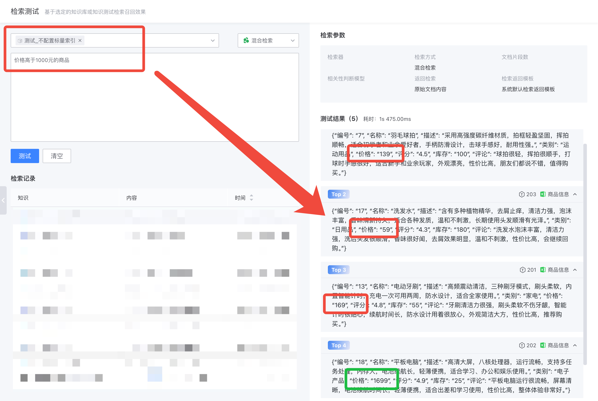
    
    配置标量索引：

    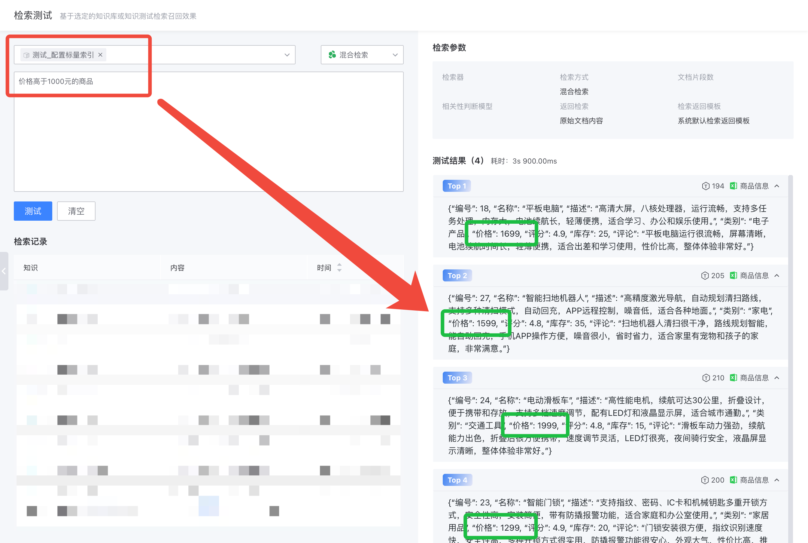
    
    对比测试2:

    不配置标量索引：

    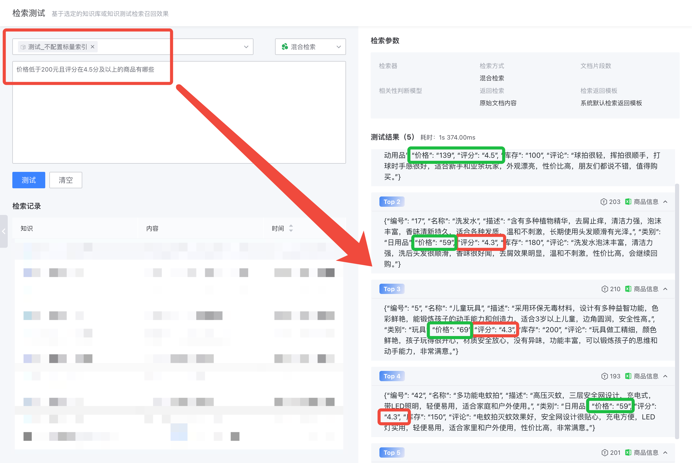
    
    配置标量索引：

    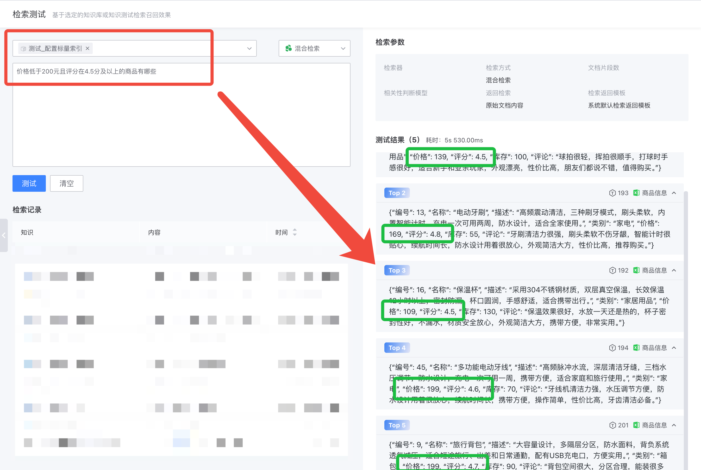
    
    对比测试3:
    
    不配置标量索引：
    
    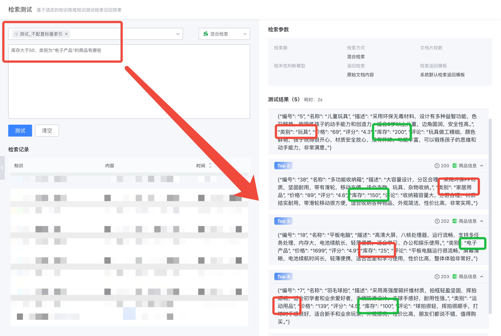

    配置标量索引：

    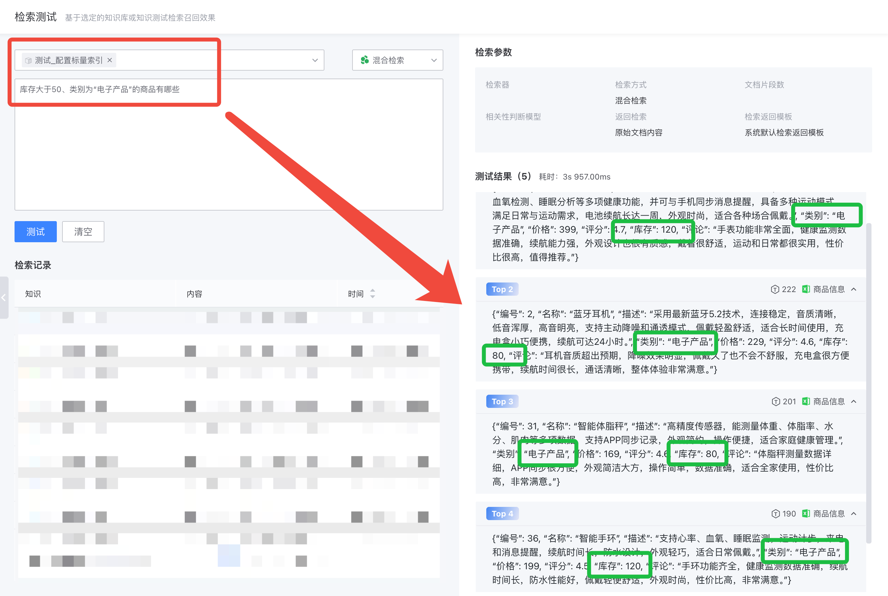
    
    从以上对比效果（检索结果中绿框代表正确，红框代表错误）可以看出，在不新建标量索引的情况下，召回中存在不符合用户 query 中逻辑条件的结果，而新建标量索引后，可以根据用户 query 中潜在的逻辑条件过滤出符合预期的检索结果。