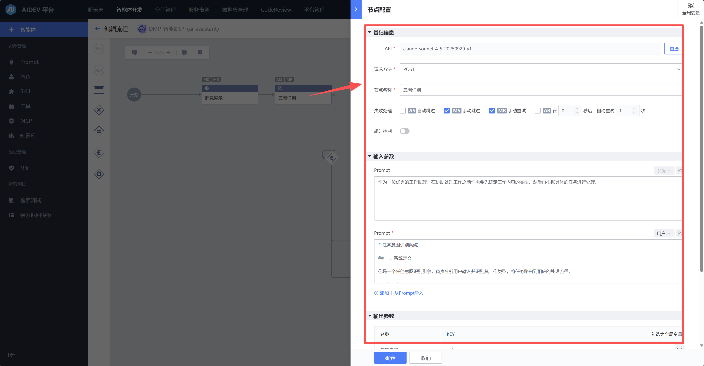
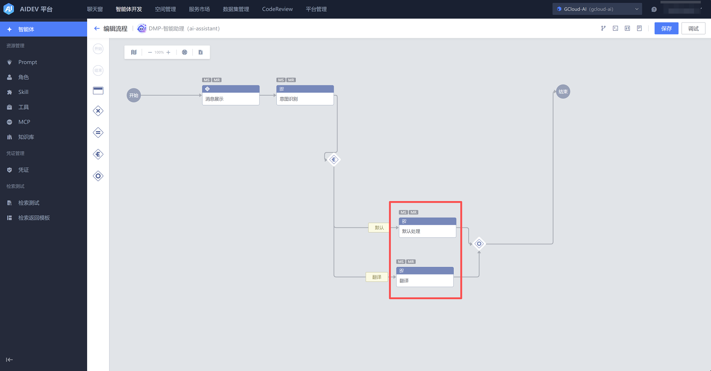
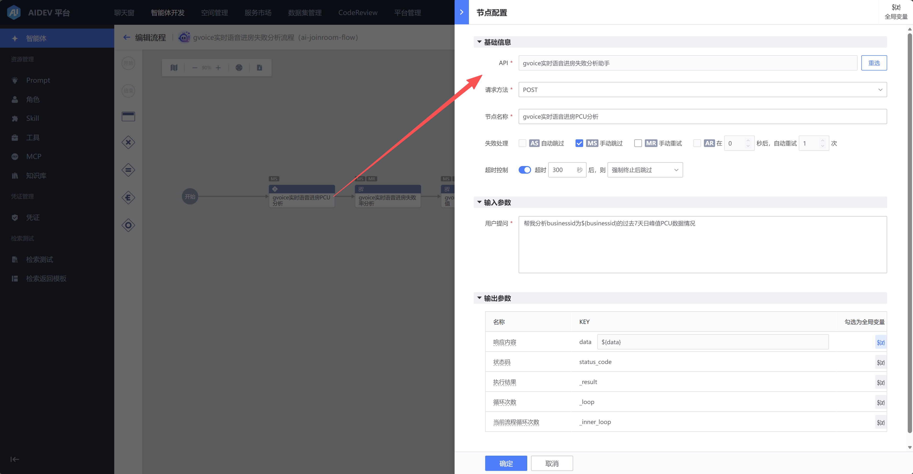
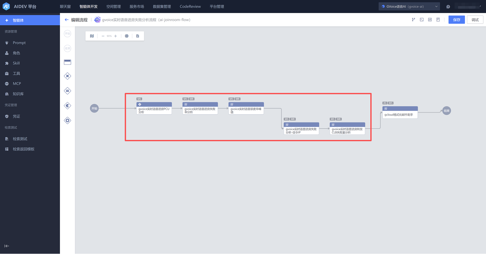
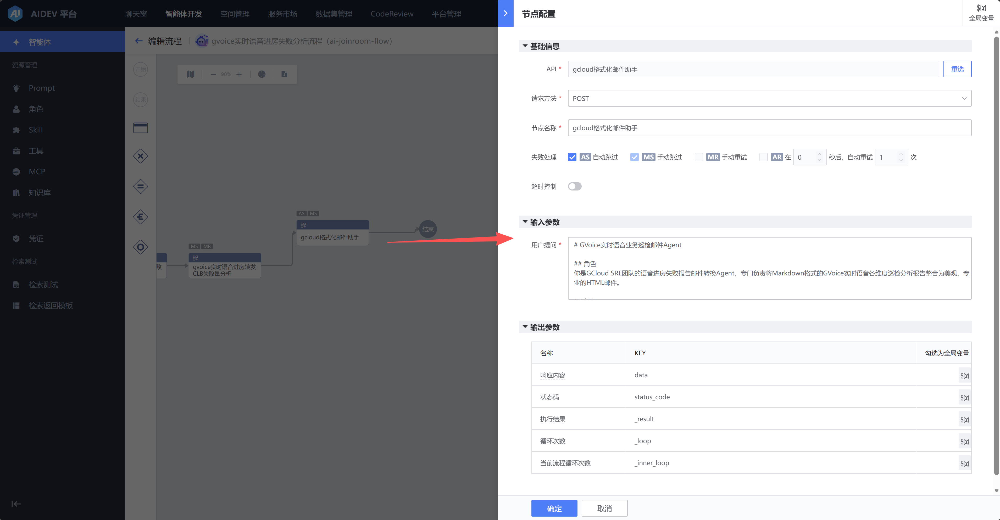
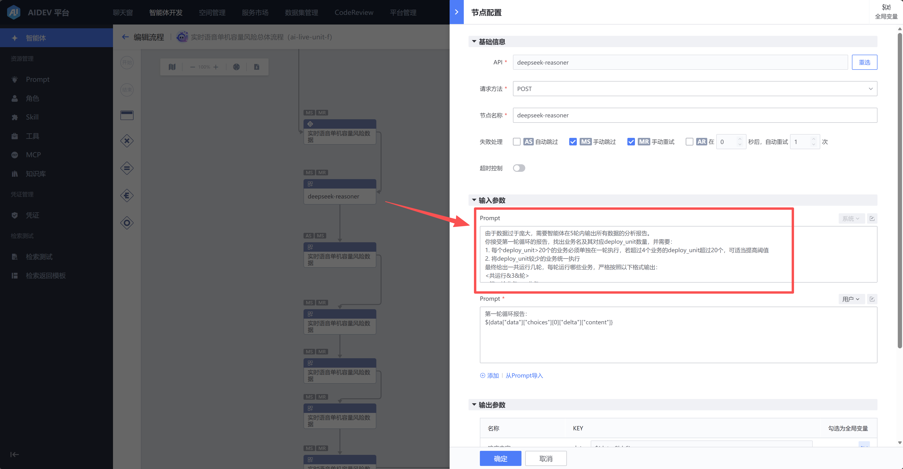
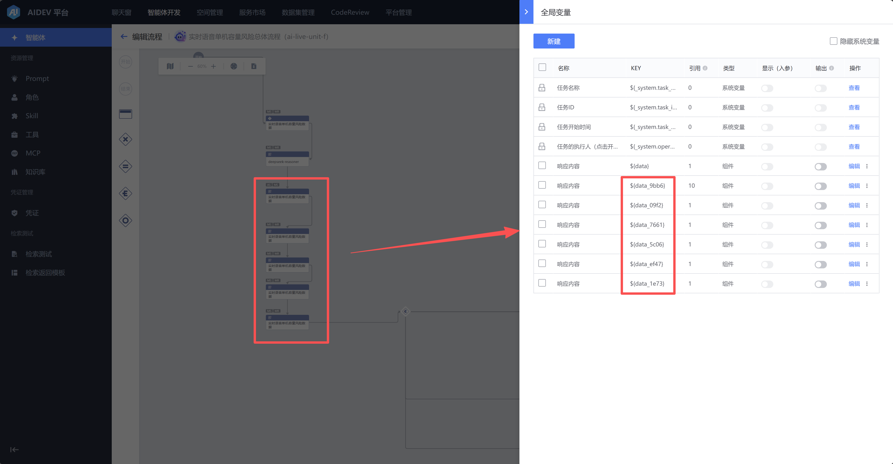
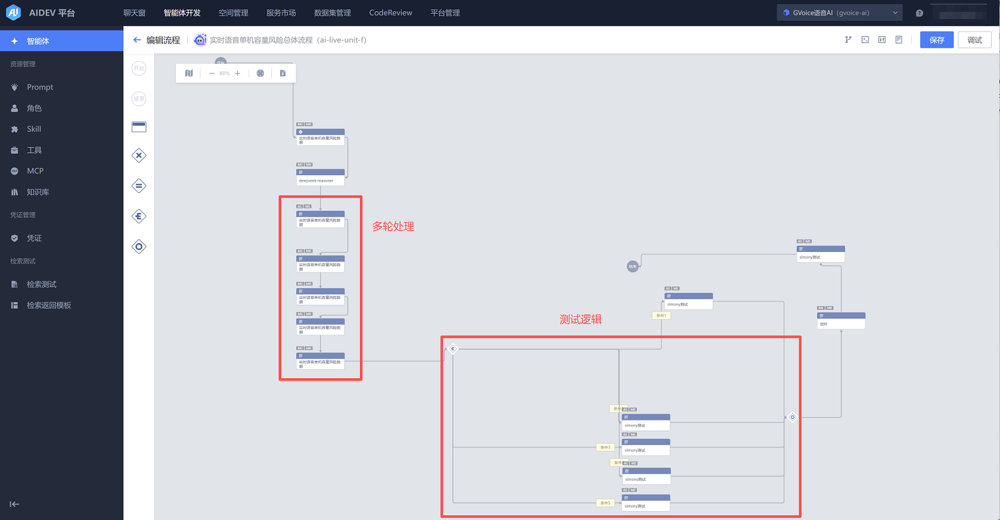

# 流程类智能体最佳实践

## 用例1（意图识别、条件并行）

https://xxxx/agent-develop/agent/flow?x-space-id=0f339e80a0f25f95&id=1825 

用大模型节点进行意图识别

对输入文本进行意图识别后，进入不同处理分支

## 用例2（智能体）

https://xxxx/agent-develop/agent/flow?x-space-id=a42d7db2b928c12b&id=2024 

获取特定业务数据，通过事先开发好的单智能体节点，进行分析

同一个智能体，被多个节点复用，每一个节点分析一种指标

分析结果汇总，通过邮件助手智能体发送

## 用例3（数据切分、条件并行）

https://xxxx/agent-develop/agent/flow?x-space-id=a42d7db2b928c12b&id=1943 

由于数据过于庞大，挂了一个大模型节点，切分多轮待分析数据

同一个智能体，被多个节点复用，分多轮输出所有数据的分析报告

在多轮处理后，汇总结果进行分支测试

